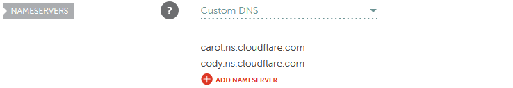
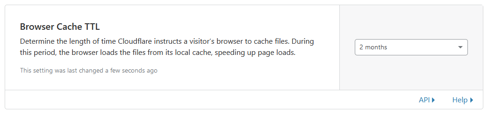
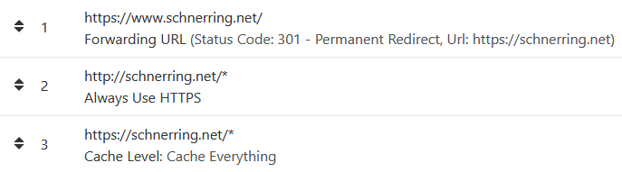

In this beginner guide, you'll create a Hugo website from scratch and publish the website on GitHub Pages. You'll configure Cloudflare's DNS and utilize its caching capabilities to optimize page speeds. Finally, implementing automated deployments with GitHub Pages will enable you to publish new content on your site easily.

<!--more-->

## Motivation

Over the last couple of years, I've written documentation for private hobby projects, most of it in [Markdown](https://en.wikipedia.org/wiki/Markdown) and managed with [Git](https://git-scm.com/). It's all over the place, some parts quite elaborate, other stuff just bullet point lists.

I think some of it might be useful for others, so I started looking for ways to publish Markdown documentation and found [Hugo](https://gohugo.io/). It's a simple to use, modern, and very popular static site generator that encourages the use of Markdown files. Perfect!

Having found Hugo, I started looking into how to best host static content. I've been using [GitHub](https://github.com/) forever, so obviously I chose [GitHub Pages](https://pages.github.com/). Accompanied by [Cloudflare](https://www.cloudflare.com/)'s caching capabilities, a blazingly fast website is guaranteed.

The only thing missing was a way to automagically publish changes made to the Git repository on the website. This is where [GitHub Actions](https://github.com/features/actions) come in.

With the technology figured out, in my very first guide, I'll show you step by step how I created this website in its first version. You can check out the code [on my GitHub](https://github.com/schnerring/schnerring.github.io/tree/v1.0.0) where I tagged the resulting commit with version `v1.0.0`.

## The Plan

Here is an overview of what you'll do:

1. [Register for third-party services and install the required software](#step-1-prerequisites)
2. [Prepare the Git repository](#step-2-prepare-git)
3. [Set up the development environment](#step-3-prepare-vs-code)
4. [Create a Hugo site from scratch and run it locally](#step-4-enter-hugo)
5. [Set up Cloudflare for a custom root (apex) domain](#step-5-configure-cloudflare)
6. [Manually deploy the website to GitHub Pages](#step-6-deploy-the-site-to-github-pages)
7. [Deploy the website automatically to GitHub Pages with GitHub Actions](#step-7-automate-deployments-with-github-actions)

I created this guide with Windows users in mind, but the workflow should be easily adaptable to other platforms. The steps are detailed and beginner-friendly, so if you're more experienced, you can skip through most parts of steps 1 to 3.

For this guide, I configured the `schnerring.net` domain and used `schnerring.github.io` as the GitHub Pages site. In the instructions, you'll need to replace these accordingly.

## Step #1: Prerequisites

First, you'll need to register for a couple of services and install some software. Everything mentioned is free, except registering a custom domain name. I'm not affiliated with any of the products I recommend in this guide.

### Sign Up at Third-Party Services

- Register a domain name with your registrar — I'm a very happy [Namecheap](https://www.namecheap.com/) customer
- Sign up at [Cloudflare](https://www.cloudflare.com/)
- Sign up at [GitHub](https://github.com/)

### Install Software for Development

Install the following programs for local development on our workstation:

- [Hugo](https://gohugo.io/getting-started/installing/) — make sure to install `hugo-extended` to be able to use themes that utilize Sass/SCSS
- [Git for Windows](https://git-scm.com/download/win) — source control management and shell
- [Visual Studio Code](https://code.visualstudio.com/Download) — editor for coding
- [Google Chrome](https://www.google.com/chrome/index.html) — web browser for debugging

I used the **Git Bash** terminal to create the instructions for this guide. It's bundled with Git for Windows and provides UNIX-like commands like `rm`, `touch`, and more.

## Step #2: Prepare Git

### Create a GitHub Repository

Sign in to your GitHub account and create a new repository. To create a _user_ type website with GitHub Pages, name the repository `schnerring.github.io`.

If you want to know more about GitHub Page types, you can find further information [in the GitHub Docs](https://docs.github.com/en/free-pro-team@latest/github/working-with-github-pages/about-github-pages#types-of-github-pages-sites).

Make sure to initialize the repository with a `README` and a `LICENSE` file. For this project, I chose the **MIT license**.

### Clone the Newly Created Repository and Open It in VS Code

If you haven't already, [configure an SSH key](https://docs.github.com/en/github-ae@latest/github/authenticating-to-github/generating-a-new-ssh-key-and-adding-it-to-the-ssh-agent) to use with GitHub. You're now ready to clone the GitHub repository to your workstation. Open a Git Bash terminal and run the following commands:

```shell
git clone git@github.com:schnerring/schnerring.github.io.git
cd schnerring.github.io
code .
```

## Step #3: Prepare VS Code

To make it easier to write clean and consistent code, install the following extensions:

**[EditorConfig](https://marketplace.visualstudio.com/items?itemName=EditorConfig.EditorConfig)**

> EditorConfig helps maintain consistent coding styles for multiple developers working on the same project across various editors and IDEs.

**[markdownlint](https://marketplace.visualstudio.com/items?itemName=DavidAnson.vscode-markdownlint)**

> markdownlint is a static analysis tool for Node.js with a library of rules to enforce standards and consistency for Markdown files

**[shellcheck](https://marketplace.visualstudio.com/items?itemName=timonwong.shellcheck)**

> ShellCheck is a GPLv3 tool that gives warnings and suggestions for bash/sh shell scripts

### Add the `.vscode/extensions.json` File

[Workspace recommended extensions](https://code.visualstudio.com/docs/editor/extension-gallery#_workspace-recommended-extensions) for VS Code make it easy to share a set of extensions easily across development environments. When you open a repository folder in VS Code and some recommended extensions are missing, you'll be notified, and just one click away from installing them.

Here's what the file looks like:

```json
{
  "recommendations": [
    "editorconfig.editorconfig",
    "davidanson.vscode-markdownlint",
    "omartawfik.github-actions-vscode",
    "timonwong.shellcheck"
  ]
}
```

### Add the `.vscode/launch.json` File

When running `hugo server` locally during development, it's nice to be able to open `http://localhost:1313` in Chrome from within VS Code by just hitting the `F5` key. For this, you need to add a _launch configuration_. VS Code stores launch configurations in the `launch.json` file located in the `.vscode/` folder.

For Windows, the configuration looks like this:

```json
{
  // Use IntelliSense to learn about possible attributes.
  // Hover to view descriptions of existing attributes.
  // For more information, visit: https://go.microsoft.com/fwlink/?linkid=830387
  "version": "0.2.0",
  "configurations": [
    {
      "type": "pwa-chrome",
      "request": "launch",
      "name": "Launch Chrome against localhost",
      "url": "http://localhost:1313",
      "webRoot": "${workspaceFolder}"
    }
  ]
}
```

Check out the official documentation to learn more about [debugging in VS Code](https://code.visualstudio.com/Docs/editor/debugging).

### Add the EditorConfig Configuration

Add the `.editorconfig` file to the root folder of the repository:

```text
# top-most EditorConfig file
root = true

# every file
[*]
charset = utf-8
indent_size = 2
indent_style = space
insert_final_newline = true
trim_trailing_whitespace = true

# Markdown files
[*.md]
trim_trailing_whitespace = false
```

[Check out EditorConfig](https://editorconfig.org/) if you want to learn more, it's awesome!

### Add the `.gitignore` File

To prevent cluttering of the repository with files generated by VS Code, add a `.gitignore` file to the root of the repository. To generate the `.gitignore` file, I like to use [gitignore.io](https://www.toptal.com/developers/gitignore). Hugo adds a `debug.log` file from time to time which I manually add, as well.

```ignore
debug.log

# Created by https://www.toptal.com/developers/gitignore/api/hugo,vscode
# Edit at https://www.toptal.com/developers/gitignore?templates=hugo,vscode

### Hugo ###
# Generated files by hugo
/public/
/resources/_gen/
hugo_stats.json

# Executable may be added to repository
hugo.exe
hugo.darwin
hugo.linux

### vscode ###
.vscode/*
!.vscode/settings.json
!.vscode/tasks.json
!.vscode/launch.json
!.vscode/extensions.json
*.code-workspace

# End of https://www.toptal.com/developers/gitignore/api/hugo,vscode
```

### Push Development Environment Settings to GitHub

The folder structure now looks like this:

```text
.vscode/
├─ extensions.json
├─ launch.json
.editorconfig
.gitignore
LICENSE
README.md
```

Push the changes to GitHub:

```shell
git add --all
git commit --message="Add vscode launch.json / extensions.json, .editorconfig, .gitignore"
git push
```

## Step #4: Enter Hugo

[Only a few steps](https://gohugo.io/getting-started/quick-start/) are required to create a functional Hugo site.

### Create a New Site

To create a Hugo site in your current working folder, use the [Hugo CLI](https://gohugo.io/commands/):

```shell
hugo new site . --force
```

With `--force`, Hugo won't complain about the folder containing files.

### Add a Theme

To get started quickly, add the [Hello Friend theme](https://themes.gohugo.io/hugo-theme-hello-friend) as a [Git Submodule](https://git-scm.com/book/en/v2/Git-Tools-Submodules). Check out [themes.gohugo.io](https://themes.gohugo.io/) for more themes.

```shell
git submodule add https://github.com/panr/hugo-theme-hello-friend.git themes/hello-friend
```

### Update the Hugo Configuration

The Hello Friend theme requires minimal configuration steps to work. As a baseline, use the sample [provided in the themes' README](https://github.com/rhazdon/hugo-theme-hello-friend-ng#how-to-configure) and make some straightforward changes to it.

The resulting `config.toml` looks like this:

```toml
baseURL = "https://schnerring.net"
languageCode = "en-us"
theme = "hello-friend"
paginate = 5
ignoreFiles = [ "LICENSE$" ]

[params]
  # dir name of your blog content (default is `content/posts`).
  # the list of set content will show up on your index page (baseurl).
  #contentTypeName = "posts"

  # "light" or "dark"
  defaultTheme = "dark"

  # if you set this to 0, only submenu trigger will be visible
  showMenuItems = 2

  # Show reading time in minutes for posts
  showReadingTime = false

  # Show table of contents at the top of your posts (defaults to false)
  # Alternatively, add this param to post front matter for specific posts
  # toc = true

  # Show full page content in RSS feed items
  #(default is Description or Summary metadata in the front matter)
  # rssFullText = true

[languages]
  [languages.en]
    title = "Michael Schnerring"
    subtitle = "Coder and Computer Enthusiast"
    keywords = ""
    description = "Michael Schnerring is a coder and computer enthusiast."
    copyright = "<p>Copyright © 2020 Michael Schnerring</p><p xmlns:dct='http://purl.org/dc/terms/' xmlns:cc='http://creativecommons.org/ns#' class='license-text'><a rel='cc:attributionURL' property='dct:title' href='https://github.com/schnerring/schnerring.github.io/tree/main/content'>Content</a> licensed under <a rel='license' href='https://creativecommons.org/licenses/by/4.0'>CC BY 4.0</a></p>"
    menuMore = "Show more"
    writtenBy = "Written by"
    readMore = "Read more"
    readOtherPosts = "Read other posts"
    newerPosts = "Newer posts"
    olderPosts = "Older posts"
    minuteReadingTime = "min read"
    dateFormatSingle = "2006-01-02"
    dateFormatList = "2006-01-02"
    # leave empty to disable, enter display text to enable
    #lastModDisplay = "modified"

    [languages.en.params.logo]
      logoText = "schnerring.net"
      logoHomeLink = "/"
    # or
    #
    # path = "/img/your-example-logo.svg"
    # alt = "Your example logo alt text"

    [languages.en.menu]
      [[languages.en.menu.main]]
        identifier = "about"
        name = "About"
        url = "/about"
```

The themes' GitHub repository [features another `config.toml` example](https://github.com/rhazdon/hugo-theme-hello-friend-ng/blob/master/exampleSite/config.toml). You can read more about how to configure Hugo [in the official documentation](https://gohugo.io/getting-started/configuration/).

### Add Some Content

With the help of the Hugo CLI, add an about page and the first blog post:

```shell
hugo new about.md
hugo new posts/hello-world.md
```

#### about.md

```markdown
---
title: "About"
draft: false
---

I code by day and toy around with computers by night...
```

#### posts/hello-world.md

````markdown
---
title: "Hello World"
description: "The first post of this blog"
date: 2021-03-14T15:00:21+01:00
draft: false
tags:
  - "csharp"
  - "hello world"
---

I'm a .NET developer by trade, so let's say hello in C#!

```csharp
using System;

class Program
{
    public static void Main(string[] args)
    {
        Console.WriteLine("Hello, world!");
    }
}
```
````

Note the post's default status `draft: true`, so newly created content has to be published manually. You can read more about it [in the official documentation](https://gohugo.io/getting-started/usage/#draft-future-and-expired-content). Make sure to set this to `false` before deployment or the post won't be displayed.

### Run the Site Locally

To finally test the changes locally, run the following in a Git Bash terminal. The `--buildDrafts` (or `-D`) option enables you to also view content that has set `draft: true`.

```shell
hugo server --buildDrafts
```

Hit the `F5` button in VS Code to open the page in Chrome.

### Push the Changes

Git ignores empty folders, so if you push the current changes and re-clone the repository, the Hugo folder structure would be partially gone. A common practice is to add empty `.gitkeep` marker files to empty folders to prevent this:

```shell
touch {data,layouts,static}/.gitkeep
```

Your folder structure should look like this, excluding `resources` or `public` folders, since those are `.gitignore`d:

```text
.vscode/
├─ extensions.json
├─ launch.json
archetypes/
├─ default.md
content/
├─ posts/
│  ├─ hello-world.md
├─ about.md
data/
├─ .gitkeep
layouts/
├─ .gitkeep
static/
├─ .gitkeep
themes/
├─ hello-friend/    (submodule)
.editorconfig
.gitignore
.gitmodules
config.toml
LICENSE
README.md
```

Commit and push everything:

```shell
git add -A
git commit -m "Add Hugo site, hello-friend theme, about page and hello-world post"
git push
```

## Step #5: Configure Cloudflare

### Add the Site to Cloudflare

1. Sign in to your Cloudflare account
2. Click **+ Add site** in the navigation bar and add `schnerring.net`
3. Select **Free plan**
4. Navigate to the **Overview** page of the newly created site
5. Take note of Cloudflare's nameservers, in my case _carol.ns.cloudflare.com_ and _cody.ns.cloudflare.com_

### Change the Nameservers for Your Domain

Sign in to the administrator account of your domain registrar and change the nameservers. My Namecheap nameserver configuration for `schnerring.net` looks like this after adding the Cloudflare nameservers:



### Add the CNAME Records

A **CNAME** record is used to map one domain name to another. Go to the DNS management at Cloudflare and add the following records to point your domain to GitHub Pages:


Make sure the “orange cloud” is enabled, so you can define rules and cache static content with Cloudflare.

### Enable _Full_ SSL/TLS Encryption Mode

Go to your site's **SSL/TLS** settings and set encryption to **Full**:


### Configure the Browser Cache TTL

Go to **Cache** &rarr; **Configuration** and choose **2 months** or higher, depending on how often you think your already published static content _changes_.



### Add Page Rules

The Free Tier lets you create up to three page rules. Go to your site's **Page Rules** settings and click **Create Page Rule**.

#### Enforce HTTPS


#### Add Forward from `www.schnerring.net` Subdomain to `schnerring.net` Root Domain

If you use a subdomain, skip this step.


#### Cache All Static Content to Speed Up the Website


### Page Rules Overview



Note that as of May 2018 GitHub Pages supports HTTPS for custom domains out of the box. They utilize [Let's Encrypt](https://letsencrypt.org/) certificates which are better than the shared certificates you get with Cloudflare. But to issue Let's Encrypt certificates for both `www.schnerring.net` and `schnerring.net`, you'd have to resort [this, in my opinion hacky, solution](https://stackoverflow.com/a/58672792/1154965).

## Step #6: Deploy the Site to GitHub Pages

You'll deploy the website to GitHub Pages on a separate, parallel `gh-pages` branch since published artifacts and source code are segregated this way. You can learn more about other options [in the official Hugo documentation](https://gohugo.io/hosting-and-deployment/hosting-on-github/).

### Initialize `gh-pages` branch

Create an _orphan_ branch which has a `git init` like state with no history:

```shell
git checkout --orphan gh-pages
git reset --hard
git commit --allow-empty -m "Init gh-pages branch"
git push origin gh-pages
git checkout main
```

### Checkout the `gh-pages` Branch in `public/`

To build the site, use the `hugo` command. The build artifacts will be placed in the `public/` folder, the contents of which need to be published on the `gh-pages` branch. To be able to checkout multiple branches, use [Git's worktree feature](https://git-scm.com/docs/git-worktree):

```shell
git worktree add -B gh-pages public origin/gh-pages
```

### Add `CNAME` File to `static/` Folder

Earlier, you configured Cloudflare to properly map `www.schnerring.net` and `schnerring.net` to `schnerring.github.io`'s destination. However, you also need a redirect from `schnerring.github.io` to `schnerring.net`. You accomplish this by adding a `static/CNAME` file to the repo, containing your custom domain. When generating the site with `hugo`, the published site will contain the CNAME file at its root:

```shell
echo "schnerring.net" > static/CNAME
rm static/.gitkeep
git add -A
git commit -m "Add CNAME file"
git push
```

### Build the Hugo Site

Make sure to set `draft: false` to publish the `hello-world.md` post. Push the change to GitHub by running `git commit -am "Publish hello-world.md" && git push`.

Then run `hugo`.

### Push the Changes on the `gh-pages` Branch

```shell
cd public
git add -A
git commit -m "Publish to gh-pages"
git push
cd ..
```

### Set `gh-pages` as Publishing Branch

Navigate to your repository on GitHub

1. Go to **Settings** &rarr; **Pages**
2. Under **Source**, select **Branch: `gh-pages`** and click **Save**

It should look like this:


Shortly after you perform these steps, your website should be available at `schnerring.net`.

### Subsequent Deployments

For future deployments, several steps are required:

1. Delete contents of `public/` folder, since [`hugo` does not remove generated files before building](https://gohugo.io/getting-started/usage/#deploy-your-website)
2. Generate the site with `hugo`
3. Push changes to the `gh-pages` branch
4. Purge Cloudflare cache

This is an error-prone and tedious process if repeated frequently, so let's automate these steps with GitHub Pages next.

## Step #7: Automate Deployments with GitHub Actions

### Configure GitHub Actions

[GitHub Actions Workflows](https://docs.github.com/en/actions/reference/workflow-syntax-for-github-actions) are configured mostly through configuration files in the `.github/workflows` folder. This allows your configuration to be version controlled and flexible.

Add the following `.github/workflows/hugo.yml` file to the repository:

```yaml
name: Hugo

on:
  push:
    branches:
      - main

  # Allows to run workflow manually from Actions tab
  workflow_dispatch:

jobs:
  build:
    runs-on: ubuntu-latest
    steps:
      - name: Checkout repository and update Hugo themes
        uses: actions/checkout@v2
        with:
          submodules: true
          fetch-depth: 0 # Fetch all history for .GitInfo and .Lastmod

      - name: Install Hugo
        uses: peaceiris/actions-hugo@v2
        with:
          hugo-version: "0.81.0"
          extended: true

      - name: Build Hugo
        run: hugo --minify

      - name: Deploy to GitHub Pages
        uses: peaceiris/actions-gh-pages@v3
        with:
          github_token: ${{ secrets.GITHUB_TOKEN }}
          publish_dir: ./public

      - name: Purge Cloudflare Cache
        env:
          CLOUDFLARE_ZONE_ID: ${{ secrets.CLOUDFLARE_ZONE_ID }}
          CLOUDFLARE_API_TOKEN: ${{ secrets.CLOUDFLARE_API_TOKEN }}
          GITHUB_TOKEN: ${{ secrets.GITHUB_TOKEN }}
        run: |
          chmod +x ./purge_cloudflare_cache.sh
          ./purge_cloudflare_cache.sh
```

Name the GitHub Actions Workflow `Hugo` which is triggered when pushed to the `main` branch. As OS, the `latest` version of `ubuntu` is used.

We only run one job, `build`, and perform the following steps:

1. Checkout the repository and update Hugo themes
2. Install Hugo `extended` since the theme uses SCSS.
3. Build Hugo and `--minify`
4. Deploy to GitHub Pages. The default deployment branch is `gh-pages`. Choose the `./public` folder to be published.
5. Purge the Cloudflare Cache by running the `./purge_cloudflare_cache.sh` script that you'll create in the next steps.

The above is straight forward, thanks to the free Actions available at the [GitHub Marketplace](https://github.com/marketplace). Thanks to [peaceiris](https://github.com/peaceiris) for the awesome work:

- [GitHub Actions for Hugo](https://github.com/peaceiris/actions-hugo)
- [GitHub Actions for GitHub Pages](https://github.com/peaceiris/actions-gh-pages)

Note the mapping of the environment variables required in step 4 and 5. You'll later configure the GitHub secrets that will be injected as environment variables into the context of the respective `steps`. The `GITHUB_TOKEN` doesn't need to be configured for GitHub Actions, since GitHub automatically creates it to use in your workflow. For local debugging though, you'll have to create a token, anyway.

### Create a GitHub Personal Access Token

> Personal access tokens (PAT) are an alternative to using passwords for authentication to GitHub when using the GitHub API or the command line.

Go to your GitHub profile's [**Settings** &rarr; **Developer settings** &rarr; **Personal access tokens**](https://github.com/settings/tokens). Click **Generate new token**, select only the `public_repo` scope and enter the note `schnerring.github.io`, to be able to later recognize what it's used for.

You only get one chance to copy the token's value, so add a new environment variable named `GITHUB_TOKEN` to your local system:


If you lose the token, just delete and then recreate it.

### Create the `purge_cloudflare_cache.sh` Script

#### Purge the Cloudflare Cache

Use Cloudflare's API to [purge all cached files](https://api.cloudflare.com/#zone-purge-all-files) with `curl` after successful deployment:

```shell
curl \
  --silent \
  --request POST \
  --header "Authorization: Bearer ${CLOUDFLARE_API_TOKEN}" \
  --header "Content-Type: application/json" \
  --data '{"purge_everything":true}' \
  "https://api.cloudflare.com/client/v4/zones/${CLOUDFLARE_ZONE_ID}/purge_cache"
```

Before you can run the command above, set `CLOUDFLARE_ZONE_ID` and `CLOUDFLARE_API_TOKEN` as environment variables in your GitHub repository and your workstation. You can add secrets in your GitHub repository's **Settings** &rarr; **Secrets** &rarr; **New repository secret**:

- Set `CLOUDFLARE_ZONE_ID` to your Cloudflare site's **Zone ID** which you can find it on your site's **Overview** page.

- Set `CLOUDFLARE_API_TOKEN` to an API Token with _Zone.Cache Purge_ permissions. Create one at **My Profile** &rarr; **API Tokens** &rarr; **Create Token** &rarr; **Create Custom Token** &rarr; **Get started**:

  

You should then be able to locally run the `curl` snippet above which should output `"success": true`:

```json
{
  "result": {
    "id": "********************************"
  },
  "success": true,
  "errors": [],
  "messages": []
}
```

#### Polling the GitHub Pages Build Status

Before purging the site's cache on Cloudflare, make sure that the GitHub Pages build completed successfully. Via GitHub's API, [query the latest GitHub Pages build](https://docs.github.com/en/free-pro-team@latest/rest/reference/repos#get-latest-pages-build) with `curl`:

```shell
curl \
  --silent \
  --user "schnerring:${GITHUB_TOKEN}" \
  --header "Accept: application/vnd.github.v3+json" \
  "https://api.github.com/repos/schnerring/schnerring.github.io/pages/builds/latest"
```

The `GITHUB_TOKEN` you configured earlier is used here. Executing the snippet locally will output `"status": "built"` if the GitHub Pages build succeeded:

```json
{
  "url": "https://api.github.com/repos/schnerring/schnerring.github.io/pages/builds/123456789",
  "status": "built",
  "error": {
    "message": null
  },
  ...
}
```

#### Put It All Together

```bash
#!/usr/bin/env bash

readonly DELAY_STEP_SECONDS=15
readonly INTERVAL_SECONDS=5
readonly TIMEOUT_SECONDS=120

readonly GITHUB_USER=schnerring
readonly GITHUB_REPO=schnerring.github.io

##################################################
# Poll status of latest GitHub Pages build every INTERVAL_SECONDS seconds for up
# to TIMEOUT_SECONDS seconds.
# Globals:
#   GITHUB_REPO
#   GITHUB_TOKEN
#   GITHUB_USER
#   INTERVAL_SECONDS
#   TIMEOUT_SECONDS
# Arguments:
#   None
# Outputs:
#   Success message to stdout or error message to stderr.
# Returns:
#   0 on success, 1 otherwise.
##################################################
function poll_build_status() {
  echo "Awaiting completion of latest GitHub Pages build ..."
  local waited_seconds=0
  while [[ "${waited_seconds}" -lt "${TIMEOUT_SECONDS}" ]]; do
    if curl \
      --silent \
      --user "${GITHUB_USER}:${GITHUB_TOKEN}" \
      --header "Accept: application/vnd.github.v3+json" \
      "https://api.github.com/repos/${GITHUB_USER}/${GITHUB_REPO}/pages/builds/latest" \
      | grep -q '"status": "built"'; then
      echo "Success."
      return 0
    fi
    echo "  Sleeping ${INTERVAL_SECONDS} seconds until next status poll ..."
    sleep "${INTERVAL_SECONDS}"
    (( waited_seconds += INTERVAL_SECONDS ))
  done
  echo "Failure." >&2
  return 1
}

##################################################
# Purge entire Cloudflare cache.
# Globals:
#   CLOUDFLARE_API_TOKEN
#   CLOUDFLARE_ZONE_ID
# Arguments:
#   None
# Outputs:
#   Success message to stdout or error message to stderr.
# Returns:
#   0 on success, 1 otherwise.
##################################################
function purge_cache() {
  echo "Purging Cloudflare cache ..."
  if curl \
    --silent \
    --request POST \
    --header "Authorization: Bearer ${CLOUDFLARE_API_TOKEN}" \
    --header "Content-Type: application/json" \
    --data '{"purge_everything":true}' \
    "https://api.cloudflare.com/client/v4/zones/${CLOUDFLARE_ZONE_ID}/purge_cache" \
    | grep -q '"success": true'; then
    echo "Success."
    return 0
  else
  echo "Failure." >&2
    return 1
  fi
}

##################################################
# Main function of script.
# Globals:
#   DELAY_STEP_SECONDS
# Arguments:
#   None
##################################################
function main() {
  echo "Sleeping ${DELAY_STEP_SECONDS} seconds ..."
  sleep "${DELAY_STEP_SECONDS}"
  poll_build_status || exit 1

  echo "Sleeping ${DELAY_STEP_SECONDS} seconds ..."
  sleep "${DELAY_STEP_SECONDS}"
  purge_cache || exit 1
}

# Entrypoint
main "$@"
```

`poll_build_status` and `purge_cache` contain the functionality. The `main` function serves as the entry point executing those functions.

`poll_build_status` implements a `while` loop to repeatedly poll GitHub's API. It succeeds if the response contains `"status": "built"` or times out after two minutes and fails.

Before each step, the script heuristically `sleep`s 15 seconds in case of latency issues with GitHub's API or GitHub Pages updates.

Running the `./purge_cloudflare_cache.sh` script locally should output:

```text
Awaiting completion of latest GitHub Pages build ...
Success.
Purging Cloudflare cache ...
Success.
```

Note that for sites with lots of files, purging the whole cache should be avoided. Cloudflare supports purging the cache for individual files.

We _could_ list only changed files if we wanted to with a command like `git diff-tree -r --no-commit-id --name-only --diff-filter=DM gh-pages` and only purge the cache for these files, but that's out of scope for this post.

Now push `.github/workflows/hugo.yml` and `purge_cloudflare_cache.sh` to the repository:

```shell
git add -A
git commit -m "Add .github/workflows/hugo.yml, purge_cloudflare_cache.sh"
git push
```

Go check out the **Actions** tab on your GitHub repository. If everything is configured correctly, GitHub Actions should be building your site:


After the workflow succeeded, there won't be any changes to the site because we didn't change anything about our site, yet.

To make a change, switch to the light theme by setting `defaultTheme = "light"` inside the `config.toml` file. Push the changes by running `git commit -am "Set default theme to light" && git push` and another GitHub Action workflow should automatically be triggered.

After the build completes, your website should be displayed in the light theme. If it isn't, make sure to also purge your browser cache.

## Wrapping Up

It took quite a bit of effort, but you now have a hands-off system in place that helps you to publish content to your website in an automated way. All you have to do is pushing new changes to your GitHub repo and after a minute the changes will be live.
