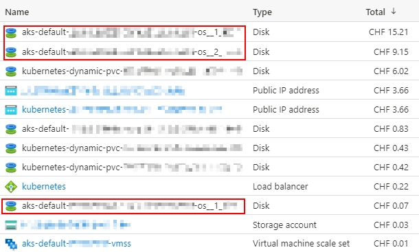

I use the Azure Kubernetes Service (AKS) to host a few services, like Synapse, Remark42, and Plausible Analytics. As of yet, none of these services require much computing power, so I chose a small VM size for the AKS node: `Standard_B2ms`. I recently analyzed my Azure costs and found out that I could have saved more than a hundred bucks in the past months if I had been more diligent.

<!--more-->

## What Storage Does AKS Use?

Besides the underlying storage of [Persistent Volumes](https://kubernetes.io/docs/concepts/storage/persistent-volumes/) Kubernetes deployments use, there's also the node itself requiring an OS disk. For OS disks, two types exist: _managed_ and _ephemeral_. [The Microsoft docs note the following on ephemeral OS disks](https://docs.microsoft.com/en-us/azure/aks/cluster-configuration#ephemeral-os):

> By default, Azure automatically replicates the operating system disk for an virtual machine to Azure storage to avoid data loss should the VM need to be relocated to another host. However, since containers aren't designed to have local state persisted, this behavior offers limited value while providing some drawbacks, including slower node provisioning and higher read/write latency.
>
> By contrast, ephemeral OS disks are stored only on the host machine, just like a temporary disk. This provides lower read/write latency, along with faster node scaling and cluster upgrades.
>
> Like the temporary disk, an ephemeral OS disk is included in the price of the virtual machine, so you incur no additional storage costs.

I created my cluster in 2021, and [ephemeral OS disks have been generally available since November 2020](https://github.com/Azure/AKS/releases/tag/2020-11-16) and [B-series VMs support ephemeral OS disks](https://docs.microsoft.com/en-us/azure/virtual-machines/sizes-b-series-burstable). However, the cost analysis in the Azure Portal shows that I'm incurring storage costs for my cluster's _managed_ OS disks. The following screenshot shows that I paid CHF 24.43 in October 2021.

I pay CHF 33.50 per month for the `Standard_B2ms` VM instance, which the screenshot doesn't correctly display. To save around 70% compared to pay-as-you-go prices, I use [Azure Reserved Virtual Machine Instances](https://azure.microsoft.com/en-us/pricing/reserved-vm-instances/), which Microsoft bills separately. So why am I paying for a _managed_ OS disk that almost doubles the operating cost of my AKS cluster? Well, because I made a mistake.

## Using Terraform to Deploy AKS

[I use Terraform to manage my AKS cluster.](/use-terraform-to-deploy-an-azure-kubernetes-service-aks-cluster-traefik-2-cert-manager-and-lets-encrypt-certificates) The `azurerm_kubernetes_cluster` Terraform resource features the [`os_disk_type`](https://registry.terraform.io/providers/hashicorp/azurerm/latest/docs/resources/kubernetes_cluster#os_disk_type) option:

> (Optional) The type of disk which should be used for the Operating System. Possible values are `Ephemeral` and `Managed`. Defaults to `Managed`. Changing this forces a new resource to be created.

Here it is! I didn't explicitly set it to `Ephemeral` when I initially configured my cluster over six months ago. An expensive mistake!
