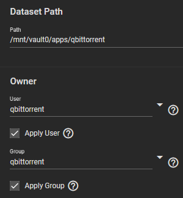
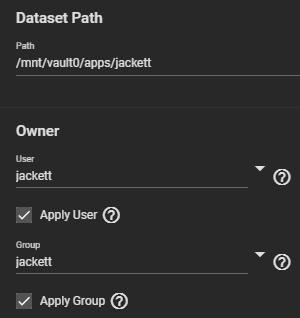
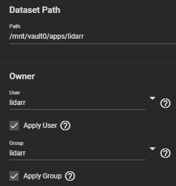
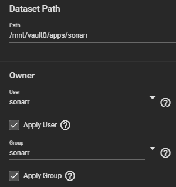
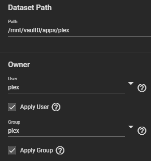
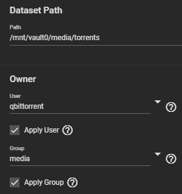
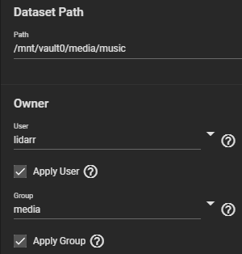
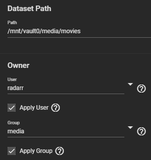
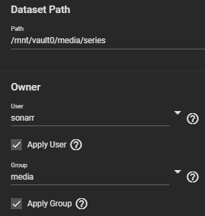

This post documents the steps required to install [qBittorrent](https://www.qbittorrent.org/), [Jackett](https://github.com/Jackett/Jackett), [Lidarr](https://lidarr.audio/), [Radarr](https://radarr.video/), [Sonarr](https://sonarr.tv/), and [Plex](https://www.plex.tv/) in [TrueNAS jails](https://www.truenas.com/docs/core/applications/jails/) version `12.0-U6`.

<!--more-->

## Disclaimer

[From Wikipedia on BitTorrent Legislation](https://en.wikipedia.org/wiki/BitTorrent#Legislation):

> Although the protocol itself is legal, problems stem from using the protocol to traffic copyright infringing works, since BitTorrent is often used to download otherwise paid content, such as movies and video games.

See also: [Legal issues with BitTorrent (Wikipedia)](https://en.wikipedia.org/wiki/Legal_issues_with_BitTorrent)

## Goals

These are the goals pictured in the diagram above.

- Each service lives inside a separate jail
- Each service runs as a different user
- Each service user is a member of the built-in `media` group (GID `8675309`)
- Each jail uses a dataset for configuration data
- Media datasets shared between jails
- Members of the `media` group are permitted to write to media datasets

I only mention options that deviate from the defaults. I use DHCP reservations to manage my server IPs, so I use the `dhcp=1` option to create jails.

## Groups

Navigate to  and add the following groups.

|                      |               |
| -------------------- | ------------- |
| GID                  | `850`         |
| Name                 | `qbittorrent` |
| Samba Authentication | `unchecked`   |

|                      |             |
| -------------------- | ----------- |
| GID                  | `354`       |
| Name                 | `jackett`   |
| Samba Authentication | `unchecked` |

|                      |             |
| -------------------- | ----------- |
| GID                  | `356`       |
| Name                 | `lidarr`    |
| Samba Authentication | `unchecked` |

|                      |             |
| -------------------- | ----------- |
| GID                  | `352`       |
| Name                 | `radarr`    |
| Samba Authentication | `unchecked` |

|                      |             |
| -------------------- | ----------- |
| GID                  | `351`       |
| Name                 | `sonarr`    |
| Samba Authentication | `unchecked` |

|                      |             |
| -------------------- | ----------- |
| GID                  | `972`       |
| Name                 | `plex`      |
| Samba Authentication | `unchecked` |

## Users

Navigate to  and add the following users.

|                      |               |
| -------------------- | ------------- |
| Full Name            | `qBittorrent` |
| Username             | `qbittorrent` |
| User ID              | `850`         |
| New Primary Group    | `unchecked`   |
| Primary Group        | `qbittorrent` |
| Primary Group        | `qbittorrent` |
| Auxiliary Groups     | `media`       |
| Disable Password     | `Yes`         |
| Shell                | `nologin`     |
| Samba Authentication | `unchecked`   |

|                      |             |
| -------------------- | ----------- |
| Full Name            | `Jackett`   |
| Username             | `jackett`   |
| User ID              | `354`       |
| New Primary Group    | `unchecked` |
| Primary Group        | `jackett`   |
| Disable Password     | `Yes`       |
| Shell                | `nologin`   |
| Samba Authentication | `unchecked` |

|                      |             |
| -------------------- | ----------- |
| Full Name            | `Lidarr`    |
| Username             | `lidarr`    |
| User ID              | `356`       |
| New Primary Group    | `unchecked` |
| Primary Group        | `lidarr`    |
| Auxiliary Groups     | `media`     |
| Disable Password     | `Yes`       |
| Shell                | `nologin`   |
| Samba Authentication | `unchecked` |

|                      |             |
| -------------------- | ----------- |
| Full Name            | `Radarr`    |
| Username             | `radarr`    |
| User ID              | `352`       |
| New Primary Group    | `unchecked` |
| Primary Group        | `radarr`    |
| Auxiliary Groups     | `media`     |
| Disable Password     | `Yes`       |
| Shell                | `nologin`   |
| Samba Authentication | `unchecked` |

|                      |             |
| -------------------- | ----------- |
| Full Name            | `Sonarr`    |
| Username             | `sonarr`    |
| User ID              | `351`       |
| New Primary Group    | `unchecked` |
| Primary Group        | `sonarr`    |
| Auxiliary Groups     | `media`     |
| Disable Password     | `Yes`       |
| Shell                | `nologin`   |
| Samba Authentication | `unchecked` |

|                      |             |
| -------------------- | ----------- |
| Full Name            | `Plex`      |
| Username             | `plex`      |
| User ID              | `972`       |
| New Primary Group    | `unchecked` |
| Primary Group        | `plex`      |
| Auxiliary Groups     | `media`     |
| Disable Password     | `Yes`       |
| Shell                | `nologin`   |
| Samba Authentication | `unchecked` |

## Datasets

Navigate to  and add the datasets and permissions.

### Jail Config Datasets












### Media Datasets









## Jails

Connect to TrueNAS via SSH or similar.

### qBittorrent Jail

```bash
# Create jail
iocage create --name qbittorrent --release 12.2-RELEASE dhcp=1 boot=1
# Mount jail config dataset
iocage exec qbittorrent mkdir /mnt/config
iocage fstab --add qbittorrent /mnt/vault0/apps/qbittorrent /mnt/config nullfs rw 0 0
# Mount media dataset
iocage exec qbittorrent mkdir /mnt/torrents
iocage fstab --add qbittorrent /mnt/vault0/media/torrents /mnt/torrents nullfs rw 0 0
# Update packages
iocage exec qbittorrent "pkg update && pkg upgrade"
# Install qBittorrent without GUI
iocage exec qbittorrent pkg install qbittorrent-nox
# Enable qBittorrent service
iocage exec qbittorrent sysrc qbittorrent_enable=YES
# Configure config directory
iocage exec qbittorrent sysrc qbittorrent_conf_dir=/mnt/config
# Add `media` group
iocage exec qbittorrent pw groupadd -n media -g 8675309
# Add user to `media` group
iocage exec qbittorrent pw groupmod media -m qbittorrent
# Start the service
iocage exec qbittorrent service qbittorrent start
```

Login at `http://<jail IP>:8080` with the default credentials

| Username | Password     |
| -------- | ------------ |
| `admin`  | `adminadmin` |

Navigate to  and change the **Default Save Path** to `/mnt/torrents`:


### Jackett Jail

```bash
# Create jail
iocage create --name jackett --release 12.2-RELEASE dhcp=1 boot=1
# Mount jail config dataset
iocage exec jackett mkdir /mnt/config
iocage fstab --add jackett /mnt/vault0/apps/jackett /mnt/config nullfs rw 0 0
# Change pkg repository set from `quarterly` to `latest`
# At the time of this writing, `jackett` from the quarterly repo wasn't working
iocage exec jackett sed -i '' 's/quarterly/latest/g' /etc/pkg/FreeBSD.conf
# Update packages
iocage exec jackett "pkg update && pkg upgrade"
# Install
iocage exec jackett pkg install jackett
# Enable service
iocage exec jackett sysrc jackett_enable=YES
# Configure config directory
iocage exec jackett sysrc jackett_data_dir=/mnt/config
# Start the service
iocage exec jackett service jackett start
```

Navigate to `http://<jail IP>:9117` in your browser to use Jackett.

### Lidarr Jail

```bash
# Create jail
iocage create --name lidarr --release 12.2-RELEASE dhcp=1 boot=1
# Mount jail config dataset
iocage exec lidarr mkdir /mnt/config
iocage fstab --add lidarr /mnt/vault0/apps/lidarr /mnt/config nullfs rw 0 0
# Mount media datasets
iocage exec lidarr mkdir /mnt/music
iocage fstab --add lidarr /mnt/vault0/media/music /mnt/music nullfs rw 0 0
iocage exec lidarr mkdir /mnt/torrents
iocage fstab --add lidarr /mnt/vault0/media/torrents /mnt/torrents nullfs rw 0 0
# Change pkg repository set from `quarterly` to `latest`
iocage exec lidarr sed -i '' 's/quarterly/latest/g' /etc/pkg/FreeBSD.conf
# Update packages
iocage exec lidarr "pkg update && pkg upgrade"
# Install
iocage exec lidarr pkg install lidarr
# Enable service
iocage exec lidarr sysrc lidarr_enable=YES
# Configure config directory
iocage exec lidarr sysrc lidarr_data_dir=/mnt/config
# Add `media` group
iocage exec lidarr pw groupadd -n media -g 8675309
# Add user to `media` group
iocage exec lidarr pw groupmod media -m lidarr
# Start the service
iocage exec lidarr service lidarr start
```

Navigate to `http://<jail IP>:8686` in your browser to use Lidarr.

### Sonarr Jail

```bash
# Create jail
iocage create --name sonarr --release 12.2-RELEASE dhcp=1 boot=1
# Mount jail config dataset
iocage exec sonarr mkdir /mnt/config
iocage fstab --add sonarr /mnt/vault0/apps/sonarr /mnt/config nullfs rw 0 0
# Mount media datasets
iocage exec sonarr mkdir /mnt/series
iocage fstab --add sonarr /mnt/vault0/media/series /mnt/series nullfs rw 0 0
iocage exec sonarr mkdir /mnt/torrents
iocage fstab --add sonarr /mnt/vault0/media/torrents /mnt/torrents nullfs rw 0 0
# Change pkg repository set from `quarterly` to `latest`
iocage exec sonarr sed -i '' 's/quarterly/latest/g' /etc/pkg/FreeBSD.conf
# Update packages
iocage exec sonarr "pkg update && pkg upgrade"
# Install
iocage exec sonarr pkg install sonarr
# Enable service
iocage exec sonarr sysrc sonarr_enable=YES
# Configure config directory
iocage exec sonarr sysrc sonarr_data_dir=/mnt/config
# Add `media` group
iocage exec sonarr pw groupadd -n media -g 8675309
# Add user to `media` group
iocage exec sonarr pw groupmod media -m sonarr
# Start the service
iocage exec sonarr service sonarr start
```

Navigate to `http://<jail IP>:8989` in your browser to use Sonarr.
