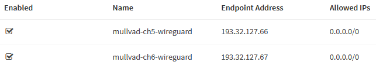
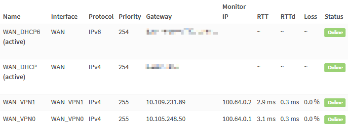
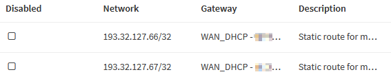
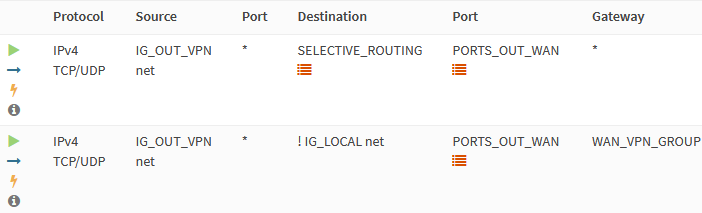
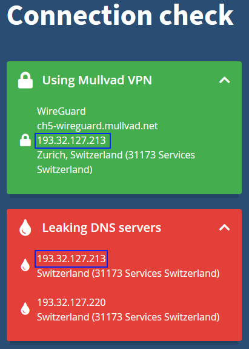
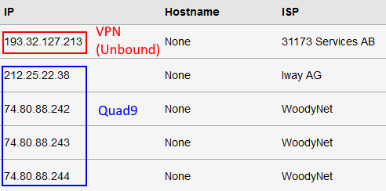

This beginner-friendly, step-by-step guide walks you through the initial configuration of your OPNsense firewall. The title of this guide is an homage to the [pfSense baseline guide with VPN, Guest, and VLAN support](https://nguvu.org/pfsense/pfsense-baseline-setup) that some of you guys might know, and this is an [OPNsense](https://opnsense.org) migration of it. I found that guide two years ago and immediately fell in love with the network setup. After researching for weeks, I decided to use OPNsense instead of pfSense. I bit the bullet and bought the [Deciso DEC630](https://www.deciso.com/product-catalog/dec630/) appliance. Albeit expensive and possibly overkill for my needs, I'm happy to support the open-source mission of Deciso, the maintainers of OPNsense. The only thing I regret about the purchase is that I now can't afford the sexier-looking successor model, the [DEC690](https://shop.opnsense.com/dec600-series-opnsense-desktop-security-appliances/).

To configure OPNsense, I followed the instructions of the pfSense guide, taking notes on the differences. Some options moved to different menus or changed. As my notes grew, I decided to publish them as a guide on my website.

My goal was to create a comprehensive guide that's easy to follow. But I tried to strike a different balance regarding the brevity of the instructions compared to the pfSense guide. It's a matter of personal taste, but I find the instructions in that guide too verbose. I intentionally omit most of the repetitive "click save and apply" instructions and only list configuration changes deviating from defaults, making exceptions for important settings. I consider the OPNsense defaults stable enough for this approach in the hope of keeping the effort required to maintain this guide to a minimum.

I'm a homelab hobbyist, so be warned that this guide likely contains errors. Please, verify the steps yourself and do your research. I hope this guide is as helpful and inspiring to you as the pfSense guide was to me. Your feedback is always welcome and very much appreciated.

## Overview

### WAN

- DHCP WAN from a single Internet Service Provider (ISP)
- [Mullvad VPN](https://mullvad.net) multi-WAN with gateway groups

### LAN

We segregate the local network into several areas with different requirements.

#### Management Network (VLAN 10)

The Management network connects native management interfaces like WiFi access points and IPMI interfaces.

#### VPN Network (VLAN 20)

The primary LAN network uses the WireGuard VPN tunnels for outbound connections, maximizing privacy and security. If the VPN tunnels fail, outbound connections won't be possible. Exceptions to selectively route traffic through the ISP WAN gateway are possible.

#### "Clear" Network (VLAN 30)

General-purpose web access network that doesn't use VPN tunnels. All outgoing connections leave through the ISP WAN gateway. It serves as a backup network in case the VPN tunnels fail.

#### Guest Network (VLAN 40)

The network that visitors use. It allows unrestricted internet access. Local networks aren't accessible.

#### LAN Network

"Native" VLAN, used to debug and test new configurations.

### DNS Services

We'll configure a DNS resolver (Unbound), as well as a DNS forwarder (Dnsmasq) in OPNsense. Management and VPN networks will use the resolver, the Clear network will use the forwarder, and the Guest network will use Cloudflare as an external DNS resolver. [We'll dig into the details later](#dns).

## Hardware Selection and Installation

The original pfSense guide features a [large section of hardware recommendations](https://nguvu.org/pfsense/pfsense-baseline-setup/#Hardware%20selection) and [installation instructions](https://nguvu.org/pfsense/pfsense-baseline-setup/#Install%20pfSense).

As mentioned earlier, I bought the [Deciso DEC630](https://www.deciso.com/product-catalog/dec630/) appliance, which is why I'm not advising on hardware choices. Have a look at the [official hardware sizing & setup guidelines](https://docs.opnsense.org/manual/hardware.html) for more information. See also [Initial Installation & Configuration](https://docs.opnsense.org/manual/install.html).

I verified this guide with a clean install of OPNsense version `21.7.5`.

## Wizard

Navigate to `192.168.1.1` in your browser and login with default credentials:

- **Username**: `root`
- **Password**: `opnsense`

Click `Next` to leave the welcome screen and get started with the initial wizard configuration.

### General Information


I prefer using the DNS servers of [Quad9](https://quad9.org/) over the ones of my ISP. Only the Clear network will use these anyway, as secured networks use Unbound instead. The Guest network will use Cloudflare DNS servers.

For the domain, I prefer to use a subdomain of a domain name I own, like `corp.example.com`. I only use this subdomain internally. I consider the `local.lan` pattern a relic of the past. To prevent our local network structure from leaking to the outside world, we'll later configure Unbound and Dnsmasq to treat the domain as private.

|                       |                    |
| --------------------- | ------------------ |
| Domain                | `corp.example.com` |
| Primary DNS Server    | `9.9.9.9`          |
| Secondary DNS Server  | `149.112.112.112`  |
| Override DNS          | `unchecked`        |
| Enable DNSSEC Support | `checked`          |
| Harden DNSSEC data    | `checked`          |

If you prefer using your ISP's DNS servers, leave the **Override DNS** option checked.

### Time Server Information

Choose the NTP servers geographically closest to your location. I live in Switzerland, which makes the [servers from the `ch.pool.ntp.org` pool](https://www.pool.ntp.org/zone/ch) the natural choice.

|                      |                                                                           |
| -------------------- | ------------------------------------------------------------------------- |
| Time server hostname | `0.ch.pool.ntp.org 1.ch.pool.ntp.org 2.ch.pool.ntp.org 3.ch.pool.ntp.org` |
| Timezone             | `Europe/Zurich`                                                           |

### Configure Interfaces

By default, the WAN interface obtains an IP address from your ISP via DHCP. DHCP is also configured for the LAN interface by default and has the IP `192.168.1.1`. It works for most people, so we just keep the defaults.

### Set Root Password

Choose a strong root password and complete the wizard.

## General Settings

### Access

Navigate to .

| HTTP Redirect                 |           |
| ----------------------------- | --------- |
| Disable web GUI redirect rule | `checked` |

Permitting root user login and password login is a quick and dirty way of enabling SSH access, but I strongly discourage you from doing it. They are disabled for security reasons. I highly recommend using certificate- or [key-based authentication](https://www.digitalocean.com/community/tutorials/how-to-configure-ssh-key-based-authentication-on-a-linux-server). If your device has a serial console port, like the Deciso DEC630, enabling SSH is not required.

| Secure Shell        |           |     |
| ------------------- | --------- | --- |
| Secure Shell Server | `checked` |     |

| Authentication |                |                                                         |
| -------------- | -------------- | ------------------------------------------------------- |
| Sudo           | `Ask password` | Permit sudo usage for administrators with shell access. |

Navigate to  and add a new user.

|                   |                              |
| ----------------- | ---------------------------- |
| Username          | `<choose a username>`        |
| Password          | `<choose a secure password>` |
| Login shell       | `/bin/csh`                   |
| Group Memberships | `admins`                     |
| Authorized keys   | `<valid SSH public key>`     |

Configuring the SSH client and generating keys is out of scope for this guide, so I'll just recommend this [DigitalOcean tutorial covering SSH essentials](https://www.digitalocean.com/community/tutorials/ssh-essentials-working-with-ssh-servers-clients-and-keys).

### Miscellaneous

Navigate to .

| Power Savings |              |
| ------------- | ------------ |
| Use PowerD    | `checked`    |
| Power Mode    | `Hiadaptive` |

Choose **Cryptography settings** and **Thermal Sensors** settings compatible with your hardware.

### Firewall Settings

Navigate to .

Although IPv6 is something I want to use, it's out of scope for this guide, so we uncheck the following.

|            |             |
| ---------- | ----------- |
| Allow IPv6 | `unchecked` |

When a rule uses a specific gateway and goes down, a rule gets created, sending traffic to the default gateway. Checking this option skips the creation of this rule.

| Gateway Monitoring |           |
| ------------------ | --------- |
| Skip rules         | `checked` |

Depending on your hardware, you might want to tweak the following settings to improve performance.

| Miscellaneous                  |                |                                                                                                                       |
| ------------------------------ | -------------- | --------------------------------------------------------------------------------------------------------------------- |
| Firewall Optimization          | `conservative` | Tries to avoid dropping any legitimate idle connections at the expense of increased memory usage and CPU utilization. |
| Firewall Maximum Table Entries | `2000000`      | default is 1'000'000                                                                                                  |

We disable the auto-generated anti-lockout rule because we'll define it manually later.

|                      |           |
| -------------------- | --------- |
| Disable anti-lockout | `checked` |

### Checksum Offloading

For some hardware, checksum offloading doesn't work, particularly some Realtek cards. Rarely, drivers may have problems with checksum offloading and some specific NICs. If your hardware is incompatible with checksum offloading, disable it.

Navigate to .

|              |             |                                   |
| ------------ | ----------- | --------------------------------- |
| Hardware CRC | `unchecked` | Disable hardware checksum offload |

## VLANs

### Switch Choice

A 802.1Q-capable switch with properly configured VLANs is required. Check my [router on a stick VLAN configuration guide](/posts/router-on-a-stick-vlan-configuration-with-swos-on-the-mikrotik-crs328-24p-4s+rm-switch) to see an example setup with a [Mikrotik](https://mikrotik.com/) switch.

### VLAN Definitions

Typically, the `LAN` port also carries the VLAN traffic and functions as [trunk port](https://www.techopedia.com/definition/27008/trunk-port). For me, the default is the `igb0` port. I chose it as the parent interface for all VLANs in the following steps.


Navigate to  and add the VLANs.

#### Management VLAN

|                  |                 |
| ---------------- | --------------- |
| Parent Interface | `igb0`          |
| VLAN tag         | `10`            |
| Description      | `VLAN10_MANAGE` |

#### VPN VLAN

|                  |              |
| ---------------- | ------------ |
| Parent Interface | `igb0`       |
| VLAN tag         | `20`         |
| Description      | `VLAN20_VPN` |

#### Clear VLAN

|                  |                |
| ---------------- | -------------- |
| Parent Interface | `igb0`         |
| VLAN tag         | `30`           |
| Description      | `VLAN30_CLEAR` |

#### Guest VLAN

|                  |                |
| ---------------- | -------------- |
| Parent Interface | `igb0`         |
| VLAN tag         | `40`           |
| Description      | `VLAN40_GUEST` |

### VLAN Interfaces

We add an interface for each VLAN. Navigate to .


- Select `vlan 10`, enter the description `VLAN10_MANAGE`, and click `+`
- Select `vlan 20`, enter the description `VLAN20_VPN`, and click `+`
- Select `vlan 30`, enter the description `VLAN30_CLEAR`, and click `+`
- Select `vlan 40`, enter the description `VLAN40_GUEST`, and click `+`

Click `Save`.

### VLAN Interface IPs

To easier remember which IP range belongs to which VLAN, I like the convention of matching the third octet of the IP with the VLAN ID. I.e., assigning the VLAN with the ID **10** the address 192.168.**10**.0/24.


#### Interface: VLAN10_MANAGE

Select the `VLAN10_MANAGE` interface.

|                         |                   |
| ----------------------- | ----------------- |
| Enable Interface        | `checked`         |
| IPv4 Configuration Type | `Static IPv4`     |
| IPv4 Address            | `192.168.10.1/24` |

Click `Save`.

#### Interface: VLAN20_VPN

|                         |                   |
| ----------------------- | ----------------- |
| Enable Interface        | `checked`         |
| IPv4 Configuration Type | `Static IPv4`     |
| IPv4 Address            | `192.168.20.1/24` |

#### Interface: VLAN30_CLEAR

|                         |                   |
| ----------------------- | ----------------- |
| Enable Interface        | `checked`         |
| IPv4 Configuration Type | `Static IPv4`     |
| IPv4 Address            | `192.168.30.1/24` |

#### Interface: VLAN40_GUEST

|                         |                   |
| ----------------------- | ----------------- |
| Enable Interface        | `checked`         |
| IPv4 Configuration Type | `Static IPv4`     |
| IPv4 Address            | `192.168.40.1/24` |

### VLAN Interface DHCP

We need to configure DHCP for each VLAN we created. I use `x.x.x.100-199` for dynamic and `x.x.x.10.10-99` for static IP address assignments. You might want to amend these ranges to your requirements.


Navigate to .

#### DHCP: VLAN10_MANAGE

Select `VLAN10_MANAGE`.

|        |                                           |
| ------ | ----------------------------------------- |
| Enable | `checked`                                 |
| Range  | from `192.168.10.100` to `192.168.10.199` |

Click `Save`.

#### DHCP: VLAN20_VPN

|        |                                           |
| ------ | ----------------------------------------- |
| Enable | `checked`                                 |
| Range  | from `192.168.20.100` to `192.168.20.199` |

#### DHCP: VLAN30_CLEAR

|        |                                           |
| ------ | ----------------------------------------- |
| Enable | `checked`                                 |
| Range  | from `192.168.30.100` to `192.168.30.199` |

#### DHCP: VLAN40_GUEST

|             |                                           |
| ----------- | ----------------------------------------- |
| Enable      | `checked`                                 |
| Range       | from `192.168.40.100` to `192.168.40.199` |
| DNS servers | `1.1.1.1` `1.0.0.1`                       |

#### DHCP: LAN

|       |                                         |
| ----- | --------------------------------------- |
| Range | from `192.168.1.100` to `192.168.1.199` |

## WireGuard VPN with Mullvad

In recent years, [Mullvad](https://mullvad.net/) has been my VPN provider of choice. When _That One Privacy Site_ was still a thing, Mullvad was one of the top recommendations there. After reading the review, I decided to try it out and haven't looked back since. No personally identifiable information is required to register, and paying cash via mail works perfectly.

I decided to go with [WireGuard](https://www.wireguard.com/) because I'm fine riding the bleeding edge. 😎 For more detailed steps, check the official OPNsense documentation on setting up [WireGuard with Mullvad](https://docs.opnsense.org/manual/how-tos/wireguard-client-mullvad.html) and [WireGuard selective routing](https://docs.opnsense.org/manual/how-tos/wireguard-selective-routing.html).

Please note that the FreeBSD kernel does not (yet) natively support WireGuard, so you must install it as a plugin. Possibly, this doesn't meet your stability, security, or performance requirements.

By default, the OPNsense plugin uses the Go implementation of WireGuard. But I couldn't get multi-WAN working with it. However, with the experimental WireGuard kernel module `wireguard-kmod`, it works. I only managed to get failover working, though. Load balancing doesn't seem to be supported yet.

Navigate to  and install `os-wireguard`. Refresh the browser and navigate to . Then SSH into OPNsense, run `pkg install wireguard-kmod`, and reboot.

### Remote Peers

Select your preferred WireGuard servers from the [Mullvad's server list](https://mullvad.net/en/servers/) and take note of their names and public keys. It's worth spending some time to benchmark server performance before making a choice.



Select the **Endpoints** tab and click **Add**. Here is the configuration for the remote `ch5-wireguard` Mullvad endpoint.

|                  |                                                |
| ---------------- | ---------------------------------------------- |
| Name             | `mullvad-ch5-wireguard`                        |
| Public key       | `/iivwlyqWqxQ0BVWmJRhcXIFdJeo0WbHQ/hZwuXaN3g=` |
| Allowed IPs      | `0.0.0.0/0`                                    |
| Endpoint Address | `193.32.127.66`                                |
| Endpoint Port    | `51820`                                        |
| Keepalive        | `25`                                           |

To mitigate risks against DNS poisoning, resolve the server's hostname and enter its IP as **Endpoint Address**. You can do this by running `nslookup ch5-wireguard.mullvad.net` in a shell.

Repeat the steps above to add another server, e.g., `ch6-wireguard`. Note that for all endpoint configurations, the **Endpoint Port** is `51820`.

### Local Peers

Select the **Local** tab, click `Add`, and enable the `advanced mode`.

|                |                 |
| -------------- | --------------- |
| Name           | `mullvad0`      |
| Listen Port    | `51820`         |
| Tunnel Address | `<LEAVE EMPTY>` |
| Peers          | `ch5-wireguard` |
| Disable Routes | `checked`       |
| Gateway        | `<LEAVE EMPTY>` |

Click `Save` to generate the WireGuard key pair. Click `Edit` and copy the generated **Public Key**. Next, run the following shell command.

```shell
curl -sSL https://api.mullvad.net/app/v1/wireguard-keys \
  -H "Content-Type: application/json" \
  -H "Authorization: Token <Mullvad account number>" \
  -d '{"pubkey":"<generated public key>"}'
```

This command returns a JSON response containing IPs without DNS hijacking enabled. I cover the snippet above and Mullvad's DNS hijacking in another post: [Use Custom DNS Servers With Mullvad And Any WireGuard Client](/posts/use-custom-dns-servers-with-mullvad-and-any-wireguard-client).

```json
{
  "id": "ufO5jCni55uvioHM%2FeLBgyrrUMocEXsADPc2OvYhF3k%3D",
  "pubkey": "ufO5jCni55uvioHM/eLBgyrrUMocEXsADPc2OvYhF3k=",
  "ipv4_address": "10.105.248.51/32",
  "ipv6_address": "fc00:bbbb:bbbb:bb01::2a:f832/128"
}
```

Copy the IPv4 IP address to the **Tunnel Address** field of the local peer. Subtract one from the **Tunnel Address** and enter the result as **Gateway** IP. E.g., `10.105.248.50` for the example above. It's just a convention I like, but you can use any arbitrary, unused [private RFC1918 IP](https://datatracker.ietf.org/doc/html/rfc1918).


Repeat the steps above to create a second local peer named `mullvad1`. Remember to use a _different_ **Listen Port** (e.g., `51821`).


When you finish, select the `General` tab. Check **Enable WireGuard**. You should see a handshake for the `wg0` and `wg1` tunnels on the **Handshakes** tab.

### WireGuard Interfaces

Navigate to .

- Select `wg0`, add the description `WAN_VPN0`, and click `+`
- Select `wg1`, add the description `WAN_VPN1`, and click `+`

Enable the newly created interfaces and restart the WireGuard service after. It ensures the interfaces get an IP address from WireGuard.

### VPN Gateways



Navigate to  and add the VPN gateways.

#### WAN_VPN0

|                            |                 |
| -------------------------- | --------------- |
| Name                       | `WAN_VPN0`      |
| Interface                  | `WAN_VPN0`      |
| Address Family             | `IPv4`          |
| IP Address                 | `10.105.248.50` |
| Far Gateway                | `checked`       |
| Disable Gateway Monitoring | `unchecked`     |
| Monitor IP                 | `100.64.0.1`    |

#### WAN_VPN1

|                            |                 |
| -------------------------- | --------------- |
| Name                       | `WAN_VPN1`      |
| Interface                  | `WAN_VPN1`      |
| Address Family             | `IPv4`          |
| IP Address                 | `10.109.231.89` |
| Far Gateway                | `checked`       |
| Disable Gateway Monitoring | `unchecked`     |
| Monitor IP                 | `100.64.0.2`    |

#### Monitoring IPs

Each VPN gateway requires a unique monitoring IP because setting a monitoring IP installs a static route. Optimally, the monitoring IP should be the least possible amount of hops away from the gateway. For Mullvad specifically, we can "abuse" the local infrastructure that's available through a Mullvad connection. Any of the following IPs are only _one_ hop away from the tunnel exit.

- `100.64.0.1` to `100.64.0.3` are [Mullvad's ad-blocking and tracker-blocking DNS service servers](https://mullvad.net/it/blog/2021/5/27/how-set-ad-blocking-our-app/)
- `10.64.0.1` is the local Mullvad gateway

You can easily verify the above by running `traceroute 100.64.0.1` from a host connected to Mullvad.

#### Add Static IPv4 Configuration to the WireGuard Interfaces

OPNsense versions newer than `21.7.3` require adding static IPv4 configuration to the WireGuard interface. Otherwise, Unbound will use the default route despite setting the **Outgoing Network Interfaces** option. Other solutions exist, but I'm not sure which the "best" or most logical one is. As WireGuard integration matures, this section hopefully becomes obsolete. [You can find more information regarding this issue on GitHub](https://github.com/opnsense/core/issues/5329#issuecomment-958397043).

Navigate to **Interfaces** and edit the WireGuard interfaces.

##### IP Configuration: WAN_VPN0

|                         |                            |
| ----------------------- | -------------------------- |
| IPv4 Configuration Type | `Static IPv4`              |
| IPv4 address            | `10.105.248.51/32`         |
| IPv4 Upstream Gateway   | `WAN_VPN0 - 10.105.248.50` |

##### IP Configuration: WAN_VPN1

|                         |                            |
| ----------------------- | -------------------------- |
| IPv4 Configuration Type | `Static IPv4`              |
| IPv4 address            | `10.109.231.90/32`         |
| IPv4 Upstream Gateway   | `WAN_VPN1 - 10.109.231.89` |

#### Gateway Group

Navigate to  and click `Add`.

|               |                               |
| ------------- | ----------------------------- |
| Group Name    | `WAN_VPN_GROUP`               |
| WAN_VPN0      | `Tier 1`                      |
| WAN_VPN1      | `Tier 2` (failover)           |
| Trigger Level | `Packet Loss or High Latency` |

It's also possible to configure failover or both.

### Static Routes (Optional)

Defining static routes for the tunnel gateways is optional. It would be necessary, for example, if we want to consider the VPN gateways as default gateway candidates. It requires static routes to the ISP WAN gateway to keep the tunnel connections alive.



Navigate to  and click `Add`.

|                 |                                               |
| --------------- | --------------------------------------------- |
| Network Address | `193.32.127.66/32`                            |
| Gateway         | `WAN_DHCP`                                    |
| Description     | `Keep tunnels to mullvad-ch5-wireguard alive` |

|                 |                                               |
| --------------- | --------------------------------------------- |
| Network Address | `193.32.127.67/32`                            |
| Gateway         | `WAN_DHCP`                                    |
| Description     | `Keep tunnels to mullvad-ch6-wireguard alive` |

## DNS


OPNsense includes a DNS _resolver_ (Unbound) and a DNS _forwarder_ (Dnsmasq / Unbound in forwarding mode). Simple setups usually use one of either, but we'll use both. Because we'll also use Unbound and Dnsmasq for internal DNS resolution, we don't want to use them for the Guest network, as this would expose our internal network structure. That's the reason why we earlier configured it to use Cloudflare DNS servers instead.

Like the name suggests, a DNS forwarder forwards DNS requests to an external DNS resolver of an ISP, Quad9, Cloudflare, or similar service provider. We'll configure the forwarder for the Clear network. In case the primary, secured networks lose connectivity, the Clear network can serve as a backup.

One of the advantages of self-hosting a DNS resolver is improved privacy. A resolver iteratively queries a chain of one or more DNS servers to resolve a request, so there isn't a single instance knowing all your DNS requests. It comes at the cost of speed when resolving a hostname for the first time. As Unbound's cache grows, the cost diminishes. We'll configure our primary networks to use Unbound.

We'll also keep DNS traffic from Unbound within the VPN tunnels. In the rare case of a VPN outage, we'll want local DNS services to fail and not leak through the ISP WAN. The reason for this isn't improved privacy as you might think. In some cases, this might even hurt your privacy. Why? Either your ISP or your VPN provider will see the iterative DNS requests Unbound sends. So it becomes a question of who you rather entrust with this data. But if there are no privacy benefits, why do it? Honestly, I don't require such a setup. I configured it for educational purposes and fun. Other reasons that don't affect me but other users are.

- ISP selling user data
- ISP enforcing censorship
- ISP hijacking DNS traffic to redirect it to their DNS resolver; this makes self-hosting a DNS resolver impossible

Let's summarize our goals.

- Use a DNS resolver for the management and VPN networks
- Resolve private domain hostnames for management and VPN networks
- Prevent DNS leaks from Unbound through the ISP WAN gateway
- Use DNS forwarding for the Clear network
- Use external DNS resolvers for the Guest network

### Resolver (Unbound)

Navigate to .

|                             |                                    |
| --------------------------- | ---------------------------------- |
| Network Interfaces          | `LAN` `VLAN10_MANAGE` `VLAN20_VPN` |
| DNSSEC                      | `checked`                          |
| DHCP registration           | `checked`                          |
| DHCP static mappings        | `checked`                          |
| Local Zone Type             | `static`                           |
| Outgoing Network Interfaces | `WAN_VPN0` `WAN_VPN1`              |

Navigate to .

|                          |           |
| ------------------------ | --------- |
| Hide Identity            | `checked` |
| Hide Version             | `checked` |
| Prefetch Support         | `checked` |
| Prefetch DNS Key Support | `checked` |
| Harden DNSSEC data       | `checked` |

The final step is to add a custom [SOA record](https://www.cloudflare.com/learning/dns/dns-records/dns-soa-record/) to the local zone making Unbound the authoritative name server for `corp.example.com`. This way, we prevent Unbound from querying external name servers for the internal domain and exposing our network structure to the outside world. For [advanced Unbound configuration like this](https://docs.opnsense.org/manual/unbound.html#advanced-configurations), we use [Templates](https://docs.opnsense.org/development/backend/templates.html).

Connect to OPNsense via serial console or SSH and add a `+TARGETS` file by running `sudo vi /usr/local/opnsense/service/templates/OPNsense/Unbound/+TARGETS` containing:

```text
private_domains.conf:/usr/local/etc/unbound.opnsense.d/private_domains.conf
```

Add the template file by running `sudo vi /usr/local/opnsense/service/templates/OPNsense/Unbound/private_domains.conf` containing:

```text
server:
  local-data: "corp.example.com. 3600 IN SOA opnsense.corp.example.com. root.example.com. 2021110201 86400 7200 3600000 3600"
```

Here is a translation of what the SOA record means.

|                     |                             |
| ------------------- | --------------------------- |
| Name                | `corp.example.com`          |
| Record Type         | `SOA`                       |
| Primary Name Server | `opnsense.corp.example.com` |
| Administrator Email | `root@example.com`          |
| Serial              | `2021110201` (YYMMDDnn)     |
| Refresh             | `86400` (24 hours)          |
| Retry               | `7200` (2 hours)            |
| Expire              | `3600000` (1000 hours)      |
| TTL                 | `3600` (1 hour)             |

Run the following to verify the configuration.

```shell
# generate template
configctl template reload OPNsense/Unbound
# show generated file
cat /usr/local/etc/unbound.opnsense.d/private_domains.conf
# check if configuration is valid
configctl unbound check
```

### Forwarder (Dnsmasq)

Dnsmasq will forward DNS requests to the configured system DNS servers and `127.0.0.1` (Unbound). Earlier, you either explicitly configured them or decided to receive the DNS servers via DHCP from your ISP. Because Unbound already uses port 53, we'll use port 5335 for Dnsmasq. We'll later create rules to port forward DNS traffic to this port.

Navigate to .

|                                        |           |
| -------------------------------------- | --------- |
| Enable                                 | `checked` |
| Listen Port                            | `5335`    |
| Do not forward private reverse lookups | `checked` |

Forward reverse DNS lookups in the `192.168.0.0/16` range to Unbound by adding the following **Domain Override**s. We additionally make Unbound the authoritative DNS server for `corp.example.com`.

| Domain                 | IP             | Description                                                  |
| ---------------------- | -------------- | ------------------------------------------------------------ |
| `168.192.in-addr.arpa` | `192.168.20.1` | Forward reverse lookups of private IP addresses to Unbound   |
| `corp.example.com`     | `192.168.20.1` | Make Unbound the authoritative DNS server for private domain |

## Firewall

Here is an overview of what we want to implement with firewall rules.

- Allow internet access for specific ports through WAN and VPN
- Allow intranet communications
- Redirect outbound DNS traffic to either Unbound or Dnsmasq
- Redirect NTP traffic to OPNsense
- Block intranet access for the Guest network

|                  | VLAN10  | VLAN20              | VLAN30  | VLAN40   | LAN      |
| ---------------- | ------- | ------------------- | ------- | -------- | -------- |
| **Internet**     | WAN     | VPN + selective WAN | WAN     | WAN      | WAN      |
| **Intranet**     | pass    | pass                | pass    | block    | pass     |
| **ICMP**         | pass    | pass                | pass    | pass     | pass     |
| **Anti-lockout** | yes     | no                  | no      | no       | yes      |
| **DNS**          | Unbound | Unbound             | Dnsmasq | external | Unbound  |
| **NTP**          | local   | local               | local   | external | external |

### Interface Groups

We use [interface groups](https://docs.opnsense.org/manual/firewall_groups.html) to apply policies to multiple interfaces at once and reduce the number of required firewall rules significantly. Do not use them for WAN interfaces because they don't use the `reply-to` directive!

I'm honestly not sure if I went overboard with interface groups and over-abstracted things. Currently, I'm happy with the configuration, and I guess only time will tell how maintainable this approach is. I'd like to know what you think and would very much appreciate your feedback.


Navigate to  and add the following interface groups.

#### IG_LOCAL

|             |                                                                  |
| ----------- | ---------------------------------------------------------------- |
| Name        | `IG_LOCAL`                                                       |
| Description | `All local interfaces`                                           |
| Members     | `LAN` `VLAN10_MANAGE` `VLAN20_VPN` `VLAN30_CLEAR` `VLAN40_GUEST` |

#### IG_OUT_WAN

|             |                                                     |
| ----------- | --------------------------------------------------- |
| Name        | `IG_OUT_WAN`                                        |
| Description | `Interfaces allowing outbound WAN traffic`          |
| Members     | `LAN` `VLAN10_MANAGE` `VLAN30_CLEAR` `VLAN40_GUEST` |

#### IG_OUT_VPN

|             |                                                                               |
| ----------- | ----------------------------------------------------------------------------- |
| Name        | `IG_OUT_VPN`                                                                  |
| Description | `Interfaces allowing outbound VPN traffic and selective outbound WAN traffic` |
| Members     | `VLAN20_VPN`                                                                  |

#### IG_DNS_RESOLVE

|             |                                    |
| ----------- | ---------------------------------- |
| Name        | `IG_DNS_RESOLVE`                   |
| Description | `Interfaces forced to use Unbound` |
| Members     | `VLAN10_MANAGE` `VLAN20_VPN`       |

#### IG_DNS_FORWARD

|             |                                    |
| ----------- | ---------------------------------- |
| Name        | `IG_DNS_FORWARD`                   |
| Description | `Interfaces forced to use Dnsmasq` |
| Members     | `VLAN30_CLEAR`                     |

#### IG_NTP

|             |                                                   |
| ----------- | ------------------------------------------------- |
| Name        | `IG_NTP`                                          |
| Description | `Interfaces forced to use OPNsense as NTP server` |
| Members     | `VLAN10_MANAGE` `VLAN20_VPN` `VLAN30_CLEAR`       |

### Aliases

We define a few reusable [aliases](https://docs.opnsense.org/manual/aliases.html) that help us condense our firewall rules. Some of them might become hard to maintain as they grow, in which case you might want to consider nesting aliases.


Navigate to  and create the following aliases.

#### Selective Routing Addresses

Services like banks might object to traffic originating from known VPN endpoints. We selectively route traffic from the VPN VLAN through the default WAN gateway.

|             |                                                                 |
| ----------- | --------------------------------------------------------------- |
| Name        | `SELECTIVE_ROUTING`                                             |
| Type        | `Host(s)`                                                       |
| Description | `External hosts reachable from IG_OUT_VPN networks through WAN` |

If you're having issues with a service not working due to VPN, add the hostname to this alias, e.g., `netflix.com`.

#### Admin / Anti-lockout Ports

|             |                            |
| ----------- | -------------------------- |
| Name        | `PORTS_ANTI_LOCKOUT`       |
| Type        | `Port(s)`                  |
| Content     | `443` (Web GUI) `22` (SSH) |
| Description | `OPNsense admin ports`     |

#### Ports Allowed To Communicate Between VLANs

Allowed ports for intranet traffic. Amend the list depending on your needs.

|             |                              |
| ----------- | ---------------------------- |
| Name        | `PORTS_OUT_LAN`              |
| Type        | `Port(s)`                    |
| Description | `Ports allowed for intranet` |

Content:

- `53` DNS
- `5353:5354` mDNS
- `123` NTP
- `21` FTP
- `22` SSH
- `161` SNMP
- `80` HTTP
- `8080`: HTTP alt / UniFi device and application communication
- `443` HTTPS
- `8443` HTTPS alt / UniFi application GUI/API as seen in a web browser
- `8880` UniFi HTTP portal redirection
- `10001` UniFi device discovery
- `5001` iPerf
- `623` IPMI
- `5900` VNC
- `3389` RDP
- `49152:65535` ephemeral ports

#### Ports Allowed to Communicate with the Internet

Allow ports for _egress_ internet traffic. Amend the list depending on your needs.

|             |                              |
| ----------- | ---------------------------- |
| Name        | `PORTS_OUT_WAN`              |
| Type        | `Port(s)`                    |
| Description | `Ports allowed for internet` |

Content:

- `21` FTP
- `22` SSH
- `80` HTTP
- `8080` HTTP alt
- `443` HTTPS
- `8443` HTTPS alt
- `465` SMTPS
- `587`: SMTPS
- `993`: IMAPS
- `49152:65535` ephemeral ports

### NAT

Network Address Translation (NAT) is required to translate private to public IP addresses. We have the following requirements.

- Translate `IG_OUT_WAN` and `IG_OUT_VPN` network addresses to the `WAN` address range. Translating `IG_OUT_VPN` to `WAN` allows selective routing.
- Translate `IG_OUT_VPN` network addresses to the `WAN_VPN0` address range.


Navigate to .

Select `Manual outbound NAT rule generation` and add the following rules.

#### IG_OUT_WAN to WAN

|                |                     |
| -------------- | ------------------- |
| Interface      | `WAN`               |
| Source address | `IG_OUT_WAN net`    |
| Description    | `IG_OUT_WAN to WAN` |

#### IG_OUT_VPN to WAN

|                |                     |
| -------------- | ------------------- |
| Interface      | `WAN`               |
| Source address | `IG_OUT_VPN net`    |
| Description    | `IG_OUT_VPN to WAN` |

#### IG_OUT_VPN to WAN_VPN0

|                |                          |
| -------------- | ------------------------ |
| Interface      | `WAN_VPN0`               |
| Source address | `IG_OUT_VPN net`         |
| Description    | `IG_OUT_VPN to WAN_VPN0` |

#### IG_OUT_VPN to WAN_VPN1

|                |                          |
| -------------- | ------------------------ |
| Interface      | `WAN_VPN1`               |
| Source address | `IG_OUT_VPN net`         |
| Description    | `IG_OUT_VPN to WAN_VPN1` |

### Rules

Navigate to .

#### Anti-Lockout

Before adding any other rules, we add the anti-lockout ones on the `VLAN10_MANAGE` and `LAN` networks, so we can't lock ourselves out. 😅


Select **Floating** and add the following rule.

|                        |                       |
| ---------------------- | --------------------- |
| Action                 | `Pass`                |
| Interface              | `LAN` `VLAN10_MANAGE` |
| Protocol               | `TCP/UDP`             |
| Source                 | `any`                 |
| Destination            | `This Firewall`       |
| Destination port range | `PORTS_ANTI_LOCKOUT`  |
| Description            | `Anti-lockout`        |

`This Firewall` is a pre-defined alias representing all interface addresses of OPNsense.

#### Allow Intranet Pings

We allow ICMP pings for the entire local network. Pings are maliciously abusable, so you may want to put stricter rules into place if required.


Select **IG_LOCAL** and add the following rule.

|                |                        |
| -------------- | ---------------------- |
| Action         | `Pass`                 |
| Interface      | `IG_LOCAL`             |
| TCP/IP Version | `IPv4`                 |
| Protocol       | `ICMP`                 |
| ICMP type      | `Echo Request`         |
| Source         | `IG_LOCAL net`         |
| Description    | `Allow intranet pings` |

#### Reject Intranet Traffic By Default

By default, we _reject_ traffic on local interfaces instead of _blocking_ it. _Block_ drops packets silently. _Reject_ returns a "friendly" response to the sender. To be able to override this rule, unchecking **Quick** is crucial! To use [Firewall Logs](https://docs.opnsense.org/manual/logging_firewall.html) to review blocked ports and amend our port list alias if necessary, we enable logging on this rule.

Select **IG_LOCAL** and add the following rule.

|                |                                      |
| -------------- | ------------------------------------ |
| Action         | `Reject`                             |
| **Quick**      | `unchecked`                          |
| Interface      | `IG_LOCAL`                           |
| TCP/IP Version | `IPv4+IPv6`                          |
| Protocol       | `any`                                |
| Source         | `IG_LOCAL net`                       |
| Log            | `checked`                            |
| Description    | `Reject intranet traffic by default` |

#### Allow Intranet Traffic

We only allow intranet traffic on the ports defined in the `PORTS_OUT_LAN` alias. We'll override this rule for the `VLAN40_GUEST` network later, so we must uncheck the **Quick** option again. For the Management network, you might want to consider stricter rules, as well.

Select **IG_LOCAL** and add the following rule.

|                        |                          |
| ---------------------- | ------------------------ |
| Action                 | `Pass`                   |
| **Quick**              | `unchecked`              |
| Interface              | `IG_LOCAL`               |
| Protocol               | `TCP/UDP`                |
| Source                 | `IG_LOCAL net`           |
| Destination            | `IG_LOCAL net`           |
| Destination port range | `PORTS_OUT_LAN`          |
| Description            | `Allow intranet traffic` |

#### Allow Internet Traffic

We allow internet traffic on `PORTS_OUT_WAN` for `IG_OUT_WAN` networks.


Select **IG_OUT_WAN** and add the following rule.

|                        |                                      |
| ---------------------- | ------------------------------------ |
| Action                 | `Pass`                               |
| **Quick**              | `unchecked`                          |
| Interface              | `IG_OUT_WAN`                         |
| Protocol               | `TCP/UDP`                            |
| Source                 | `IG_OUT_WAN net`                     |
| Destination / Invert   | `checked`                            |
| Destination            | `IG_LOCAL net`                       |
| Destination port range | `PORTS_OUT_WAN`                      |
| Description            | `Allow internet traffic through WAN` |

We later want to enable unrestricted internet access on the Guest network, so make sure to uncheck the **Quick** option!

Next, we allow internet traffic on `PORTS_OUT_WAN` for the `IG_OUT_VPN` networks.



Select **IG_OUT_VPN** and add the following rules to configure selective routing.

|                        |                                               |
| ---------------------- | --------------------------------------------- |
| Action                 | `Pass`                                        |
| Interface              | `IG_OUT_VPN`                                  |
| Protocol               | `TCP/UDP`                                     |
| Source                 | `IG_OUT_VPN net`                              |
| Destination            | `SELECTIVE_ROUTING`                           |
| Destination port range | `PORTS_OUT_WAN`                               |
| Description            | `Allow selected internet traffic through WAN` |

|                        |                                           |
| ---------------------- | ----------------------------------------- |
| Action                 | `Pass`                                    |
| Protocol               | `TCP/UDP`                                 |
| Source                 | `IG_OUT_VPN net`                          |
| Destination / Invert   | `checked`                                 |
| Destination            | `IG_LOCAL net`                            |
| Destination port range | `PORTS_OUT_WAN`                           |
| Description            | `Allow internet traffic through WAN_VPN0` |
| Gateway                | `WAN_VPN_GROUP`                           |

#### Restrict Guest Network

Select **VLAN40_GUEST** and add the following rules.


To block Web GUI and SSH access from the Guest network, we block traffic to any OPNsense interface on the `PORTS_ANTI_LOCKOUT` ports. We enable logging for this rule to be able to see if any guests try to access OPNsense.

|                        |                      |
| ---------------------- | -------------------- |
| Action                 | `Block`              |
| Interface              | `VLAN40_GUEST`       |
| Protocol               | `TCP/UDP`            |
| Source                 | `VLAN40_GUEST net`   |
| Destination            | `This Firewall`      |
| Destination port range | `PORTS_ANTI_LOCKOUT` |
| Log                    | `checked`            |
| Description            | `Block admin ports`  |

We block access to other local networks and also enable logging for the rule.

|             |                                   |
| ----------- | --------------------------------- |
| Action      | `Block`                           |
| Interface   | `VLAN40_GUEST`                    |
| Protocol    | `TCP/UDP`                         |
| Source      | `VLAN40_GUEST net`                |
| Destination | `IG_LOCAL net`                    |
| Log         | `checked`                         |
| Description | `Block traffic to local networks` |

Finally, we enable unrestricted internet access on Guest networks.

|                      |                                |
| -------------------- | ------------------------------ |
| Action               | `Pass`                         |
| Interface            | `VLAN40_GUEST`                 |
| Protocol             | `TCP/UDP`                      |
| Source               | `VLAN40_GUEST net`             |
| Destination / Invert | `checked`                      |
| Destination          | `IG_LOCAL net`                 |
| Description          | `Unrestricted internet access` |

#### LAN Network For Testing And Debugging

I just keep the pre-defined "LAN to any" rules. I periodically reconfigure this network for testing and debugging and don't use it for anything else.


#### Redirect Outbound DNS Traffic

To prevent clients from explicitly querying outbound DNS and leaking information to the outside, we redirect any outbound DNS traffic to Unbound or Dnsmasq.


Navigate to  and add the following rules.

|                        |                                       |
| ---------------------- | ------------------------------------- |
| Interface              | `IG_DNS_FORWARD`                      |
| Protocol               | `TCP/UDP`                             |
| Source                 | `IG_DNS_FORWARD net`                  |
| Destination            | `any`                                 |
| Destination port range | `DNS`                                 |
| Redirect target IP     | `127.0.0.1`                           |
| Redirect target port   | `5335`                                |
| Description            | `Redirect any DNS traffic to Dnsmasq` |

|                        |                                            |
| ---------------------- | ------------------------------------------ |
| Interface              | `IG_DNS_RESOLVE`                           |
| Protocol               | `TCP/UDP`                                  |
| Source                 | `IG_DNS_RESOLVE net`                       |
| Destination / Invert   | `checked`                                  |
| Destination            | `IG_DNS_RESOLVE net`                       |
| Destination port range | `DNS`                                      |
| Redirect target IP     | `127.0.0.1`                                |
| Redirect target port   | `DNS`                                      |
| Description            | `Redirect outbound DNS traffic to Unbound` |

#### Redirect Outbound NTP Traffic

To sync the time of all our devices on the network to OPNsense, we redirect all NTP traffic.


Navigate to  and add the following rule.

|                        |                                             |
| ---------------------- | ------------------------------------------- |
| Interface              | `IG_NTP`                                    |
| Protocol               | `UDP`                                       |
| Source                 | `IG_NTP net`                                |
| Destination / Invert   | `checked`                                   |
| Destination            | `IG_NTP net`                                |
| Destination port range | `NTP`                                       |
| Redirect target IP     | `127.0.0.1`                                 |
| Redirect target port   | `NTP`                                       |
| Description            | `Redirect outbound NTP traffic to OPNsense` |

## Test

Now would be a could time to reboot OPNsense to make sure all settings are applied.

### Test DHCP

Connect to a host in each VLAN and verify it receives an IP inside the specified DHCP range. Here is the output of the `ip -4 addr show eth0` command from a Ubuntu host connected to the VPN VLAN.

```text
8: eth0: <BROADCAST,MULTICAST,UP> mtu 1500 group default qlen 1
    inet 192.168.20.106/24 brd 192.168.20.255 scope global dynamic
       valid_lft 7196sec preferred_lft 7196sec
```

### Test DNS

We have to verify the following functionality of our DNS architecture:

- `VLAN20_VPN`
  - Unbound _resolves_ remote and local hostname lookups
  - Redirect outbound DNS traffic to Unbound
  - Reverse lookups of private IPs
  - Don't leak lookups for the private `corp.example.com` domain
- `VL30_CLEAR`
  - Dnsmasq _forwards_ remote hostname lookups to the system DNS servers like Quad9 _and_ Unbound
  - Forward local hostname lookups to Unbound
  - Redirect outbound DNS traffic to Dnsmasq
  - Forward local reverse lookups of private IPs to Unbound
  - Don't leak lookups for the private `corp.example.com` domain and forward them to Unbound
- `VL40_GUEST`
  - Use external DNS resolvers
  - Allow for clients to override DNS
  - OPNsense lookups are blocked

We'll use the `dig` tool and the firewall logs under  for testing.

I'll also skip the Management network because it requires the same testing as the VPN network.

#### VLAN20_VPN: Test DNS

Connect to `VLAN20_VPN`.

##### VLAN20_VPN: Remote Hostname Lookups

Run `dig california.gov`:

```text
; <<>> DiG 9.16.1-Ubuntu <<>> california.gov
;; global options: +cmd
;; Got answer:
;; ->>HEADER<<- opcode: QUERY, status: NOERROR, id: 41004
;; flags: qr rd ra ad; QUERY: 1, ANSWER: 1, AUTHORITY: 0, ADDITIONAL: 1

;; OPT PSEUDOSECTION:
; EDNS: version: 0, flags:; udp: 1232
;; QUESTION SECTION:
;california.gov.                        IN      A

;; ANSWER SECTION:
california.gov.         300     IN      A       63.196.102.29

;; Query time: 36 msec
;; SERVER: 192.168.20.1#53(192.168.20.1)
;; WHEN: Tue Nov 16 22:37:34 CET 2021
;; MSG SIZE  rcvd: 59
```

Here are the firewall logs showing the iterative DNS requests Unbound sends.


##### VLAN20_VPN: Local Hostname Lookups

Run `dig opnsense.corp.example.com`:

```text
; <<>> DiG 9.16.1-Ubuntu <<>> opnsense.corp.example.com
;; global options: +cmd
;; Got answer:
;; ->>HEADER<<- opcode: QUERY, status: NOERROR, id: 22291
;; flags: qr aa rd ra; QUERY: 1, ANSWER: 3, AUTHORITY: 0, ADDITIONAL: 1

;; OPT PSEUDOSECTION:
; EDNS: version: 0, flags:; udp: 1232
;; QUESTION SECTION:
;opnsense.corp.example.com.  IN      A

;; ANSWER SECTION:
opnsense.corp.example.com. 3600 IN   A       192.168.1.1
opnsense.corp.example.com. 3600 IN   A       192.168.10.1
opnsense.corp.example.com. 3600 IN   A       192.168.20.1

;; Query time: 0 msec
;; SERVER: 192.168.20.1#53(192.168.20.1)
;; WHEN: Tue Nov 16 21:48:19 CET 2021
;; MSG SIZE  rcvd: 105
```

##### VLAN20_VPN: Redirect Outbound DNS Traffic

Run `dig opnsense.org @8.8.8.8`:

```text
; <<>> DiG 9.16.1-Ubuntu <<>> opnsense.org @8.8.8.8
;; global options: +cmd
;; Got answer:
;; ->>HEADER<<- opcode: QUERY, status: NOERROR, id: 17970
;; flags: qr rd ra ad; QUERY: 1, ANSWER: 1, AUTHORITY: 0, ADDITIONAL: 1

;; OPT PSEUDOSECTION:
; EDNS: version: 0, flags:; udp: 1232
;; QUESTION SECTION:
;opnsense.org.                  IN      A

;; ANSWER SECTION:
opnsense.org.           184     IN      A       178.162.131.118

;; Query time: 0 msec
;; SERVER: 8.8.8.8#53(8.8.8.8)
;; WHEN: Tue Nov 16 21:51:15 CET 2021
;; MSG SIZE  rcvd: 57
```

`dig` can't tell that OPNsense hijacked the request and thus displays an incorrect `SERVER` value. If you check the firewall logs, you shouldn't see any requests to `8.8.8.8`. Instead, you should see iterative root server requests.

##### VLAN20_VPN: Reverse Lookups of Private IPs

Run `dig -x 192.168.20.1`:

```text
; <<>> DiG 9.16.1-Ubuntu <<>> -x 192.168.20.1
;; global options: +cmd
;; Got answer:
;; ->>HEADER<<- opcode: QUERY, status: NOERROR, id: 9264
;; flags: qr aa rd ra; QUERY: 1, ANSWER: 1, AUTHORITY: 0, ADDITIONAL: 1

;; OPT PSEUDOSECTION:
; EDNS: version: 0, flags:; udp: 1232
;; QUESTION SECTION:
;1.20.168.192.in-addr.arpa.     IN      PTR

;; ANSWER SECTION:
1.20.168.192.in-addr.arpa. 3600 IN      PTR     OPNsense.corp.example.com.

;; Query time: 0 msec
;; SERVER: 192.168.20.1#53(192.168.20.1)
;; WHEN: Tue Nov 16 21:56:14 CET 2021
;; MSG SIZE  rcvd: 96
```

If you want, additionally reverse-lookup an IP that doesn't exist. The firewall logs mustn't contain requests to external DNS servers.

##### VLAN20_VPN: Verify `corp.example.com` Is Private

To test whether OPNsense is the authoritative server for `corp.example.com`, we lookup a non-existent hostname in that domain. `dig` should return an authoritative `NXDOMAIN` response with the SOA record we earlier defined earlier in the `AUTHORITY SECTION`.

Run `dig nowhere.corp.example.com`:

```text
; <<>> DiG 9.16.1-Ubuntu <<>> nowhere.corp.example.com
;; global options: +cmd
;; Got answer:
;; ->>HEADER<<- opcode: QUERY, status: NXDOMAIN, id: 44590
;; flags: qr aa rd ra; QUERY: 1, ANSWER: 0, AUTHORITY: 1, ADDITIONAL: 1

;; OPT PSEUDOSECTION:
; EDNS: version: 0, flags:; udp: 1232
;; QUESTION SECTION:
;nowhere.corp.example.com.   IN      A

;; AUTHORITY SECTION:
corp.example.com.    3600    IN      SOA     opnsense.corp.example.com. root.example.com. 2021110201 86400 7200 3600000 3600

;; Query time: 0 msec
;; SERVER: 192.168.20.1#53(192.168.20.1)
;; WHEN: Tue Nov 16 21:59:58 CET 2021
;; MSG SIZE  rcvd: 110
```

##### VLAN20_VPN: DNS Leak Test

In your browser, navigate to [dnsleaktest.com](https://dnsleaktest.com/) or [mullvad.net/check](https://mullvad.net/en/check/). We expect the "leaked" DNS server to match our Mullvad public Mullvad IP. The second leak is from the **Outgoing Interface** we configured for Unbound:



#### VLAN30_CLEAR: Test DNS

Connect to `VLAN30_CLEAR`.

##### VLAN30_CLEAR: Remote Hostname Lookups

Run `dig opnsense.org`:

```text
; <<>> DiG 9.16.1-Ubuntu <<>> opnsense.org
;; global options: +cmd
;; Got answer:
;; ->>HEADER<<- opcode: QUERY, status: NOERROR, id: 65053
;; flags: qr rd ra; QUERY: 1, ANSWER: 1, AUTHORITY: 0, ADDITIONAL: 1

;; OPT PSEUDOSECTION:
; EDNS: version: 0, flags:; udp: 1232
;; QUESTION SECTION:
;opnsense.org.                  IN      A

;; ANSWER SECTION:
opnsense.org.           596     IN      A       178.162.131.118

;; Query time: 5 msec
;; SERVER: 192.168.30.1#53(192.168.30.1)
;; WHEN: Tue Nov 16 16:45:08 CET 2021
;; MSG SIZE  rcvd: 57
```

Check the firewall logs. Enable logging for the port forward rule if you want it to show up.


You can see that Dnsmasq forwards to the DNS servers defined under  _and_ Unbound.

##### VLAN30_CLEAR: Local Hostname Lookups

Run `dig opnsense.corp.example.com`:

```text
; <<>> DiG 9.16.1-Ubuntu <<>> opnsense.corp.example.com
;; global options: +cmd
;; Got answer:
;; ->>HEADER<<- opcode: QUERY, status: NOERROR, id: 61385
;; flags: qr aa rd ra; QUERY: 1, ANSWER: 1, AUTHORITY: 0, ADDITIONAL: 1

;; OPT PSEUDOSECTION:
; EDNS: version: 0, flags:; udp: 4096
;; QUESTION SECTION:
;opnsense.corp.example.com.  IN      A

;; ANSWER SECTION:
opnsense.corp.example.com. 1 IN      A       192.168.1.1

;; Query time: 0 msec
;; SERVER: 192.168.30.1#53(192.168.30.1)
;; WHEN: Wed Nov 17 00:45:49 CET 2021
;; MSG SIZE  rcvd: 73
```

##### VLAN30_CLEAR: Redirect Outbound DNS Traffic

Run `dig opnsense.org @8.8.8.8`:

```text
; <<>> DiG 9.16.1-Ubuntu <<>> opnsense.org @8.8.8.8
;; global options: +cmd
;; Got answer:
;; ->>HEADER<<- opcode: QUERY, status: NOERROR, id: 34638
;; flags: qr rd ra; QUERY: 1, ANSWER: 1, AUTHORITY: 0, ADDITIONAL: 1

;; OPT PSEUDOSECTION:
; EDNS: version: 0, flags:; udp: 1232
;; QUESTION SECTION:
;opnsense.org.                  IN      A

;; ANSWER SECTION:
opnsense.org.           430     IN      A       178.162.131.118

;; Query time: 3 msec
;; SERVER: 8.8.8.8#53(8.8.8.8)
;; WHEN: Tue Nov 16 00:12:15 CET 2021
;; MSG SIZE  rcvd: 57
```

We confirm it works by looking at the firewall logs again:


##### VLAN30_CLEAR: Forward Reverse Lookups of Private IPs to Unbound

Run `dig -x 192.168.20.1`:

```text
; <<>> DiG 9.16.1-Ubuntu <<>> -x 192.168.20.1
;; global options: +cmd
;; Got answer:
;; ->>HEADER<<- opcode: QUERY, status: NOERROR, id: 20607
;; flags: qr aa rd ra; QUERY: 1, ANSWER: 1, AUTHORITY: 0, ADDITIONAL: 1

;; OPT PSEUDOSECTION:
; EDNS: version: 0, flags:; udp: 1232
;; QUESTION SECTION:
;1.20.168.192.in-addr.arpa.     IN      PTR

;; ANSWER SECTION:
1.20.168.192.in-addr.arpa. 3600 IN      PTR     OPNsense.home.schnerring.net.

;; Query time: 1 msec
;; SERVER: 192.168.30.1#53(192.168.30.1)
;; WHEN: Wed Nov 17 00:09:05 CET 2021
;; MSG SIZE  rcvd: 96
```

The firewall logs confirm it works.


##### VLAN30_CLEAR: Verify `corp.example.com` Is Private

Run `dig nowhere.corp.example.com`:

```text
; <<>> DiG 9.16.1-Ubuntu <<>> nowhere.corp.example.com
;; global options: +cmd
;; Got answer:
;; ->>HEADER<<- opcode: QUERY, status: NXDOMAIN, id: 7481
;; flags: qr aa rd ra; QUERY: 1, ANSWER: 0, AUTHORITY: 1, ADDITIONAL: 1

;; OPT PSEUDOSECTION:
; EDNS: version: 0, flags:; udp: 1232
;; QUESTION SECTION:
;nowhere.corp.example.com. IN      A

;; AUTHORITY SECTION:
corp.example.com.    3600    IN      SOA     opnsense.corp.example.com. root.example.com. 2021110201 86400 7200 3600000 3600

;; Query time: 0 msec
;; SERVER: 192.168.30.1#53(192.168.30.1)
;; WHEN: Tue Nov 16 20:44:35 CET 2021
;; MSG SIZE  rcvd: 112
```

This time, requests will only be forwarded to Unbound, but not external DNS resolvers.


##### VLAN30_CLEAR: DNS Leak Test

As we saw earlier, we expect the Quad9 _and_ the Mullvad public IPs to leak. Here is the result of an extended test from [dnsleaktest.com](https://dnsleaktest.com/):



#### VLAN40_GUEST: Test DNS

Connect to `VLAN40_GUEST`.

Verify that `dig opnsense.org @192.168.40.1` times out.

The Cloudflare DNS servers you configured in the DHCP settings of the Guest VLAN should show up when running the leak test:


## Thanks For Reading ❤️

If you're here, I thank you for reading all this! Any feedback is highly appreciated.

When I decided to write this guide, I didn't think it would take soooo long. I worked on it intensively for the better part of a month. I spent like a week configuring Unbound to use WireGuard tunnels, only to find out that [I couldn't get it working due to a bug](https://github.com/opnsense/core/issues/5329). But it was all worth it and a fulfilling journey — I have learned so much OPNsense and networking. But I'm also happy to be able to put this aside for a while. 🎉

So what's next?

Let's Encrypt certificates and [HAProxy](https://docs.opnsense.org/manual/how-tos/haproxy.html) to secure self-hosted services. I imagine configuring it should be pretty straightforward.

Me and possibly others want to be able to access my home network from the outside via WireGuard. I have a dynamic IP, so I thought I'd have to resort to [Dynamic DNS](https://docs.opnsense.org/manual/dynamic_dns.html). But I think [port forwarding with Mullvad](https://mullvad.net/en/help/port-forwarding-and-mullvad/) is the better solution and doesn't require me to associate my public IP address with a public DNS record.

[Traffic shaping](https://docs.opnsense.org/manual/shaping.html) and [intrusion prevention](https://docs.opnsense.org/manual/ips.html) is something I want to look into, too.

So yeah, OPNsense and I will be friends for a while. 👫
