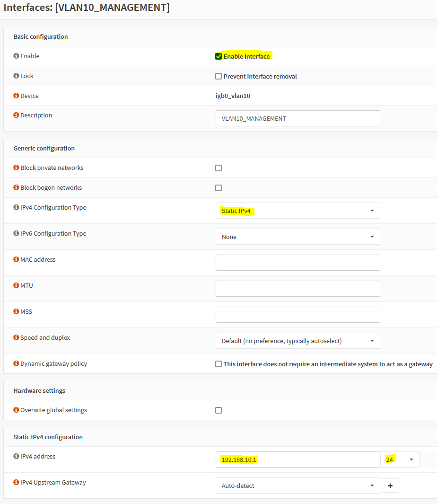
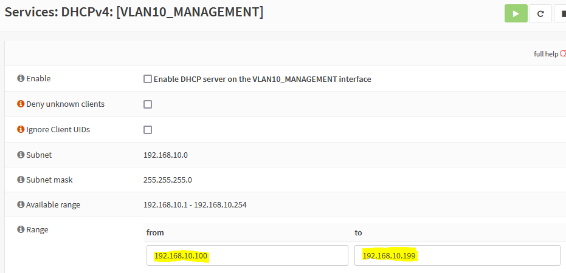
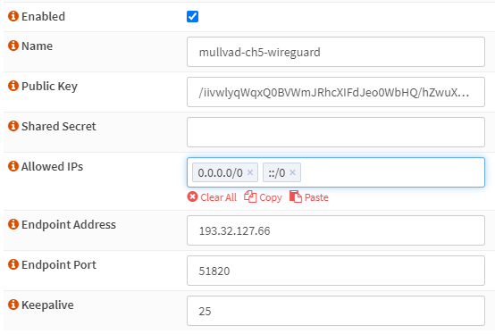
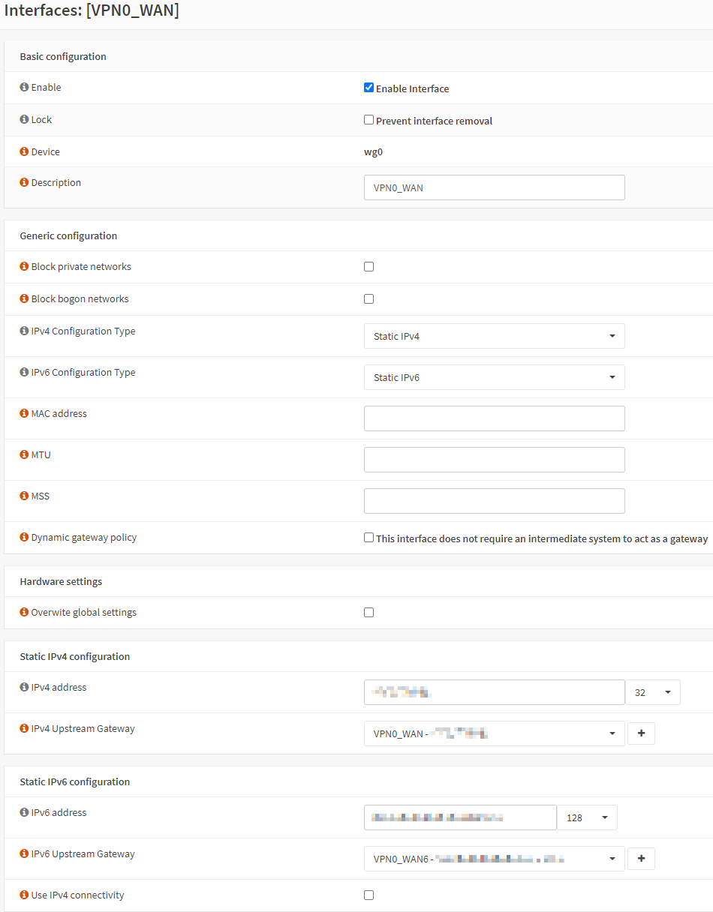

## Interface Creation And Configuration

### Create VLANs

We need to identify the physical parent interface which transfers all VLAN traffic. Typically an assignment to the logical `LAN` interface already exists, connecting your switch to the OPNsense router. In my case that's `igb0`.

Navigate to `Interfaces` &rarr; `Other Types` &rarr; `VLAN`.

#### Management VLAN

1. Click `+`:
2. `Parent Interface`: the parent interface, e.g. `igb0`
3. `VLAN tag`: `10`
4. `Description`: `VLAN10_MANAGE`
5. Click `Save`

#### VPN VLAN

1. Click `+`:
2. `Parent Interface`: the parent interface, e.g. `igb0`
3. `VLAN tag`: `20`
4. `Description`: `VLAN20_VPN`
5. Click `Save`

#### Clear VLAN

1. Click `+`:
2. `Parent Interface`: the parent interface, e.g. `igb0`
3. `VLAN tag`: `30`
4. `Description`: `VLAN30_CLEAR`
5. Click `Save`

#### Guest VLAN

1. Click `+`:
2. `Parent Interface`: the parent interface, e.g. `igb0`
3. `VLAN tag`: `40`
4. `Description`: `VLAN40_GUEST`
5. Click `Save`

### Create Logical Interfaces

For each VLAN, create a logical interface. Navigate to `Interfaces` &rarr; `Assignments`

1. Select `vlan 10`, add the description `VLAN10_MANAGE`, and click `+`
2. Select `vlan 20`, add the description `VLAN20_VPN`, and click `+`
3. Select `vlan 30`, add the description `VLAN30_CLEAR`, and click `+`
4. Select `vlan 40`, add the description `VLAN40_GUEST`, and click `+`
5. Click `Save`

### Configure Interface IP Addresses

To easier remember which IP range belongs to which VLAN, a common approach is to match an octet of the IP range with the VLAN ID. E.g., the VLAN with the ID **10** would have a range of 192.168.**10**.0/24.



Navigate to `Interfaces` &rarr; `Assignments`.

#### VLAN10_MANAGE Interface

1. Navigate to `VLAN10_MANAGE`
2. `Enable Interface`
3. `IPv4 Configuration Type`: `Static IPv4`
4. `IPv4 Address`: `192.168.10.1/24`
5. Click `Save` and `Apply changes` when prompted

#### VLAN20_VPN Interface

1. Navigate to `VLAN20_VPN`
2. `Enable Interface`
3. `IPv4 Configuration Type`: `Static IPv4`
4. `IPv4 Address`: `192.168.20.1/24`
5. Click `Save` and `Apply changes` when prompted

#### VLAN30_CLEAR Interface

1. Navigate to `VLAN30_CLEAR`
2. `Enable Interface`
3. `IPv4 Configuration Type`: `Static IPv4`
4. `IPv4 Address`: `192.168.30.1/24`
5. Click `Save` and `Apply changes` when prompted

#### VLAN40_GUEST Interface

1. Navigate to `VLAN40_GUEST`
2. `Enable Interface`
3. `IPv4 Configuration Type`: `Static IPv4`
4. `IPv4 Address`: `192.168.40.1/24`
5. Click `Save` and `Apply changes` when prompted

### Configure Interface DHCP

Depending on your needs, you might have to adjust the DHCP ranges. For my homelab I chose `x.x.x.100-199` for dynamic addresses and `x.x.x.10.10-99` for static addresses.



Navigate to `Services` &rarr; `DHCPv4`.

#### VLAN10_MANAGE DHCP

1. Select `VLAN10_MANAGE`
2. Check `Enable DHCP server on the VLAN10_MANAGE interface`
3. Configure the `Range` from `192.168.10.100` to `192.168.10.199`
4. Click `Save`

#### VLAN20_VPN DHCP

1. Select `VLAN20_VPN`
2. Check `Enable DHCP server on the VLAN20_VPN interface`
3. Configure the `Range` from `192.168.20.100` to `192.168.20.199`
4. Click `Save`

#### VLAN30_CLEAR DHCP

1. Select `VLAN30_CLEAR`
2. Check `Enable DHCP server on the VLAN30_CLEAR interface`
3. Configure the `Range` from `192.168.30.100` to `192.168.30.199`
4. Click `Save`

#### VLAN40_GUEST DHCP

1. Select `VLAN40_GUEST`
2. Check `Enable DHCP server on the VLAN40_GUEST interface`
3. Configure the `Range` from `192.168.40.100` to `192.168.40.199`
4. Click `Save`

## VPN Configuration

In recent years, I've been using [Mullvad](https://mullvad.net/) as a VPN provider. When _That One Privacy Site_ was still a thing, Mullvad was one of the top recommendations in the reviews. I decided to try it out and haven't looked back since. No personally identifiable information is required to register, and paying cash via mail works perfectly.

I decided to go with the [WireGuard Road Warrior](https://docs.opnsense.org/manual/how-tos/wireguard-client.html) setup since I think WireGuard is the VPN protocol of the future. For more detailed steps, check the [official OPNsense documentation on setting up WireGuard with Mullvad](https://docs.opnsense.org/manual/how-tos/wireguard-client-mullvad.html). We'll also configure failover with two separate tunnels in case one goes down.

WireGuard is not (yet) a native part of FreeBSD, so you must install it as a plugin. Navigate to `System` &rarr; `Firmware` &rarr; `Plugins` and install `os-wireguard`.

After refreshing the browser, navigate to `VPN` &rarr; `WireGuard`.

### Setup the Endpoint (Client Peer)



Select one or more WireGuard servers from [Mullvad's server list](https://mullvad.net/en/servers/) and take note of their name and public key.

1. Select the `Endpoints` tab
2. Click `Add`
3. `Name`: e.g., `mullvad-ch5-wireguard`
4. `Public Key`: e.g, `/iivwlyqWqxQ0BVWmJRhcXIFdJeo0WbHQ/hZwuXaN3g=`
5. `Allowed IPs`: `0.0.0.0/0`, `::/0`
6. `Endpoint Address`: `<server name>.mullvad.net` e.g., `ch5-wireguard.mullvad.net`
7. `Endpoint Port`: `51820`
8. Click `Save`

Repeat the steps above and add another server, e.g., `ch6-wireguard`. If you want to mitigate the risk against DNS poisoning, enter the resolved IP as `Endpoint Address` instead of the hostname.

### Setup the Local Peer (Server)


1. Select the `Local` tab
2. Click `Add`
3. Enable `advanced mode`
4. `Name`: e.g., `mullvad0`
5. `Listen Port`: `51820`
6. `DNS Server`: `193.138.218.74` (public Mullvad DNS)
7. `Tunnel Address`: leave empty for now
8. `Peers`: e.g., `ch5-wireguard`
9. Click `Save`
10. Click `Edit` and copy the generated `Public Key`
11. Check `Disable Routes`

The following command will output an IPv4 and IPv6 IP address:

```shell
curl -sSL https://api.mullvad.net/wg/ -d account=<account number> --data-urlencode pubkey=<public key>
```

Replace the `Tunnel Address` with these IP addresses.

Repeat the steps above to create a second local peer named `mullvad1`. Don't forget to use a different `Listen Port`, e.g. `51821`.

Next, select the `General` tab and check `Enable WireGuard`. Check whether handshakes for the `wg0` and `wg1` tunnels appear on the `Handshakes` tab.

### WireGuard Interface Assignments and Addressing

Next, we assign the WireGuard tunnels to interfaces.



Navigate to `Interfaces` &rarr; `Assignments`.

1. Select `wg0`, add the description `VPN0_WAN`, and click `+`
2. Select `wg1`, add the description `VPN1_WAN`, and click `+`

#### VPN0 Interface

1. Navigate to `VPN0_WAN`
2. `Enable Interface`
3. `IPv4 Configuration Type`: `Static IPv4`
4. `IPv4 Address`: IPv4 address of the `mullvad0` local peer
5. `IPv4 Upstream Gateway`
   1. Click `+`
   2. `Gateway Name`: `VPN0_WAN`
   3. `Gateway IPv4`: IPv4 address of the `mullvad0` local peer
   4. Click `Save` and select the new gateway
6. `IPv6 Configuration Type`: `Static IPv6`
7. `IPv6 Address`: IPv6 address of the `mullvad0` local peer
8. `IPv6 Upstream Gateway`
   1. Click `+`
   2. `Gateway Name`: `VPN0_WAN6`
   3. `Gateway IPv6`: IPv6 address of the `mullvad0` local peer
   4. Click `Save` and select the new gateway
9. Click `Save` and `Apply changes`

#### VPN1 Interface

1. Navigate to `VPN1_WAN`
2. `Enable Interface`
3. `IPv4 Configuration Type`: `Static IPv4`
4. `IPv4 Address`: IPv4 address of the `mullvad1` local peer
5. `IPv4 Upstream Gateway`
   1. Click `+`
   2. `Gateway Name`: `VPN1_WAN`
   3. `Gateway IPv4`: IPv4 address of the `mullvad1` local peer
   4. Click `Save` and select the new gateway
6. `IPv6 Configuration Type`: `Static IPv6`
7. `IPv6 Address`: IPv6 address of the `mullvad1` local peer
8. `IPv6 Upstream Gateway`
   1. Click `+`
   2. `Gateway Name`: `VPN1_WAN6`
   3. `Gateway IPv6`: IPv6 address of the `mullvad1` local peer
   4. Click `Save` and select the new gateway
9. Click `Save` and `Apply changes`

### Configure Gateway Monitoring

Since the gateway address uses the local address of the tunnel, the gateway will always be online. Hence, failover will never occur, even if a WireGuard endpoint is unreachable. To mitigate this issue, configure a remote monitor IP for the gateway. It's best to use highly reliable services like Cloudflare for this.

Navigate to `System` &rarr; `Gateways` &rarr; `Single`

1. `Edit` the `VPN0_WAN` gateway, enter `1.1.1.1` as `Monitor IP`, and click `Save`
2. `Edit` the `VPN1_WAN` gateway, enter `1.0.0.1` as `Monitor IP`, and click `Save`
3. `Edit` the `VPN0_WAN6` gateway, enter `2606:4700:4700::1111` as `Monitor IP`, and click `Save`
4. `Edit` the `VPN1_WAN6` gateway, enter `2606:4700:4700::1001` as `Monitor IP`, and click `Save`
5. Click `Apply changes`

### Configure Gateway Failover

Navigate to `System` &rarr; `Gateways` &rarr; `Group`

#### IPv4 Gateway Failover

1. Click `+`
2. `Group Name`: `VPN_GROUP`
3. `VPN0_WAN`: `Tier 1`
4. `VPN1_WAN`: `Tier 1`
5. `Trigger Level`: `Packet Loss or High Latency`
6. Click `Save` and `Apply changes`

#### IPv6 Gateway Failover

1. Click `+`
2. `Group Name`: `VPN_GROUP6`
3. `VPN0_WAN6`: `Tier 1`
4. `VPN1_WAN6`: `Tier 1`
5. `Trigger Level`: `Packet Loss or High Latency`
6. Click `Save` and `Apply changes`

## DNS

We make use of three DNS resolvers to provide name resolution across the network:

- **Cloudflare DNS** for the guest network, supporting WAN failover
- **DNS Forwarder (Dnsmasq DNS)** for the Clear network. Unbound handles local lookups, and Quad9 handles external lookups with some privacy
- **DNS Resolver (Unbound)** will be the authoritative name server for the private `internal.example.com` domain, so names as part of that domain are not forwarded to external DNS preventing information leakage

The design of the system:

- Support multiple gateways
- Enable local device lookups for all non-guest interfaces
- Prevent information leaking to the ISP
- Prevent IP leaks by using VPN
- Keep DNS queries within the VPN tunnel from secured networks
- Optimize local performance with DNS lookup caching

Local devices only use OPNsense as DNS server. Cached and local names lookup results from Unbound. Unknown names are resolved recursively from Quad9 (Clear) or Mullvad (VPN) DNS servers. Unbound will only use the VPN_WAN interface, so DNS lookups won't be possible, which is why Clear and Guest networks serve as backups.

### Configure DNS Resolver (Unbound)

Navigate `Services` &rarr; `Unbound DNS` &rarr; `General`

- `Show advanced options`
- `Enable Unbound`
- `Listen Port`: `53`
- `Network Interfaces`: `LAN`, `VLAN10_MANAGE`, `VLAN20_VPN`
- Check `Enable DNSSec Support`
- Check `Register DHCP static mappings` to make using DHCP reservations more convenient
- `Local Zone Type`: `static`
- `Outgoing Network Interfaces`: `VPN0_WAN`, `VPN1_WAN`

Navigate to `Services` &rarr; `Unbound DNS` &rarr; `Advanced`

- Check `Prefetch Support`
- Check `Prefetch DNS Key Support`
- Check `Harden DNSSEC data`

We also need to tell Unbound not to query external name servers for the private `internal.example.com` domain. We need to add a custom [SOA record](https://www.cloudflare.com/learning/dns/dns-records/dns-soa-record/) overriding the authoritative name server. We'll make use of [templates](https://docs.opnsense.org/development/backend/templates.html) to for [advanced Unbound configuration](https://docs.opnsense.org/manual/unbound.html#advanced-configurations). To configure them, you need to access OPNsense through either SSH or the serial console.

Add a `+TARGETS` file by running `vi /usr/local/opnsense/service/templates/sampleuser/Unbound/+TARGETS` with the content:

```text
private_domains.conf:/usr/local/etc/unbound.opnsense.d/private_domains.conf
```

Add the template file by running `vi /usr/local/opnsense/service/templates/sampleuser/Unbound/private_domains.conf` with the content:

```text
server:
  private-domain: internal.example.com
  local-data: "internal.example.com. 10800 IN SOA opnsense.internal.example.com. root.example.com. 1 3600 1200 604800 10800"
```

Run the following to verify the configuration:

```shell
# generate template
configctl template reload sampleuser/Unbound
# show generated file
cat /usr/local/etc/unbound.opnsense.d/private_domains.conf
# check if configuration is valid
configctl unbound check
```

## Firewall

### Interface Groups

[Interface groups](https://docs.opnsense.org/manual/firewall_groups.html) can be used to add policies to multiple interfaces at once. Do not use them for WAN interfaces, since they don't receive `reply-to`.

Navigate to `Firewall` &rarr; `Groups`

- Click `+`
- `Name`: `LAN_INTERFACES`
- `Description`: `Local LAN interfaces`
- `Members`: `LAN`, `VLAN10_MANAGE`, `VLAN20_VPN`, `VLAN30_CLEAR`, `VLAN40_GUEST`
- Click `Save`

### Aliases

To simplify the creation and maintenance of firewall rules, we define a few reusable [aliases]().

Navigate to `Firewall` &rarr; `Aliases`

#### Local Network

- Click `+`
- `Name`: `LAN_NETWORK`
- `Type`: `Network(s)`
- `Content`: `192.168.0.0/16`
- `Description`: `Local network IP range 192.168.0.0-192.168.255.255`
- Click `Save`

#### Selective Routing Addresses

Services like banks might object to traffic originating from known VPN end points, so some traffic from the VPN VLAN must be selectively routed through the WAN gateway.

- Click `+`
- `Name`: `SELECTIVE_ROUTING`
- `Type`: `Host(s)`
- `Description`: `Specific external hosts for which traffic is routed through the WAN gateway`
- Click `Save`

#### Admin / Anti-lockout Ports

- Click `+`
- `Name`: `ADMIN_PORTS`
- `Type`: `Port(s)`
- `Content`: `443` (Web UI), `22` (SSH, if desired)
- `Description`: `Ports used for anti-lockout rules`
- Click `Save`

#### Ports Allowed To Communicate Between VLANs

A list of ports allowing traffic between local VLANs. The following will get you started but require changes depending on your needs. Use [Firewall Logs](https://docs.opnsense.org/manual/logging_firewall.html) to review blocked ports.

- Click `+`
- `Name`: `OUT_PORTS_LAN`
- `Type`: `Port(s)`
- `Content`:
  - `53` DNS
  - `5353:5354` mDNS
  - `123` NTP
  - `21` FTP
  - `22` SSH
  - `161` SNMP
  - `80` HTTP
  - `8080`: HTTP alt / UniFi device and application communication
  - `443` HTTPS
  - `8443` HTTPS alt / UniFi application GUI/API as seen in a web browser
  - `8880` UniFi HTTP portal redirection
  - `8843` UniFi HTTPS portal redirection
  - `10001` UniFi device discovery
  - `5001` iperf
  - `5900` IPMI
  - `3389` RDP
  - `49152:65535` ephemeral ports
- `Description`: `VLAN egress ports`
- Click `Save`

#### Ports Allowed to Communicate with the Internet

A list of ports allowing egress traffic to the internet. The following will get you started but require changes depending on your needs. Use [Firewall Logs](https://docs.opnsense.org/manual/logging_firewall.html) to review blocked ports.

- Click `+`
- `Name`: `OUT_PORTS_WAN`
- `Type`: `Port(s)`
- `Content`:
  - `21` FTP
  - `22` SSH
  - `80` HTTP
  - `8080` HTTP alt
  - `443` HTTPS
  - `8443` HTTPS alt
  - `465` SMTPS
  - `587`: SMTPS
  - `993`: IMAPS
  - `49152:65535` ephemeral ports
- `Description`: `WAN egress ports`
- Click `Save`

---

Click `Apply`

### NAT

NAT translates private to public IP addresses. We need to set this up for both the WAN and the VPN gateways:

- All VLANs are translated to the WAN address range
- VPN VLAN is translated to VPN_WAN and WAN ranges (selective routing)

Navigate to **Firewall** &rarr; **NAT** &rarr; **Outbound**

- Select `Manual outbound NAT rule generation`
- Click `Save` and `Apply changes`

If there are any rules, go ahead and delete them. Then add the following rules:

#### localhost to WAN

- Click `+`
- `Interface`: `WAN`
- `Source address`: `Loopback net`
- `Description`: `localhost to WAN`

#### LAN_INTERFACES to WAN

- Click `+`
- `Interface`: `WAN`
- `Source address`: `LAN_INTERFACES net`
- `Description`: `LAN_INTERFACES to WAN`

#### VLAN20_VPN to VPN0_WAN

- Click `+`
- `Interface`: `VPN0_WAN`
- `Source address`: `VLAN20_VPN net`
- `Description`: `VLAN20_VPN to VPN0_WAN`

#### VLAN20_VPN to VPN1_WAN

- Click `+`
- `Interface`: `VPN1_WAN`
- `Source address`: `VLAN20_VPN net`
- `Description`: `VLAN20_VPN to VPN1_WAN`

### Rules

Navigate to `Firewall` &rarr; `Rules`

#### LAN_INTERFACES Rules

These rules apply to any local interface.

Select `LAN_INTERFACES`.

##### ICMP Debugging

By default all VLANs allow ICMP pings from anywhere for debugging

- Click `Add`
- `Action`: `Pass`
- `TCP/IP Version`: `IPv4`
- `Protocol`: `ICMP`
- `ICMP type`: `Echo Request`
- `Source`: `LAN_INTERFACES net`
- `Description`: `Allow inter-VLAN pings`

##### Default Reject Rule

By default we reject (not block) traffic on local interfaces. This provides a response to applications, preventing them to await lengthy timeouts.

- Click `Add`
- `Action`: `Reject`
- Uncheck `Quick`
- `TCP/IP Version`: `IPv4+IPv6`
- `Protocol`: `any`
- `Source`: `LAN_INTERFACES net`
- `Description`: `Default reject rule for local interfaces`

#### VLAN30_CLEAR Rules

Requirements for the unencrypted, "clearnet" interface:

- allow traffic to local networks on allowed ports
- allow internet traffic on allowed ports via default gateway
- redirect non-local NTP time lookups
- redirect non-local DNS lookups to DNS forwarder
- reject any other traffic
