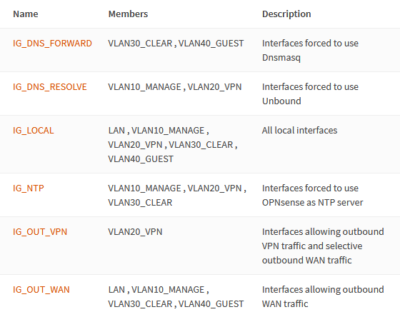
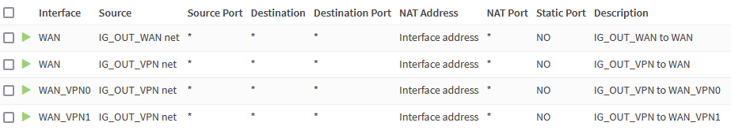
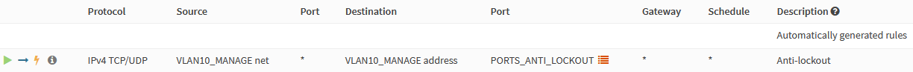
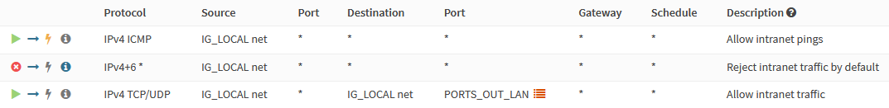
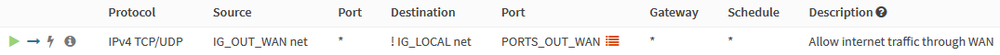
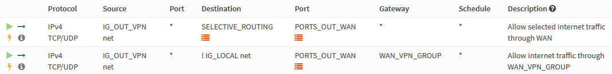
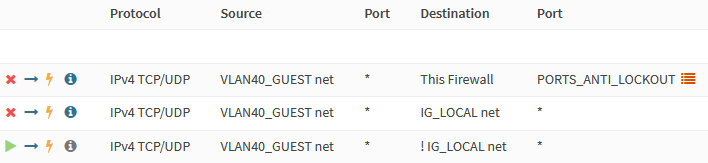
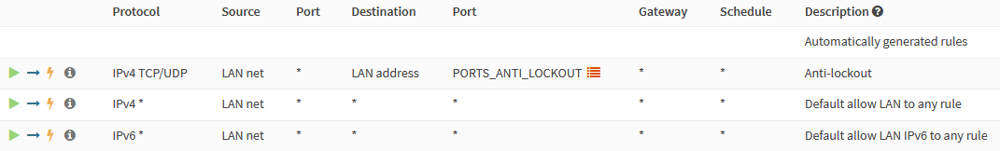
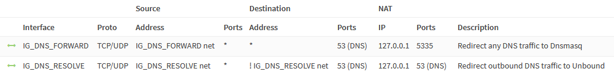
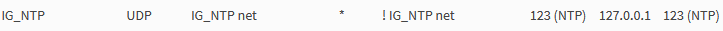

This beginner-friendly, step-by-step guide walks you through the initial configuration of your OPNsense firewall. The title of this guide is an homage to the amazing [pfSense baseline guide with VPN, Guest and VLAN support](https://nguvu.org/pfsense/pfsense-baseline-setup) that some of you guys might know, and this is an OPNsense migration of it. I found that guide two years ago and immediately fell in love with the network setup. After researching for weeks, I decided to use [OPNsense](https://opnsense.org/) instead of pfSense. I bit the bullet and bought the [Deciso DEC630](https://www.deciso.com/product-catalog/dec630/) appliance. Albeit expensive, and possibly overkill for my needs, I'm happy to support the open-source mission of Deciso, the maintainers of OPNsense.

I followed the instructions of the pfSense guide to configure OPNsense and took notes on the differences. Some options moved to different menus, some options were deprecated, and some stuff was outdated. As my notes grew, I decided to publish them as a guide on my website.

My goal was to create a beginner-friendly, comprehensive guide that's easy to follow. But I tried to strike a different balance in regards to brevity of the instructions compared to the pfSense guide. It's a matter of personal taste, but I find the instructions in that guide too verbose. I intentionally omit a lot of the repetitive "click save and apply" instructions and only list configuration changes deviating from defaults, making some exceptions for very important settings. I consider the OPNsense defaults to be stable enough for this approach and hope to keep the effort required to maintain this guide to a minimum.

I'm a homelab hobbyist, so be warned that this guide likely contains errors. Please, verify the steps yourself and do your own research. I hope this guide is as helpful and inspiring to you as the pfSense guide was to me. Your feedback is always welcome and very much appreciated.

## Network Topology

### WAN

- DHCP WAN from a single Internet Service Provider (ISP)
- [Mullvad VPN](https://mullvad.net) multi-gateway load balancing

### LAN

We segregate the local network into several areas with different requirements.

#### Management Network (VLAN 10)

The management network connects to management interfaces like WiFi access points, IPMI interfaces and headless servers.

#### VPN Network (VLAN 20)

The primary LAN network where traffic is load-balanced across multiple WireGuard VPN tunnels, maximizing privacy and security. If the VPN tunnels fail, outbound connections won't be possible. Specific exceptions can be configured to selectively route traffic out the ISP WAN gateway instead.

#### "Clear" Network (VLAN 30)

General purpose web access where encryption isn't required or possible and outgoing connections are routed out the ISP WAN gateway. It mostly serves as a backup network in case of the VPN connections going down.

#### Guest Network (VLAN 40)

An unsecured network used by visitors. Access to other VLANs and user devices is denied.

#### LAN Network

"Native" VLAN, used to debug an test new configurations.

### DNS Servers

We'll configure a DNS resolver (Unbound), as well as a DNS forwarder (Dnsmasq) on OPNsense. Secure primary networks will use the resolver and secondary networks the forwarder. [We'll dig into the details later](#dns).

## Hardware Selection and Installation

The original pfSense guide features a [large section of hardware recommendations](https://nguvu.org/pfsense/pfsense-baseline-setup/#Hardware%20selection) and [installation instructions](https://nguvu.org/pfsense/pfsense-baseline-setup/#Install%20pfSense).

As already mentioned earlier, I bought the [Deciso DEC630](https://www.deciso.com/product-catalog/dec630/) appliance from Deciso which is why I'm not advising on hardware choices. Have a look on the [official hardware sizing & setup guidelines](https://docs.opnsense.org/manual/hardware.html) for more information. See also [Initial Installation & Configuration](https://docs.opnsense.org/manual/install.html).

## Initial Wizard Configuration

Navigate to `192.168.1.1` in your browser and login with default credentials:

- 
- 

Click `Next` to leave the welcome screen and get started.

### Wizard: General Information


I prefer using the DNS servers of [Quad9](https://quad9.org/) over the ones of my ISP. Only the clear and guest networks use these anyway, as secured networks use Unbound instead. If your ISP awards DNS servers via DHCP and you prefer to use those, you can leave `Override DNS` checked.

For the domain, I prefer to use an subdomain of a domain name I own and only use it internally. I consider the `local.lan` pattern a relic of the past. To prevent the structure of our local network being leaked, we'll configure Unbound to to treat `corp.example.com` as private domain.

|                       |                    |
| --------------------- | ------------------ |
| Domain                | `corp.example.com` |
| Primary DNS Server    | `9.9.9.9`          |
| Secondary DNS Server  | `149.112.112.112`  |
| Override DNS          | `unchecked`        |
| Enable DNSSEC Support | `checked`          |
| Harden DNSSEC data    | `checked`          |

If you prefer using your ISP's DNS servers, leave the **Override DNS** option checked.

### Wizard: Time Server Information

Choose the NTP servers geographically closest to your location. I'm based in Switzerland which makes the [servers from the `ch.pool.ntp.org` pool](https://www.pool.ntp.org/zone/ch) the natural choice.

|                      |                                                                           |
| -------------------- | ------------------------------------------------------------------------- |
| Time server hostname | `0.ch.pool.ntp.org 1.ch.pool.ntp.org 2.ch.pool.ntp.org 3.ch.pool.ntp.org` |
| Timezone             | `Europe/Zurich`                                                           |

### Wizard: Configure WAN / LAN Interfaces

By default, the WAN interface is configured to obtain an IP via DHCP from your ISP. DHCP is also configured for the LAN interface by default and has the IP `192.168.1.1`. This works for most people, so we just keep the defaults.

### Wizard: Set Root Password

Choose a strong root password and complete the wizard.

## General Settings

### Access

Navigate to .

| HTTP Redirect                 |           |
| ----------------------------- | --------- |
| Disable web GUI redirect rule | `checked` |

Permitting root user login and password login is a quick and dirty way of enabling SSH access, but I strongly discourage you from using it. For good reasons both options are disabled by default and certificate- or [key-based authentication](https://www.digitalocean.com/community/tutorials/how-to-configure-ssh-key-based-authentication-on-a-linux-server) are recommended. If your device has a serial console port, like the Deciso DEC630, enabling SSH is not required.

| Secure Shell        |           |     |
| ------------------- | --------- | --- |
| Secure Shell Server | `checked` |     |

| Authentication |                |                                                         |
| -------------- | -------------- | ------------------------------------------------------- |
| Sudo           | `Ask password` | Permit sudo usage for administrators with shell access. |

Navigate to  and add a new user.

|                   |                              |
| ----------------- | ---------------------------- |
| Username          | `<choose a username>`        |
| Password          | `<choose a secure password>` |
| Login shell       | `/bin/csh`                   |
| Group Memberships | `admins`                     |
| Authorized keys   | `<valid SSH public key>`     |

Configuring the SSH client and generating keys is out of scope for this guide, so I'll just refer to a [good DigitalOcean tutorial covering SSH essentials](https://www.digitalocean.com/community/tutorials/ssh-essentials-working-with-ssh-servers-clients-and-keys).

### Miscellaneous

Navigate to .

| Power Savings |              |
| ------------- | ------------ |
| Use PowerD    | `checked`    |
| Power Mode    | `Hiadaptive` |

Verify **Cryptography settings** and **Thermal Sensors** settings are compatible with your hardware.

### Firewall Settings

Navigate to .

Although IPv6 is something I want to use, it's out of scope for this guide, so we uncheck the following:

|            |             |
| ---------- | ----------- |
| Allow IPv6 | `unchecked` |

By default, when a rule has a specific gateway set, and this gateway is down, a rule is created and traffic is sent to default gateway. This option overrides that behavior and the rule is not created when the gateway is down.

| Gateway Monitoring |           |
| ------------------ | --------- |
| Skip rules         | `checked` |

Successive connections will be redirected to the servers in a round-robin manner with connections from the same source being sent to the same gateway. This "sticky connection" will exist as long as there are states that refer to this connection. Once the states expire, so will the sticky connection. Further connections from that host will be redirected to the next gateway in the round-robin.

| Multi-WAN          |           |
| ------------------ | --------- |
| Sticky connections | `checked` |

Depending on your hardware, you might want to tweak the following settings to improve performance.

| Miscellaneous                  |                |                                                                                                                       |
| ------------------------------ | -------------- | --------------------------------------------------------------------------------------------------------------------- |
| Firewall Optimization          | `conservative` | Tries to avoid dropping any legitimate idle connections at the expense of increased memory usage and CPU utilization. |
| Firewall Maximum Table Entries | `2000000`      | default is 1'000'000                                                                                                  |

We disable the auto-generated anti-lockout rule, because we'll define it manually later.

|                      |           |
| -------------------- | --------- |
| Disable anti-lockout | `checked` |

### Checksum Offloading

Checksum offloading is broken in some hardware, particularly some Realtek cards. Rarely, drivers may have problems with checksum offloading and some specific NICs. If your hardware is incompatible with checksum offloading, disable it.

Navigate to .

|              |             |                                   |
| ------------ | ----------- | --------------------------------- |
| Hardware CRC | `unchecked` | Disable hardware checksum offload |

## Interface Creation And Configuration

### About VLANs and Switch Choice

A a 802.1Q-capable switch with properly configured VLANs is required. Check my [Router on a Stick VLAN Configuration guide (TODO)]() if you want to see an example setup with a [Mikrotik](https://mikrotik.com/) switch.

### VLAN Definitions

Typically, the `LAN` port also carries the VLAN traffic and functions as [trunk port](https://www.techopedia.com/definition/27008/trunk-port). For the Deciso DEC630, it's the `igb0` port. It is selected as parent interface for all VLANs in the next steps.


Navigate to  and add the VLANs.

#### Management VLAN

|                  |                 |
| ---------------- | --------------- |
| Parent Interface | `igb0`          |
| VLAN tag         | `10`            |
| Description      | `VLAN10_MANAGE` |

#### VPN VLAN

|                  |              |
| ---------------- | ------------ |
| Parent Interface | `igb0`       |
| VLAN tag         | `20`         |
| Description      | `VLAN20_VPN` |

#### Clear VLAN

|                  |                |
| ---------------- | -------------- |
| Parent Interface | `igb0`         |
| VLAN tag         | `30`           |
| Description      | `VLAN30_CLEAR` |

#### Guest VLAN

|                  |                |
| ---------------- | -------------- |
| Parent Interface | `igb0`         |
| VLAN tag         | `40`           |
| Description      | `VLAN40_GUEST` |

### VLAN Interfaces

We add an interface for each VLAN. Navigate to .


- Select `vlan 10`, enter the description `VLAN10_MANAGE`, and click `+`
- Select `vlan 20`, enter the description `VLAN20_VPN`, and click `+`
- Select `vlan 30`, enter the description `VLAN30_CLEAR`, and click `+`
- Select `vlan 40`, enter the description `VLAN40_GUEST`, and click `+`

Click `Save`.

### VLAN Interface IPs

To easier remember which IP range belongs to which VLAN, I like the convention of matching the third octet of the IP with the VLAN ID. I.e., assigning the VLAN with the ID **10** the address 192.168.**10**.0/24.


#### Interface: VLAN10_MANAGE

Select the `VLAN10_MANAGE` interface.

|                         |                   |
| ----------------------- | ----------------- |
| Enable Interface        | `checked`         |
| IPv4 Configuration Type | `Static IPv4`     |
| IPv4 Address            | `192.168.10.1/24` |

Click `Save`.

#### Interface: VLAN20_VPN

|                         |                   |
| ----------------------- | ----------------- |
| Enable Interface        | `checked`         |
| IPv4 Configuration Type | `Static IPv4`     |
| IPv4 Address            | `192.168.20.1/24` |

#### Interface: VLAN30_CLEAR

|                         |                   |
| ----------------------- | ----------------- |
| Enable Interface        | `checked`         |
| IPv4 Configuration Type | `Static IPv4`     |
| IPv4 Address            | `192.168.30.1/24` |

#### Interface: VLAN40_GUEST

|                         |                   |
| ----------------------- | ----------------- |
| Enable Interface        | `checked`         |
| IPv4 Configuration Type | `Static IPv4`     |
| IPv4 Address            | `192.168.40.1/24` |

### VLAN Interface DHCP

I personally use the convention `x.x.x.100-199` for dynamic and `x.x.x.10.10-99` for static IP address assignments. You might want to amend these ranges to your requirements.


Navigate to .

#### DHCP: VLAN10_MANAGE

Select `VLAN10_MANAGE`.

|        |                                           |
| ------ | ----------------------------------------- |
| Enable | `checked`                                 |
| Range  | from `192.168.10.100` to `192.168.10.199` |

Click `Save`.

#### DHCP: VLAN20_VPN

|        |                                           |
| ------ | ----------------------------------------- |
| Enable | `checked`                                 |
| Range  | from `192.168.20.100` to `192.168.20.199` |

#### DHCP: VLAN30_CLEAR

|        |                                           |
| ------ | ----------------------------------------- |
| Enable | `checked`                                 |
| Range  | from `192.168.30.100` to `192.168.30.199` |

#### DHCP: VLAN40_GUEST

|        |                                           |
| ------ | ----------------------------------------- |
| Enable | `checked`                                 |
| Range  | from `192.168.40.100` to `192.168.40.199` |

#### DHCP: LAN

|       |                                         |
| ----- | --------------------------------------- |
| Range | from `192.168.1.100` to `192.168.1.199` |

## WireGuard VPN Configuration with Mullvad

In recent years, [Mullvad](https://mullvad.net/) has been my VPN provider of choice. When _That One Privacy Site_ was still a thing, Mullvad was one of the top recommendations there. After reading the review, I decided to try it out and haven't looked back since. No personally identifiable information is required to register, and paying cash via mail works perfectly.

I decided to go with a [WireGuard](https://www.wireguard.com/) because I think WireGuard is the VPN protocol of the future. For more detailed steps, check the official OPNsense documentation on setting up [WireGuard with Mullvad](https://docs.opnsense.org/manual/how-tos/wireguard-client-mullvad.html) and [WireGuard selective routing](https://docs.opnsense.org/manual/how-tos/wireguard-selective-routing.html).

Please note that the FreeBSD kernel does not (yet) natively support WireGuard, so you must install it as a plugin. Possibly, this doesn't meet your stability, security, or performance requirements. I'm fine riding the bleeding edge. 😎

We'll configure multi-gateway load balancing with two tunnels in case one of them goes down.

Navigate to  and install `os-wireguard`. Refresh the browser and navigate to .

### Remote Peers

Select your preferred WireGuard servers from the [Mullvad's server list](https://mullvad.net/en/servers/) and take note of their name and public key. It's worth spending some time to benchmark server performance before making a choice.


Select the **Endpoints** tab and click **Add**. Here is the configuration for the remote `ch5-wireguard` Mullvad endpoint:

|                  |                                                |
| ---------------- | ---------------------------------------------- |
| Name             | `mullvad-ch5-wireguard`                        |
| Public key       | `/iivwlyqWqxQ0BVWmJRhcXIFdJeo0WbHQ/hZwuXaN3g=` |
| Allowed IPs      | `0.0.0.0/0`                                    |
| Endpoint Address | `193.32.127.66`                                |
| Endpoint Port    | `51820`                                        |
| Keepalive        | `25`                                           |

To mitigate risks against DNS poisoning, resolve the server's hostname and enter its IP as **Endpoint Address**. You can do this by running `nslookup ch5-wireguard.mullvad.net` in a shell.

Repeat the steps above to add another server, e.g., `ch6-wireguard`. Note that for all endpoint configurations, the **Endpoint Port** is `51820`.

### Local Peers

Select the **Local** tab, click `Add`, and enable the `advanced mode`.

|                |                 |
| -------------- | --------------- |
| Name           | `mullvad0`      |
| Listen Port    | `51820`         |
| Tunnel Address | `<LEAVE EMPTY>` |
| Peers          | `ch5-wireguard` |
| Disable Routes | `checked`       |
| Gateway        | `<LEAVE EMPTY>` |

Click `Save` to generate the WireGuard key pair. Click `Edit` and copy the generated **Public Key**. Next, run the following shell command:

```shell
curl -sSL https://api.mullvad.net/app/v1/wireguard-keys \
  -H "Content-Type: application/json" \
  -H "Authorization: Token <Mullvad account number>" \
  -d '{"pubkey":"<generated public key>"}'
```

It returns a JSON response like this:

```json
{
  "id": "ufO5jCni55uvioHM%2FeLBgyrrUMocEXsADPc2OvYhF3k%3D",
  "pubkey": "ufO5jCni55uvioHM/eLBgyrrUMocEXsADPc2OvYhF3k=",
  "ipv4_address": "10.105.248.51/32",
  "ipv6_address": "fc00:bbbb:bbbb:bb01::2a:f832/128"
}
```

Copy the IPv4 IP address to the **Tunnel Address** field. Subtract one from the **Tunnel Address** and enter the result as **Gateway** IP. For the above example that would be `10.105.248.50`. It's just a convention I like, but you can use any arbitrary [private IP](https://datatracker.ietf.org/doc/html/rfc1918) not in use.


Repeat the steps above to create a second local peer named `mullvad1`. Remember to use a different **Listen Port** (e.g., `51821`).


When you finish, select the `General` tab and check **Enable WireGuard**. You should now see handshakes for the `wg0` and `wg1` tunnels on the `Handshakes` tab.

### WireGuard Interfaces

Navigate to .

- Select `wg0`, add the description `WAN_VPN0`, and click `+`
- Select `wg1`, add the description `WAN_VPN1`, and click `+`

Enable the newly created interfaces and restart the WireGuard service after. This ensures the newly created interfaces get an IP address from WireGuard.

### VPN Gateways


Navigate to .

#### WAN_VPN0

Click `Add`.

|                            |                 |
| -------------------------- | --------------- |
| Name                       | `WAN_VPN0`      |
| Interface                  | `WAN_VPN0`      |
| Address Family             | `IPv4`          |
| IP Address                 | `10.105.248.50` |
| Far Gateway                | `checked`       |
| Disable Gateway Monitoring | `unchecked`     |
| Monitor IP                 | `100.64.0.1`    |

#### WAN_VPN1

|                            |                                       |
| -------------------------- | ------------------------------------- |
| Name                       | `WAN_VPN1`                            |
| Interface                  | `WAN_VPN1`                            |
| Address Family             | `IPv4`                                |
| IP Address                 | `<Gateway IP of mullvad1 local peer>` |
| Far Gateway                | `checked`                             |
| Disable Gateway Monitoring | `unchecked`                           |
| Monitor IP                 | `100.64.0.2`                          |

#### Monitoring IPs

Each gateway requires a monitoring IP. Setting a monitoring IP automatically installs a static route, so each IP can only be used once. Optimally, the monitoring IP should the least possible amount of hops away from the gateway. For Mullvad specifically, we can "abuse" their infrastructure that is only available through a Mullvad connection. Any of the following IPs are only _one_ hop away from the tunnel exit:

- `100.64.0.1` to `100.64.0.3` are [Mullvad's ad-blocking and tracker-blocking DNS service servers](https://mullvad.net/it/blog/2021/5/27/how-set-ad-blocking-our-app/)
- `10.64.0.1` is the local Mullvad gateway / proxy

You can easily verify the above by running `traceroute 100.64.0.1` from a host connected to Mullvad.

### Load Balancing

Navigate to  and click `Add`.

|               |                               |
| ------------- | ----------------------------- |
| Group Name    | `WAN_VPN_GROUP`               |
| WAN_VPN0      | `Tier 1`                      |
| WAN_VPN1      | `Tier 1`                      |
| Trigger Level | `Packet Loss or High Latency` |

It's also possible to configure failover with gateway groups.

### Static Routes

Defining static routes for your tunnel connections is optional. This would be necessary, for example, if you want to consider the VPN gateways as default gateway candidates. To ensure tunnel connections to remote peers are kept alive, static routes to the ISP WAN gateway need to be configured.


Navigate to  and click `Add`.

|                 |                                               |
| --------------- | --------------------------------------------- |
| Network Address | `193.32.127.66/32`                            |
| Gateway         | `WAN_DHCP`                                    |
| Description     | `Keep tunnels to mullvad-ch5-wireguard alive` |

Repeat the same steps for each WireGuard remote peer you defined.

## DNS

OPNsense includes both a DNS _resolver_ (Unbound) and a DNS _forwarder_ (Dnsmasq / Unbound in forwarding mode). Simple setups usually use one of either, but we'll use both.

A DNS forwarder simply forwards DNS requests to an external DNS resolver of a service provider like an ISP, Cloudflare, or Google. We'll configure the forwarder for the clear and guest networks. In case the primary, secured networks lose connectivity, the clear network can serve as a backup. We'll also use the forwarder for the guest network, because we'll use Unbound for internal DNS resolution. So exposing Unbound to the guest network would be a good idea.

One of the major advantages of self-hosting a DNS resolver is privacy. A resolver iteratively queries a chain of one or more DNS servers to resolve a request, so there isn't a single instance knowing all your DNS requests. It comes at the cost of speed when resolving a hostname for the first time, which diminishes as Unbound's cache grows. We'll configure our primary networks to use Unbound.

We'll also keep DNS traffic from Unbound within the VPN tunnels. In the rare case of a VPN outage, we'll want local DNS services to fail and not leak through the ISP WAN. The reason for this isn't privacy as you might think. In some cases this might even hurt your privacy. Why? Either your ISP or your VPN provider wil see the iterative DNS queries Unbound sends. So it becomes a question of who you rather entrust with this data. But if there are no privacy benefits, why do it? Personally, I don't require such a setup. I configured it for educational purposes and my desire to tinker with it. Other reasons, that don't affect me but other users, are:

- ISP selling user data
- ISP enforcing censorship
- ISP hijacking DNS traffic to redirect it to their own DNS resolver; this makes running a DNS resolver impossible

Let's summarize our goals:

- Use DNS resolver for the management VPN networks
- Resolve private domain hostnames for management and VPN networks
- Prevent DNS leaks from Unbound to the ISP WAN gateway
- Use DNS forwarding for other networks

### DNS Resolver (Unbound)

Navigate to .

|                             |                                    |
| --------------------------- | ---------------------------------- |
| Network Interfaces          | `LAN` `VLAN10_MANAGE` `VLAN20_VPN` |
| DNSSEC                      | `checked`                          |
| DHCP registration           | `checked`                          |
| DHCP static mappings        | `checked`                          |
| Local Zone Type             | `static`                           |
| Outgoing Network Interfaces | `WAN_VPN0` `WAN_VPN1`              |

[Please note that in OPNsense versions >= 21.7 the **Outgoing Network Interfaces** currently doesn't work due to a bug.](https://github.com/opnsense/core/issues/5329#issuecomment-958397043)

Navigate to .

|                          |           |
| ------------------------ | --------- |
| Hide Identity            | `checked` |
| Hide Version             | `checked` |
| Prefetch Support         | `checked` |
| Prefetch DNS Key Support | `checked` |
| Harden DNSSEC data       | `checked` |

The final step is to add a custom [SOA record](https://www.cloudflare.com/learning/dns/dns-records/dns-soa-record/) to the local zone making Unbound the authoritative name server for `corp.example.com`. This is required for Unbound to allow private IP addresses for this subdomain. This implicitly prevents Unbound from queriying external name servers for an internal domain and exposing our network structure to the outside. For [advanced Unbound configuration like this](https://docs.opnsense.org/manual/unbound.html#advanced-configurations), we use [Templates](https://docs.opnsense.org/development/backend/templates.html) (OPNsense versions >= 21.7).

Connect to OPNsense via serial console or SSH and add a `+TARGETS` file by running `sudo vi /usr/local/opnsense/service/templates/OPNsense/Unbound/+TARGETS` containing:

```text
private_domains.conf:/usr/local/etc/unbound.opnsense.d/private_domains.conf
```

Add the template file by running `sudo vi /usr/local/opnsense/service/templates/OPNsense/Unbound/private_domains.conf` containing:

```text
server:
  local-data: "corp.example.com. 3600 IN SOA opnsense.corp.example.com. root.example.com. 2021110201 86400 7200 3600000 3600"
```

This is a translation of what the SOA record means:

|                     |                             |
| ------------------- | --------------------------- |
| Name                | `corp.example.com`          |
| Record Type         | `SOA`                       |
| Primary Name Server | `opnsense.corp.example.com` |
| Administrator Email | `root@example.com`          |
| Serial              | `2021110201` (YYMMDDnn)     |
| Refresh             | `86400` (24 hours)          |
| Retry               | `7200` (2 hours)            |
| Expire              | `3600000` (1000 hours)      |
| TTL                 | `3600` (1 hour)             |

Run the following to verify the configuration:

```shell
# generate template
configctl template reload OPNsense/Unbound
# show generated file
cat /usr/local/etc/unbound.opnsense.d/private_domains.conf
# check if configuration is valid
configctl unbound check
```

### DNS Forwarder (Dnsmasq)

Dnsmasq will forward DNS requests to the configured system DNS servers. These are either manually configured or advertised from your ISP via the WAN interface, depending on what you configured earlier. Because Unbound already uses port 53, we'll use port 5335 for Dnsmasq. We'll later create rules to port forward DNS traffic to this port.

Navigate to .

|                                        |           |
| -------------------------------------- | --------- |
| Enable                                 | `checked` |
| Listen Port                            | `5335`    |
| Do not forward private reverse lookups | `checked` |

Forward reverse DNS lookups in the `192.168.0.0/16` range to Unbound by adding the following **Domain Override**:

| Domain               | IP          | Description                                                |
| -------------------- | ----------- | ---------------------------------------------------------- |
| 168.192.in-addr.arpa | 192.168.1.1 | Forward reverse lookups of private IP addresses to Unbound |

### Verify DNS Functionality

Navigate to  and verify that DNS lookups work.


Subsequent requests from 127.0.0.1 should result in a 0 ms lookup due to caching.

## Firewall

Here is an overview of what we want to implement with firewall rules.

- Allow internet access for specific ports through WAN and VPN
- Allow intranet communications
- Redirect outbound DNS traffic to either Unbound or Dnsmasq
- Redirect NTP traffic to OPNsense
- Block intranet access for guest network

|              | VLAN10  | VLAN20              | VLAN30  | VLAN40   | LAN      |
| ------------ | ------- | ------------------- | ------- | -------- | -------- |
| Internet     | WAN     | VPN + selective WAN | WAN     | WAN      | WAN      |
| Intranet     | pass    | pass                | pass    | block    | pass     |
| ICMP         | pass    | pass                | pass    | pass     | pass     |
| Anti-lockout | yes     | no                  | no      | no       | yes      |
| DNS          | Unbound | Unbound             | Dnsmasq | Dnsmasq  | Unbound  |
| NTP          | local   | local               | local   | external | external |

### Interface Groups

[Interface groups](https://docs.opnsense.org/manual/firewall_groups.html) are used to apply policies to multiple interfaces at once. Do not use them for WAN interfaces, because they don't use the `reply-to` directive. Using interface groups will reduce the amount of firewall rules significantly.



Navigate to  and add the following interface groups.

#### IG_LOCAL

|             |                                                                             |
| ----------- | --------------------------------------------------------------------------- |
| Name        | `IG_LOCAL`                                                                  |
| Description | `All local interfaces`                                                      |
| Members     | `Loopback` `LAN` `VLAN10_MANAGE` `VLAN20_VPN` `VLAN30_CLEAR` `VLAN40_GUEST` |

#### IG_OUT_WAN

|             |                                                                             |
| ----------- | --------------------------------------------------------------------------- |
| Name        | `IG_OUT_WAN`                                                                |
| Description | `Interfaces allowing outbound WAN traffic`                                  |
| Members     | `Loopback` `LAN` `VLAN10_MANAGE` `VLAN20_VPN` `VLAN30_CLEAR` `VLAN40_GUEST` |

#### IG_OUT_VPN

|             |                                                                               |
| ----------- | ----------------------------------------------------------------------------- |
| Name        | `IG_OUT_VPN`                                                                  |
| Description | `Interfaces allowing outbound VPN traffic and selective outbound WAN traffic` |
| Members     | `VLAN20_VPN`                                                                  |

#### IG_DNS_RESOLVE

|             |                                    |
| ----------- | ---------------------------------- |
| Name        | `IG_DNS_RESOLVE`                   |
| Description | `Interfaces forced to use Unbound` |
| Members     | `VLAN10_MANAGE` `VLAN20_VPN`       |

#### IG_DNS_FORWARD

|             |                                    |
| ----------- | ---------------------------------- |
| Name        | `IG_DNS_FORWARD`                   |
| Description | `Interfaces forced to use Dnsmasq` |
| Members     | `VLAN30_CLEAR` `VLAN40_GUEST`      |

#### IG_NTP

|             |                                                   |
| ----------- | ------------------------------------------------- |
| Name        | `IG_NTP`                                          |
| Description | `Interfaces forced to use OPNsense as NTP server` |
| Members     | `VLAN10_MANAGE` `VLAN20_VPN` `VLAN30_CLEAR`       |

### Aliases

We define a few reusable [aliases](https://docs.opnsense.org/manual/aliases.html) that also help us writing better firewall rules.


Navigate to  and create the following aliases.

#### Selective Routing Addresses

Services like banks might object to traffic originating from known VPN end points, so some traffic from the VPN VLAN must be selectively routed through the default WAN gateway.

|             |                                                                 |
| ----------- | --------------------------------------------------------------- |
| Name        | `SELECTIVE_ROUTING`                                             |
| Type        | `Host(s)`                                                       |
| Description | `External hosts reachable from IG_OUT_VPN networks through WAN` |

#### Admin / Anti-lockout Ports

|             |                            |
| ----------- | -------------------------- |
| Name        | `PORTS_ANTI_LOCKOUT`       |
| Type        | `Port(s)`                  |
| Content     | `443` (Web GUI) `22` (SSH) |
| Description | `OPNsense admin ports`     |

#### Ports Allowed To Communicate Between VLANs

A list of ports allowed for intranet traffic. Amend the list depending on your needs.

|             |                              |
| ----------- | ---------------------------- |
| Name        | `PORTS_OUT_LAN`              |
| Type        | `Port(s)`                    |
| Description | `Ports allowed for intranet` |

Content:

- `53` DNS
- `5353:5354` mDNS
- `123` NTP
- `21` FTP
- `22` SSH
- `161` SNMP
- `80` HTTP
- `8080`: HTTP alt / UniFi device and application communication
- `443` HTTPS
- `8443` HTTPS alt / UniFi application GUI/API as seen in a web browser
- `8880` UniFi HTTP portal redirection
- `10001` UniFi device discovery
- `5001` iPerf
- `623` IPMI
- `5900` VNC
- `3389` RDP
- `49152:65535` ephemeral ports

#### Ports Allowed to Communicate with the Internet

A list of ports allowed for egress internet traffic. Amend the list depending on your needs.

|             |                              |
| ----------- | ---------------------------- |
| Name        | `PORTS_OUT_WAN`              |
| Type        | `Port(s)`                    |
| Description | `Ports allowed for internet` |

Content:

- `21` FTP
- `22` SSH
- `80` HTTP
- `8080` HTTP alt
- `443` HTTPS
- `8443` HTTPS alt
- `465` SMTPS
- `587`: SMTPS
- `993`: IMAPS
- `49152:65535` ephemeral ports

Some of those aliases might become hard to maintain as more ports are added. Nesting aliases is one solution you might want to consider.

### NAT

Network Address Translation (NAT) is required to translate private to public IP addresses. We have the following requirements:

- Translate `IG_OUT_WAN` and `IG_OUT_VPN` network addresses to the `WAN` address range. Translating `IG_OUT_VPN` to `WAN` enables selective routing.
- Translate `IG_OUT_VPN` network addresses to the `WAN_VPN*` address ranges.



Navigate to .

Select `Manual outbound NAT rule generation` and add the following rules.

#### IG_OUT_WAN to WAN

|                |                     |
| -------------- | ------------------- |
| Interface      | `WAN`               |
| Source address | `IG_OUT_WAN net`    |
| Description    | `IG_OUT_WAN to WAN` |

#### IG_OUT_VPN to WAN

|                |                     |
| -------------- | ------------------- |
| Interface      | `WAN`               |
| Source address | `IG_OUT_VPN net`    |
| Description    | `IG_OUT_VPN to WAN` |

#### IG_OUT_VPN to WAN_VPN0

|                |                          |
| -------------- | ------------------------ |
| Interface      | `WAN_VPN0`               |
| Source address | `IG_OUT_VPN net`         |
| Description    | `IG_OUT_VPN to WAN_VPN0` |

#### IG_OUT_VPN to WAN_VPN1

|                |                          |
| -------------- | ------------------------ |
| Interface      | `WAN_VPN1`               |
| Source address | `IG_OUT_VPN net`         |
| Description    | `IG_OUT_VPN to WAN_VPN1` |

### Rules

Navigate to .

#### Anti-Lockout

Before adding any rules, we add anti-lockout rules on the `VLAN10_MANAGE` and `LAN` networks, so we can't lock ourselves out. 😅



Select **Floating** and add the following rule.

|                        |                       |
| ---------------------- | --------------------- |
| Action                 | `Pass`                |
| Interface              | `LAN` `VLAN10_MANAGE` |
| Protocol               | `TCP/UDP`             |
| Source                 | `any`                 |
| Destination            | `This Firewall`       |
| Destination port range | `PORTS_ANTI_LOCKOUT`  |
| Description            | `Anti-lockout`        |

`This Firewall` is a pre-defined alias including all interface addresses of OPNsense.

#### Allow Intranet Pings

We allow ICMP pings for the entire local network. Pings can be maliciously abused, so you may put stricter rules into place if required.



Select **IG_LOCAL** and add the following rule.

|                |                        |
| -------------- | ---------------------- |
| Action         | `Pass`                 |
| Interface      | `IG_LOCAL`             |
| TCP/IP Version | `IPv4`                 |
| Protocol       | `ICMP`                 |
| ICMP type      | `Echo Request`         |
| Source         | `IG_LOCAL net`         |
| Description    | `Allow intranet pings` |

#### Reject Intranet Traffic By Default

By default, we _reject_ traffic on local interfaces instead of _blocking_ it. Blocking silently drops packets, rejecting returns a "friendly" response to the sender. To be able to override this rule, unchecking **Quick** is crucial! We enable logging to be able to use [Firewall Logs](https://docs.opnsense.org/manual/logging_firewall.html) to review blocked ports and amend our port list alias if necessary.

Select **IG_LOCAL** and add the following rule.

|                |                                      |
| -------------- | ------------------------------------ |
| Action         | `Reject`                             |
| **Quick**      | `unchecked`                          |
| Interface      | `IG_LOCAL`                           |
| TCP/IP Version | `IPv4+IPv6`                          |
| Protocol       | `any`                                |
| Source         | `IG_LOCAL net`                       |
| Log            | `checked`                            |
| Description    | `Reject intranet traffic by default` |

#### Allow Intranet Traffic

We only allow intranet traffic on `PORTS_OUT_LAN`. We have to override this rule for the `VLAN40_GUEST` network later, so we must uncheck the **Quick** option.

Select **IG_LOCAL** and add the following rule.

|                        |                          |
| ---------------------- | ------------------------ |
| Action                 | `Pass`                   |
| **Quick**              | `unchecked`              |
| Interface              | `IG_LOCAL`               |
| Protocol               | `TCP/UDP`                |
| Source                 | `IG_LOCAL net`           |
| Destination            | `IG_LOCAL net`           |
| Destination port range | `PORTS_OUT_LAN`          |
| Description            | `Allow intranet traffic` |

#### Allow Internet Traffic

We allow internet traffic on `PORTS_OUT_WAN` for `IG_OUT_WAN` networks.



Select **IG_OUT_WAN** and add the following rule.

|                        |                                      |
| ---------------------- | ------------------------------------ |
| Action                 | `Pass`                               |
| **Quick**              | `unchecked`                          |
| Interface              | `IG_OUT_WAN`                         |
| Protocol               | `TCP/UDP`                            |
| Source                 | `IG_OUT_WAN net`                     |
| Destination / Invert   | `checked`                            |
| Destination            | `IG_LOCAL net`                       |
| Destination port range | `PORTS_OUT_WAN`                      |
| Description            | `Allow internet traffic through WAN` |

We later want to enable unrestricted internet access on the guest network, so make sure to uncheck the **Quick** option.

Next, allow internet traffic on `PORTS_OUT_WAN` for `IG_OUT_VPN` networks.



Select **IG_OUT_VPN** and add the following rules to configure selective routing.

|                        |                                               |
| ---------------------- | --------------------------------------------- |
| Action                 | `Pass`                                        |
| Interface              | `IG_OUT_VPN`                                  |
| Protocol               | `TCP/UDP`                                     |
| Source                 | `IG_OUT_VPN net`                              |
| Destination            | `SELECTIVE_ROUTING`                           |
| Destination port range | `PORTS_OUT_WAN`                               |
| Description            | `Allow selected internet traffic through WAN` |

|                        |                                                |
| ---------------------- | ---------------------------------------------- |
| Action                 | `Pass`                                         |
| Protocol               | `TCP/UDP`                                      |
| Source                 | `IG_OUT_VPN net`                               |
| Destination / Invert   | `checked`                                      |
| Destination            | `IG_LOCAL net`                                 |
| Destination port range | `PORTS_OUT_WAN`                                |
| Description            | `Allow internet traffic through WAN_VPN_GROUP` |
| Gateway                | `WAN_VPN_GROUP`                                |

#### Restrict Guest Network

Select **VLAN40_GUEST** and add the following rules.



To block Web GUI and SSH access from the guest network, we block traffic to any OPNsense interface on the `PORTS_ANTI_LOCKOUT` ports. We enable logging for this rule to be able to see if any guests try to access OPNsense.

|                        |                      |
| ---------------------- | -------------------- |
| Action                 | `Block`              |
| Interface              | `VLAN40_GUEST`       |
| Protocol               | `TCP/UDP`            |
| Source                 | `VLAN40_GUEST net`   |
| Destination            | `This Firewall`      |
| Destination port range | `PORTS_ANTI_LOCKOUT` |
| Log                    | `checked`            |
| Description            | `Block admin ports`  |

We block access to other local networks and also enable logging for the rule.

|             |                                   |
| ----------- | --------------------------------- |
| Action      | `Block`                           |
| Interface   | `VLAN40_GUEST`                    |
| Protocol    | `TCP/UDP`                         |
| Source      | `VLAN40_GUEST net`                |
| Destination | `IG_LOCAL net`                    |
| Log         | `checked`                         |
| Description | `Block traffic to local networks` |

Finally, we enable unrestricted internet access on guest networks.

|                      |                                |
| -------------------- | ------------------------------ |
| Action               | `Pass`                         |
| Interface            | `VLAN40_GUEST`                 |
| Protocol             | `TCP/UDP`                      |
| Source               | `VLAN40_GUEST net`             |
| Destination / Invert | `checked`                      |
| Destination          | `IG_LOCAL net`                 |
| Description          | `Unrestricted internet access` |

#### LAN Network For Testing And Debugging

I just keep the pre-defined "LAN to any" rules. I periodically reconfigure this network for testing and debugging and don't use it for anything else.



#### Redirect Outbound DNS Traffic

To prevent clients from explicitly querying outbound DNS and leaking information, we redirect any outbound DNS traffic to Unbound or Dnsmasq.



Navigate to  and add the following rules.

|                        |                                       |
| ---------------------- | ------------------------------------- |
| Interface              | `IG_DNS_FORWARD`                      |
| Protocol               | `TCP/UDP`                             |
| Source                 | `IG_DNS_FORWARD net`                  |
| Destination            | `any`                                 |
| Destination port range | `DNS`                                 |
| Redirect target IP     | `127.0.0.1`                           |
| Redirect target port   | `5335`                                |
| Description            | `Redirect any DNS traffic to Dnsmasq` |

|                        |                                            |
| ---------------------- | ------------------------------------------ |
| Interface              | `IG_DNS_RESOLVE`                           |
| Protocol               | `TCP/UDP`                                  |
| Source                 | `IG_DNS_RESOLVE net`                       |
| Destination / Invert   | `checked`                                  |
| Destination            | `IG_DNS_RESOLVE net`                       |
| Destination port range | `DNS`                                      |
| Redirect target IP     | `127.0.0.1`                                |
| Redirect target port   | `DNS`                                      |
| Description            | `Redirect outbound DNS traffic to Unbound` |

#### Redirect Outbound NTP Traffic

To sync the time of all our devices on the network, we forward all NTP traffic to OPNsense.



Navigate to  and add the following rule.

|                        |                                             |
| ---------------------- | ------------------------------------------- |
| Interface              | `IG_NTP`                                    |
| Protocol               | `UDP`                                       |
| Source                 | `IG_NTP net`                                |
| Destination / Invert   | `checked`                                   |
| Destination            | `IG_NTP net`                                |
| Destination port range | `NTP`                                       |
| Redirect target IP     | `127.0.0.1`                                 |
| Redirect target port   | `NTP`                                       |
| Description            | `Redirect outbound NTP traffic to OPNsense` |
