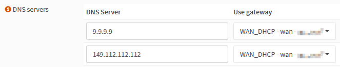
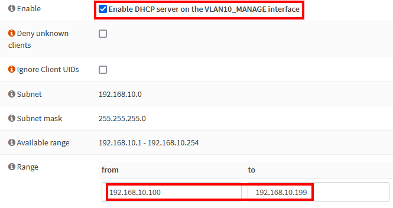
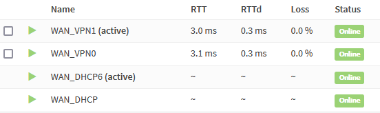

This beginner-friendly, step-by-step guide walks you through the initial configuration of your OPNsense firewall. The title of this guide is an homage to the amazing [pfSense baseline guide with VPN, Guest and VLAN support](https://nguvu.org/pfsense/pfsense-baseline-setup) that some of you guys might know, and this is the migration of it. I found that guide two years ago and immediately fell in love with the network setup. After researching for weeks, I decided to use [OPNsense](https://opnsense.org/) instead of pfSense. I bit the bullet and bought the [Deciso DEC630](https://www.deciso.com/product-catalog/dec630/) appliance. Albeit expensive, and possibly overkill for my needs, I'm happy to support the open-source mission of Deciso, the maintainers of OPNsense.

I followed the instructions of the pfSense guide to configure OPNsense and took notes on the differences. Some options moved to different menus, some options were deprecated, and some stuff was outdated. As my notes grew, I decided to publish them as a guide on my website.

My goal was to create a beginner-friendly, comprehensive guide that's easy to follow. But I tried to strike a different balance in regards to brevity of the instructions compared to the pfSense guide. It's a matter of personal taste, but I find the instructions in that guide too verbose. I intentionally omit a lot of the repetitive "click save and apply" instructions and only list configuration changes deviating from defaults, making some exceptions for very important settings. I consider the OPNsense defaults to be stable enough for this approach and hope to keep the effort required to maintain this guide to a minimum.

I'm a homelab hobbyist, so be warned that this guide likely contains errors. Please, verify the steps yourself and do your own research. I hope this guide is as helpful and inspiring to you as the pfSense guide was to me. Any feedback is greatly appreciated.

## Network Topology

### WAN

- Single ISP WAN
- [Mullvad VPN](https://mullvad.net) multi-gateway load balancing

### LAN

We segregate the local into several areas with different requirements.

#### Management Network (VLAN 10)

The management network connects to management interfaces like WiFi access points, IPMI and headless servers.

#### VPN Network (VLAN 20)

Primary LAN network where all outbound traffic exists via multiple WireGuard VPN tunnels to maximize privacy and security. If the VPN tunnels fail, outbound connection will not be possible.

#### "Clear" Network (VLAN 30)

General purpose web access where encryption isn't required or possible and outgoing connections are routed out the WAN gateway. It mostly serves as a backup network in case of the VPN connections going down.

#### Guest Network (VLAN 40)

An unsecured network used by visitors. Access to other VLANs and user devices is denied.

### DNS Servers

We'll configure a DNS resolver (Unbound), as well as a DNS forwarder (Dnsmasq) on OPNsense. Secure networks will use the resolver and insecure networks the forwarder. [We'll dig into the details later](#dns).

## Hardware Selection and Installation

The original pfSense guide features a [large section of hardware recommendations](https://nguvu.org/pfsense/pfsense-baseline-setup/#Hardware%20selection) and [installation instructions](https://nguvu.org/pfsense/pfsense-baseline-setup/#Install%20pfSense).

As already mentioned earlier, I bought the [Deciso DEC630](https://www.deciso.com/product-catalog/dec630/) appliance from Deciso which is why I'm not advising on hardware choices. Have a look on the [official hardware sizing & setup guidelines](https://docs.opnsense.org/manual/hardware.html) for more information.

Similarly, I haven't had to re-install OPNsense from scratch, I only ever factory reset. See [Initial Installation & Configuration](https://docs.opnsense.org/manual/install.html) for more information.

## Initial Wizard Configuration

Navigate to `192.168.1.1` in your browser and login with default credentials:

- 
- 

Click `Next` to leave the welcome screen and get started.

### Wizard: General Information


|                       |                    |
| --------------------- | ------------------ |
| Domain                | `corp.example.com` |
| Primary DNS Server    | `9.9.9.9`          |
| Secondary DNS Server  | `149.112.112.112`  |
| Override DNS          | `unchecked`        |
| Enable DNSSEC Support | `checked`          |
| Harden DNSSEC data    | `checked`          |

I like [Quad9](https://quad9.org/). Only clear and guest networks will use these. Only "clear" and guest networks will use these, as secured networks will use Unbound instead. If your ISP awards DNS servers via DHCP and you prefer to use these, don't enter DNS servers and leave `Override DNS` checked.

For the domain, I like to use an internal subdomain of a domain I own. You should consider the `local.lan` pattern a relic of the past. To prevent local network architecture being leaked, we'll configure Unbound to to treat `corp.example.com` as private domain.

### Wizard: Time Server Information

|                      |                                                                           |
| -------------------- | ------------------------------------------------------------------------- |
| Time server hostname | `0.ch.pool.ntp.org 1.ch.pool.ntp.org 2.ch.pool.ntp.org 3.ch.pool.ntp.org` |
| Timezone             | `Europe/Zurich`                                                           |

Choose the NTP servers that are geographically closest to your location. I'm based in Switzerland which makes the [servers from the `ch.pool.ntp.org` pool](https://www.pool.ntp.org/zone/ch) the natural choice.

### Wizard: Configure WAN / LAN Interfaces

By default, the WAN interface obtains an IP address via DHCP. Additionally, DHCP is configured for the LAN interface. This should work for most people, so just keep the defaults.

### Wizard: Set Root Password

Choose a strong root password and complete the wizard.

## General Settings

Most of the following, general settings are configured properly by default, but worth double-checking.

### DNS Server Settings

Navigate to .

Although IPv6 is something I want to do, it's out of scope for this guide, so check the following:

|                       |           |
| --------------------- | --------- |
| Prefer IPv4 over IPv6 | `checked` |

The DNS servers we entered will be used by the DNS forwarder, utilized only by clear and guest networks. Selecting `WAN_DHCP` for the **Use gateway** option ensures that DNS services are always available for these networks. If outbound VPN connections fail, I want to prevent DNS traffic leaking from secured networks. In such cases it's handy to have the clear network as a backup.



| DNS Server Options                                               |             |
| ---------------------------------------------------------------- | ----------- |
| Allow DNS server list to be overridden by DHCP/PPP on WAN        | `unchecked` |
| Do not use the local DNS service as a nameserver for this system | `unchecked` |

If you prefer using your ISP's DNS servers, leave the **Allow DNS server list to be overridden by DHCP/PPP on WAN** options checked.

We'll use multiple gateways and want the [default gateway](https://docs.opnsense.org/manual/gateways.html#default-gateways) to change in case a VPN tunnel goes down:

| Gateway switching               |           |
| ------------------------------- | --------- |
| Allow default gateway switching | `checked` |

### Access

Navigate to .

| HTTP Redirect                 |           |
| ----------------------------- | --------- |
| Disable web GUI redirect rule | `checked` |

Permitting root user login and password login is a quick and dirty way of enabling SSH access, but I strongly discourage you from using it. For good reasons both options are disabled by default and certificate- or [key-based authentication](https://www.digitalocean.com/community/tutorials/how-to-configure-ssh-key-based-authentication-on-a-linux-server) are recommended. If your device has a serial console port, like the Deciso DEC630, enabling SSH is not required.

| Secure Shell        |           |     |
| ------------------- | --------- | --- |
| Secure Shell Server | `checked` |     |

| Authentication |                |                                                         |
| -------------- | -------------- | ------------------------------------------------------- |
| Sudo           | `Ask password` | Permit sudo usage for administrators with shell access. |

Navigate to  and add a new user.

|                   |                              |
| ----------------- | ---------------------------- |
| Username          | `<choose a username>`        |
| Password          | `<choose a secure password>` |
| Login shell       | `/bin/csh`                   |
| Group Memberships | `admins`                     |
| Authorized keys   | `<valid SSH public key>`     |

Configuring the SSH client and generating keys is out of scope for this guide, so I'll just refer you to a [good DigitalOcean tutorial covering SSH essentials](https://www.digitalocean.com/community/tutorials/ssh-essentials-working-with-ssh-servers-clients-and-keys).

### Firewall Settings

Navigate to .

|            |             |
| ---------- | ----------- |
| Allow IPv6 | `unchecked` |

We disable the auto-generated anti-lockout rule, because we'll define one ourselves later.

|                      |           |
| -------------------- | --------- |
| Disable anti-lockout | `checked` |

By default, when a rule has a specific gateway set, and this gateway is down, a rule is created and traffic is sent to default gateway. This option overrides that behavior and the rule is not created when the gateway is down.

| Gateway Monitoring |           |
| ------------------ | --------- |
| Skip rules         | `checked` |

Successive connections will be redirected to the servers in a round-robin manner with connections from the same source being sent to the same gateway. This "sticky connection" will exist as long as there are states that refer to this connection. Once the states expire, so will the sticky connection. Further connections from that host will be redirected to the next gateway in the round-robin.

| Multi-WAN          |           |
| ------------------ | --------- |
| Sticky connections | `checked` |

Depending on your hardware you might want to tweak the following settings to increase performance.

| Miscellaneous                  |                |                                                                                                                       |
| ------------------------------ | -------------- | --------------------------------------------------------------------------------------------------------------------- |
| Firewall Optimization          | `conservative` | Tries to avoid dropping any legitimate idle connections at the expense of increased memory usage and CPU utilization. |
| Firewall Maximum Table Entries | `2000000`      | default is 1'000'000                                                                                                  |

### Miscellaneous

Navigate to .

| Power Savings |              |
| ------------- | ------------ |
| Use PowerD    | `checked`    |
| Power Mode    | `Hiadaptive` |

Verify **Cryptography settings** and **Thermal Sensors** settings are compatible with your hardware.

### Checksum Offloading

Checksum offloading is broken in some hardware, particularly some Realtek cards. Rarely, drivers may have problems with checksum offloading and some specific NICs.

Navigate to .

|              |             |                                   |
| ------------ | ----------- | --------------------------------- |
| Hardware CRC | `unchecked` | Disable hardware checksum offload |

## Interface Creation And Configuration

### About VLANs and Switch Choice

To configure VLANs, a 802.1Q-capable switch with properly configured VLANs is required. Check my [Router on a Stick VLAN Configuration guide (TODO)]() if you want to learn more.

### Create VLANs

Typically, the `LAN` port also carries the VLAN traffic and functions as [trunk port](https://www.techopedia.com/definition/27008/trunk-port). For the Deciso DEC630, `igb0` is the port and selected as parent interface for all VLANs in the next steps.


Navigate to  and add the VLANs.

#### Management VLAN

|                  |                 |
| ---------------- | --------------- |
| Parent Interface | `igb0`          |
| VLAN tag         | `10`            |
| Description      | `VLAN10_MANAGE` |

#### VPN VLAN

|                  |              |
| ---------------- | ------------ |
| Parent Interface | `igb0`       |
| VLAN tag         | `20`         |
| Description      | `VLAN20_VPN` |

#### Clear VLAN

|                  |                |
| ---------------- | -------------- |
| Parent Interface | `igb0`         |
| VLAN tag         | `30`           |
| Description      | `VLAN30_CLEAR` |

#### Guest VLAN

|                  |                |
| ---------------- | -------------- |
| Parent Interface | `igb0`         |
| VLAN tag         | `40`           |
| Description      | `VLAN40_GUEST` |

### Create Logical Interfaces

We create a logical interface for each VLAN. Navigate to .


- Select `vlan 10`, enter the description `VLAN10_MANAGE`, and click `+`
- Select `vlan 20`, enter the description `VLAN20_VPN`, and click `+`
- Select `vlan 30`, enter the description `VLAN30_CLEAR`, and click `+`
- Select `vlan 40`, enter the description `VLAN40_GUEST`, and click `+`

Click `Save`.

### Configure Interface IP Addresses

To easier remember which IP range belongs to which VLAN, I like the convention of matching the third octet of the IP range with the VLAN ID. E.g., the VLAN with the ID **10** has an address range of 192.168.**10**.0/24.


#### VLAN10_MANAGE Interface

Select the `VLAN10_MANAGE` interface.

|                         |                   |
| ----------------------- | ----------------- |
| Enable Interface        | `checked`         |
| IPv4 Configuration Type | `Static IPv4`     |
| IPv4 Address            | `192.168.10.1/24` |

Click `Save`.

#### VLAN20_VPN Interface

|                         |                   |
| ----------------------- | ----------------- |
| Enable Interface        | `checked`         |
| IPv4 Configuration Type | `Static IPv4`     |
| IPv4 Address            | `192.168.20.1/24` |

#### VLAN30_CLEAR Interface

|                         |                   |
| ----------------------- | ----------------- |
| Enable Interface        | `checked`         |
| IPv4 Configuration Type | `Static IPv4`     |
| IPv4 Address            | `192.168.30.1/24` |

#### VLAN40_GUEST Interface

|                         |                   |
| ----------------------- | ----------------- |
| Enable Interface        | `checked`         |
| IPv4 Configuration Type | `Static IPv4`     |
| IPv4 Address            | `192.168.40.1/24` |

### Configure Interface DHCP

You might want to adjust the DHCP ranges depending on your needs. I like `x.x.x.100-199` for dynamic and `x.x.x.10.10-99` for static IP address assignments.



Navigate to .

#### DHCP: VLAN10_MANAGE

Select `VLAN10_MANAGE`.

|        |                                           |
| ------ | ----------------------------------------- |
| Enable | `checked`                                 |
| Range  | from `192.168.10.100` to `192.168.10.199` |

Click `Save`.

#### DHCP: VLAN20_VPN

|        |                                           |
| ------ | ----------------------------------------- |
| Enable | `checked`                                 |
| Range  | from `192.168.20.100` to `192.168.20.199` |

#### DHCP: VLAN30_CLEAR

|        |                                           |
| ------ | ----------------------------------------- |
| Enable | `checked`                                 |
| Range  | from `192.168.30.100` to `192.168.30.199` |

#### DHCP: VLAN40_GUEST

|        |                                           |
| ------ | ----------------------------------------- |
| Enable | `checked`                                 |
| Range  | from `192.168.40.100` to `192.168.40.199` |

#### DHCP: LAN

|       |                                         |
| ----- | --------------------------------------- |
| Range | from `192.168.1.100` to `192.168.1.199` |

## VPN Configuration

In recent years, [Mullvad](https://mullvad.net/) has been my VPN provider of choice. When _That One Privacy Site_ was still a thing, Mullvad was one of the top recommendations. I decided to try it out and haven't looked back since. No personally identifiable information is required to register, and paying cash via mail works perfectly.

I decided to go with the [WireGuard Road Warrior](https://docs.opnsense.org/manual/how-tos/wireguard-client.html) setup because I think WireGuard is the VPN protocol of the future. For more detailed steps, check the [official OPNsense documentation on setting up WireGuard with Mullvad](https://docs.opnsense.org/manual/how-tos/wireguard-client-mullvad.html).

We'll also configure multi-gateway load balancing with two tunnels in case one of them goes down.

Please note that the FreeBSD kernel does not (yet) natively support WireGuard, so you must install it as a plugin. Possibly, this doesn't meet your requirements for maturity, stability, security, or performance. I decided to ride the bleeding edge. 😎

Navigate to  and install `os-wireguard`. Refresh the browser and navigate to .

### Remote Peers

Select WireGuard your preferred servers from [Mullvad's server list](https://mullvad.net/en/servers/) and take note of their name and public key. It's worth spending some time to benchmark server performance before making a choice.


Select the `Endpoints` tab and click `Add`. This is what the `ch5-wireguard` endpoint would look like:

|                  |                                                |
| ---------------- | ---------------------------------------------- |
| Name             | `mullvad-ch5-wireguard`                        |
| Public key       | `/iivwlyqWqxQ0BVWmJRhcXIFdJeo0WbHQ/hZwuXaN3g=` |
| Allowed IPs      | `0.0.0.0/0`                                    |
| Endpoint Address | `193.32.127.66`                                |
| Endpoint Port    | `51820`                                        |
| Keepalive        | `25`                                           |

To mitigate risks against DNS poisoning, resolve the server's hostname and enter its IP as `Endpoint Address`. You can do this by running `nslookup ch5-wireguard.mullvad.net` in a.

Repeat the steps above to add another server, e.g., `ch6-wireguard`. Note that for all endpoint configurations, the **Endpoint Port** is `51820`.

### Local Peers

Select the `Local` tab, click `Add`, and enable the `advanced mode`.

|                |                       |
| -------------- | --------------------- |
| Name           | e.g., `mullvad0`      |
| Listen Port    | `51820`               |
| Tunnel Address | `<empty for now>`     |
| Peers          | e.g., `ch5-wireguard` |
| Disable Routes | `checked`             |
| Gateway        | `<empty for now>`     |

Click `Save`, then `Edit`, and copy the generated `Public Key`. Next, run the following shell command:

```shell
curl -sSL https://api.mullvad.net/app/v1/wireguard-keys \
  -H "Content-Type: application/json" \
  -H "Authorization: Token <Mullvad account number>" \
  -d '{"pubkey":"<generated public key>"}'
```

It returns a JSON response like this:

```json
{
  "id": "ufO5jCni55uvioHM%2FeLBgyrrUMocEXsADPc2OvYhF3k%3D",
  "pubkey": "ufO5jCni55uvioHM/eLBgyrrUMocEXsADPc2OvYhF3k=",
  "ipv4_address": "10.105.248.51/32",
  "ipv6_address": "fc00:bbbb:bbbb:bb01::2a:f832/128"
}
```

Copy the IPv4 IP address to the **Tunnel Address** field. Subtract one from the **Tunnel Address** and enter the result as **Gateway** IP. For the above example that would be `10.105.248.50`. It's just a convention I like, but you can use any unused [private IP](https://datatracker.ietf.org/doc/html/rfc1918).


Repeat the steps above to create a second local peer named `mullvad1`. Remember to use a different **Listen Port** (e.g., `51821`).


When you finish, select the `General` tab and check **Enable WireGuard**. You should now see handshakes for the `wg0` and `wg1` tunnels on the `Handshakes` tab.

### Assign WireGuard Interfaces

Navigate to .

- Select `wg0`, add the description `WAN_VPN0`, and click `+`
- Select `wg1`, add the description `WAN_VPN1`, and click `+`

Enable the newly created interfaces and then restart the WireGuard service. This ensures the newly created interfaces get an IP address from WireGuard.

### Static Routes For VPN Gateways

Traffic originating from services running on OPNsense, like Unbound, use the default gateway. We want that traffic to leave through VPNs by default, so the VPN gateways need to be considered as default gateway candidates. To keep tunnel connections alive, we need to statically route traffic destined for tunnel endpoint IPs through the ISP WAN gateway.


Navigate to  and click `Add`.

|                 |                                               |
| --------------- | --------------------------------------------- |
| Network Address | `193.32.127.66/32`                            |
| Gateway         | `WAN_DHCP`                                    |
| Description     | `Keep tunnels to mullvad-ch5-wireguard alive` |

Repeat the same steps for each WireGuard endpoint you defined.

### Create VPN Gateways



Navigate to .

#### WAN_VPN0

Click `Add`.

|                            |                 |
| -------------------------- | --------------- |
| Name                       | `WAN_VPN0`      |
| Interface                  | `WAN_VPN0`      |
| Address Family             | `IPv4`          |
| IP Address                 | `10.105.248.50` |
| Upstream Gateway           | `checked`       |
| Far Gateway                | `checked`       |
| Disable Gateway Monitoring | `unchecked`     |
| Monitor IP                 | `100.64.0.1`    |

Gateways with **Upstream Gateway** are prioritized by OPNsense when determining the default gateway candidates.

#### WAN_VPN1

|                            |                                       |
| -------------------------- | ------------------------------------- |
| Name                       | `WAN_VPN1`                            |
| Interface                  | `WAN_VPN1`                            |
| Address Family             | `IPv4`                                |
| IP Address                 | `<Gateway IP of mullvad1 local peer>` |
| Upstream Gateway           | `checked`                             |
| Far Gateway                | `checked`                             |
| Disable Gateway Monitoring | `unchecked`                           |
| Monitor IP                 | `100.64.0.2`                          |

#### Monitoring IPs

Each gateway requires a monitoring IP. Setting a monitoring IP automatically installs a static route, so the IP must be unique. Optimally, the monitoring IP should the least possible amount of hops away from gateway. For Mullvad specifically, the following IPs are **one hop** away from the tunnel exit:

- `100.64.0.1` to `100.64.0.3`
  [Mullvad's ad-blocking and tracker-blocking DNS service servers](https://mullvad.net/it/blog/2021/5/27/how-set-ad-blocking-our-app/)
- `10.64.0.1`  
  Local Mullvad gateway / proxy

You can easily verify the above by running `traceroute 100.64.0.1` from a host connected to Mullvad.

### Configure Gateway Group

The next step is configuring load balancing.

Navigate to  and click `Add`.

|               |                               |
| ------------- | ----------------------------- |
| Group Name    | `WAN_VPN_GROUP`               |
| WAN_VPN0      | `Tier 1`                      |
| WAN_VPN1      | `Tier 1`                      |
| Trigger Level | `Packet Loss or High Latency` |

## DNS

OPNsense includes both a DNS _resolver_ (Unbound) and a DNS _forwarder_ (Dnsmasq / Unbound in forwarding mode). Simple setups usually use one of either, but we'll use both.

A DNS forwarder simply forwards DNS requests to an external resolver, like an ISP, Cloudflare, or Google DNS. We'll configure the forwarder for the clear and guest networks. In case the primary, secured networks lose connectivity, the clear network can serve as a backup. We'll also use the forwarder for the guest network, because we'll use Unbound for internal DNS resolution, so exposing Unbound to the guest network isn't a good idea.

One of the major advantages of self-hosting a DNS resolver is privacy. A resolver iteratively queries a chain of one or more DNS servers to resolve a request, so there isn't a single instance knowing all your DNS requests. It comes at the cost of speed when resolving a hostname for the first time, which diminishes as Unbound's cache grows. We'll configure our primary networks to use Unbound.

We'll also keep DNS traffic from Unbound within the VPN tunnels. In the rare case of a VPN outage, we'll want local DNS services to fail and not leak through the ISP WAN. The reason for this isn't privacy as you might think. In some cases this might even hurt your privacy. Why? Either your ISP or VPN provider wil see the iterative DNS queries Unbound sends. So it becomes a question of who you rather entrust with this data. But if there are no privacy benefits, why do it? Personally, I don't require such a setup. I configured it for educational purposes and my desire to tinker with it. Some more valid reasons, that don't personally affect me, are:

- ISP selling user data
- ISP enforcing censorship
- ISP hijacking DNS traffic to redirect it to their own DNS resolver; this makes running a DNS resolver impossible

Let's summarize our goals:

- Prevent DNS leaks to the ISP from management and VPN networks
- Resolve private domain hostnames for management and VPN networks
- Support DNS forwarding for clear and guest networks
- Support multi-WAN

### DNS Resolver (Unbound)

Navigate to  and click `Show advanced option`.

|                               |                                    |
| ----------------------------- | ---------------------------------- |
| Network Interfaces            | `LAN` `VLAN10_MANAGE` `VLAN20_VPN` |
| DNSSEC                        | `checked`                          |
| Register DHCP static mappings | `checked`                          |
| Local Zone Type               | `static`                           |

Navigate to .

|                          |           |
| ------------------------ | --------- |
| Prefetch Support         | `checked` |
| Prefetch DNS Key Support | `checked` |
| Harden DNSSEC data       | `checked` |

Finally, you need to configure Unbound to not recurse to external name servers for the local `internal.example.com` subdomain. Adding a custom [SOA record](https://www.cloudflare.com/learning/dns/dns-records/dns-soa-record/) to the local zone, makes Unbound the authoritative name server for that domain. We must use [Templates](https://docs.opnsense.org/development/backend/templates.html) this kind of [advanced Unbound configuration](https://docs.opnsense.org/manual/unbound.html#advanced-configurations).

Connect to OPNsense via serial console or SSH and add a `+TARGETS` file by running `vi /usr/local/opnsense/service/templates/sampleuser/Unbound/+TARGETS` containing:

```text
private_domains.conf:/usr/local/etc/unbound.opnsense.d/private_domains.conf
```

Add the template file by running `vi /usr/local/opnsense/service/templates/sampleuser/Unbound/private_domains.conf` containing:

```text
server:
  private-domain: internal.example.com
  local-data: "internal.example.com. 10800 IN SOA opnsense.internal.example.com. root.example.com. 1 3600 1200 604800 10800"
```

Run the following to verify the configuration:

```shell
# generate template
configctl template reload sampleuser/Unbound
# show generated file
cat /usr/local/etc/unbound.opnsense.d/private_domains.conf
# check if configuration is valid
configctl unbound check
```

### DNS Forwarder (Dnsmasq)

(TODO)

## Firewall

### Interface Groups

[Interface groups](https://docs.opnsense.org/manual/firewall_groups.html) are used to apply policies to multiple interfaces at once. Do not use them for WAN interfaces, because they don't use the `reply-to` directive.

Navigate to  and add the following interface groups.

#### IFGRP_LOCAL

|             |                                                                  |
| ----------- | ---------------------------------------------------------------- |
| Name        | `IFGRP_LOCAL`                                                    |
| Description | `All local interfaces`                                           |
| Members     | `LAN` `VLAN10_MANAGE` `VLAN20_VPN` `VLAN30_CLEAR` `VLAN40_GUEST` |

#### IFGRP_LOCAL_DNS

|             |                                                                            |
| ----------- | -------------------------------------------------------------------------- |
| Name        | `IFGRP_LOCAL_DNS`                                                          |
| Description | `Local interfaces of which outbound DNS traffic is redirected to OPNsense` |
| Members     | `VLAN10_MANAGE` `VLAN20_VPN`                                               |

#### IFGRP_LOCAL_NTP

|             |                                                                            |
| ----------- | -------------------------------------------------------------------------- |
| Name        | `IFGRP_LOCAL_NTP`                                                          |
| Description | `Local interfaces of which outbound NTP traffic is redirected to OPNsense` |
| Members     | `VLAN10_MANAGE` `VLAN20_VPN` `VLAN30_CLEAR`                                |

### Aliases

To simplify the creation and maintenance of firewall rules, we define a few reusable [aliases](https://docs.opnsense.org/manual/aliases.html).

Navigate to  and create the following aliases.

#### Selective Routing Addresses

Services like banks might object to traffic originating from known VPN end points, so some traffic from the VPN VLAN must be selectively routed through the default WAN gateway.

|             |                                                                              |
| ----------- | ---------------------------------------------------------------------------- |
| Name        | `SELECTIVE_ROUTING`                                                          |
| Type        | `Host(s)`                                                                    |
| Description | `Specific external hosts of which traffic is routed through the WAN gateway` |

#### Admin / Anti-lockout Ports

|             |                                        |
| ----------- | -------------------------------------- |
| Name        | `PORTS_ANTI_LOCKOUT`                   |
| Type        | `Port(s)`                              |
| Content     | `443` Web GUI<br>`22` SSH, if desired  |
| Description | `Ports that must always be accessible` |

#### Ports Allowed To Communicate Between VLANs

A list of ports allowing traffic between local VLANs. The following will get you started but require changes depending on your needs. Use [Firewall Logs](https://docs.opnsense.org/manual/logging_firewall.html) to review blocked ports.

|             |                    |
| ----------- | ------------------ |
| Name        | `PORTS_OUT_LAN`    |
| Type        | `Port(s)`          |
| Description | `Inter-VLAN ports` |

Content:

- `53` DNS
- `5353:5354` mDNS
- `123` NTP
- `21` FTP
- `22` SSH
- `161` SNMP
- `80` HTTP
- `8080`: HTTP alt / UniFi device and application communication
- `443` HTTPS
- `8443` HTTPS alt / UniFi application GUI/API as seen in a web browser
- `8880` UniFi HTTP portal redirection
- `8843` UniFi HTTPS portal redirection
- `10001` UniFi device discovery
- `5001` iperf
- `5900` IPMI
- `3389` RDP
- `49152:65535` ephemeral ports

#### Ports Allowed to Communicate with the Internet

A list of ports allowing egress traffic to the internet. The following will get you started but require changes depending on your needs. Use [Firewall Logs](https://docs.opnsense.org/manual/logging_firewall.html) to review blocked ports.

|             |                    |
| ----------- | ------------------ |
| Name        | `PORTS_OUT_WAN`    |
| Type        | `Port(s)`          |
| Description | `WAN egress ports` |

Content:

- `21` FTP
- `22` SSH
- `80` HTTP
- `8080` HTTP alt
- `443` HTTPS
- `8443` HTTPS alt
- `465` SMTPS
- `587`: SMTPS
- `993`: IMAPS
- `49152:65535` ephemeral ports

### NAT

NAT is required to translate private to public IP addresses:

- All VLAN IPs are translated to the WAN address range
- VPN VLAN IPs are translated to VPN_WAN and WAN ranges (selective routing)

Navigate to .

Select `Manual outbound NAT rule generation`, click `Save`, click `Apply changes`, and add the following rules.

#### localhost to WAN

|                |                    |
| -------------- | ------------------ |
| Interface      | `WAN`              |
| Source address | `Loopback net`     |
| Description    | `localhost to WAN` |

#### IFGRP_LOCAL to WAN

|                |                      |
| -------------- | -------------------- |
| Interface      | `WAN`                |
| Source address | `IFGRP_LOCAL net`    |
| Description    | `IFGRP_LOCAL to WAN` |

#### VLAN20_VPN to WAN_VPN0

|                |                          |
| -------------- | ------------------------ |
| Interface      | `WAN_VPN0`               |
| Source address | `VLAN20_VPN net`         |
| Description    | `VLAN20_VPN to WAN_VPN0` |

#### VLAN20_VPN to WAN_VPN1

|                |                          |
| -------------- | ------------------------ |
| Interface      | `WAN_VPN1`               |
| Source address | `VLAN20_VPN net`         |
| Description    | `VLAN20_VPN to WAN_VPN1` |

### Rules

#### IFGRP_LOCAL Rules

These rules apply to any local interface.

Navigate to  and add the following rules.

##### ICMP Debugging Rule

By default all local interfaces allow ICMP pings from any other local interface.

|                |                          |
| -------------- | ------------------------ |
| Action         | `Pass`                   |
| Interface      | `IFGRP_LOCAL`            |
| TCP/IP Version | `IPv4`                   |
| Protocol       | `ICMP`                   |
| ICMP type      | `Echo Request`           |
| Source         | `IFGRP_LOCAL net`        |
| Description    | `Allow inter-VLAN pings` |

##### Default Reject Rule

By default we reject (not block) traffic on local interfaces providing an immediate response to applications.

|                |                                                |
| -------------- | ---------------------------------------------- |
| Action         | `Reject`                                       |
| Quick          | `unchecked`                                    |
| Interface      | `IFGRP_LOCAL`                                  |
| TCP/IP Version | `IPv4+IPv6`                                    |
| Protocol       | `any`                                          |
| Source         | `IFGRP_LOCAL net`                              |
| Log            | `checked`                                      |
| Description    | `Default reject all rule for local interfaces` |

##### Allow Inter-VLAN Traffic On Allowed Ports Rule

By default allow inter-VLAN traffic on `ALLOWED_PORTS`. It's crucial to uncheck the **Quick** option to be able to override this rule for `VLAN40_GUEST`.

|                        |                                             |
| ---------------------- | ------------------------------------------- |
| Action                 | `Pass`                                      |
| Interface              | `IFGRP_LOCAL`                               |
| Protocol               | `TCP/UDP`                                   |
| Source                 | `IFGRP_LOCAL net`                           |
| Destination            | `IFGRP_LOCAL net`                           |
| Destination port range | `PORTS_OUT_LAN`                             |
| Description            | `Allow inter-VLAN traffic on allowed ports` |

#### IFGRP_LOCAL_DNS Rules

Navigate to  and click `Add`.

|                        |                                             |
| ---------------------- | ------------------------------------------- |
| Interface              | `IFGRP_LOCAL_DNS`                           |
| Protocol               | `TCP/UDP`                                   |
| Source                 | `IFGRP_LOCAL_DNS net`                       |
| Destination / Invert   | `checked`                                   |
| Destination            | `IFGRP_LOCAL_DNS net`                       |
| Destination port range | `DNS`                                       |
| Redirect target IP     | `127.0.0.1`                                 |
| Redirect target port   | `DNS`                                       |
| Description            | `Redirect outbound DNS traffic to OPNsense` |

#### IFGRP_LOCAL_NTP Rules

Navigate to  and click `Add`.

|                        |                                             |
| ---------------------- | ------------------------------------------- |
| Interface              | `IFGRP_LOCAL_NTP`                           |
| Protocol               | `UDP`                                       |
| Source                 | `IFGRP_LOCAL_NTP net`                       |
| Destination / Invert   | `checked`                                   |
| Destination            | `IFGRP_LOCAL_NTP net`                       |
| Destination port range | `NTP`                                       |
| Redirect target IP     | `127.0.0.1`                                 |
| Redirect target port   | `NTP`                                       |
| Description            | `Redirect outbound NTP traffic to OPNsense` |

#### VLAN10_MANAGE Rules

- allow traffic to local interfaces on approved ports
- allow internet traffic on approved ports
- redirect any non-local NTP time lookups to OPNsense
- allow internal and external DNS resolution

Navigate to .

##### VLAN10_MANAGE Anti-lockout Rule

- Click `+`
- 
- 
- 
- 
- 
- 
- 
- Click `Save`

##### VLAN10_MANAGE Allow WAN Egress On PORTS_OUT_WAN Ports

- Click `+`
- 
- 
- 
- 
- 
- 
- 
- 
- Click `Save`

#### VLAN20_VPN Rules

##### VLAN20_VPN Allow WAN Egress On SELECTIVE_ROUTING Ports

|                        |                                               |
| ---------------------- | --------------------------------------------- |
| Action                 | `Pass`                                        |
| Interface              | `VLAN20_VPN`                                  |
| Protocol               | `TCP/UDP`                                     |
| Source                 | `VLAN20_VPN net`                              |
| Destination            | `SELECTIVE_ROUTING`                           |
| Destination port range | `PORTS_OUT_WAN`                               |
| Description            | `Allow WAN egress on SELECTIVE_ROUTING ports` |

##### VLAN20_VPN Allow VPN Egress On Allowed Ports

|                        |                                     |
| ---------------------- | ----------------------------------- |
| Action                 | `Pass`                              |
| Quick                  | `VLAN20_VPN`                        |
| Protocol               | `TCP/UDP`                           |
| Source                 | `VLAN20_VPN net`                    |
| Destination / Invert   | `checked`                           |
| Destination            | `VLAN20_VPN net`                    |
| Destination port range | `PORTS_OUT_WAN`                     |
| Description            | `Allow VPN egress on allowed ports` |
| Gateway                | `VPN_WAN_GROUP`                     |

#### VLAN30_CLEAR Rules

Requirements for the unencrypted, "clearnet" interface:

- allow traffic to local networks on allowed ports
- allow internet traffic on allowed ports via default gateway
- redirect non-local NTP time lookups
- redirect non-local DNS lookups to DNS forwarder
- reject any other traffic

#### LAN Rules

##### LAN Anti-lockout Rule

- Click `+`
- 
- 
- 
- 
- 
- 
- 
- Click `Save`
- Move the rule to the top

##### Pass LAN To Any Rule

This rule should by default exist. If not, create it.

- Click `+`
- 
- 
- 
- 
- Click `Save`

## NTP

Except the guest network, my entire homelab is synchronized to my OPNsense router. We earlier configured NTP servers with the wizard but we want to set a couple of more things:

|            |                                |
| ---------- | ------------------------------ |
| Interfaces | `VLAN10_MANAGE` `VLAN20_VPN` ` |
