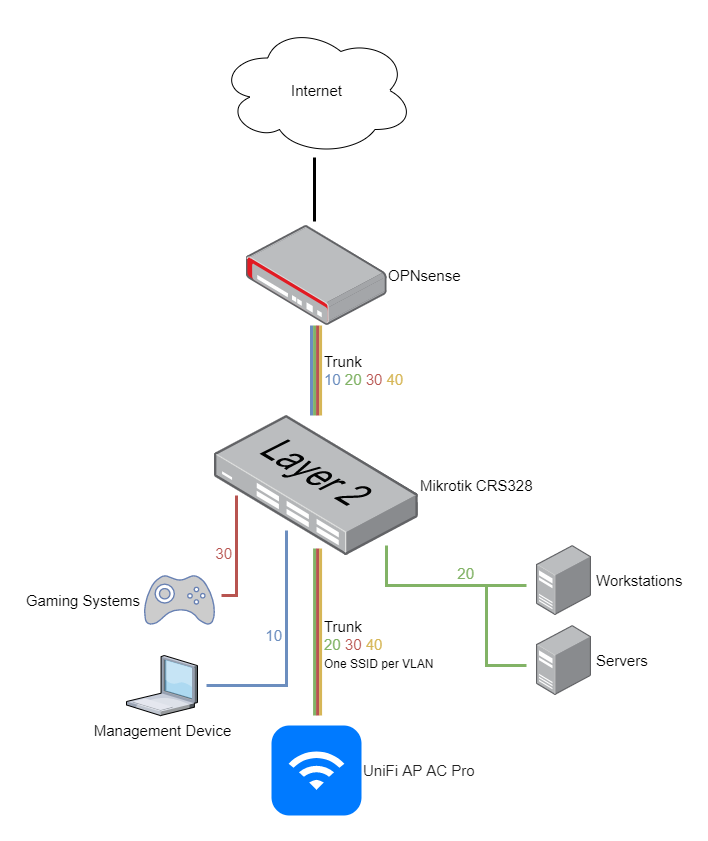

Writing this guide, I took most of my inspiration from the excellent [pfSense router-on-a-stick VLAN configuration with a Mikrotik SG260GS](https://nguvu.org/pfsense/pfsense-router-on-a-stick-with-mikrotik-switch/) guide. My homelab grew quite a bit over the past years. And with that, my networking needs also changed: stricter firewall rules, segregating untrusted IoT devices into separate networks, traffic prioritization, and more. My motivation for writing this is to document my switch and VLAN configuration. And maybe this might be useful for someone out there, too.

## Mikrotik CRS328-24P-4S+RM

The [Mikrotik CRS328-24P-4S+RM](https://mikrotik.com/product/crs328_24p_4s_rm) is a beefy layer 3 switch. It features 24 Gigabit PoE ethernet ports and four 10 Gbps SFP+ ports and a 500W power supply, so it'll be able to serve as a core switch for my homelab for a long time. It's rack-mountable and was significantly cheaper than comparable Ubiquiti gear I was considering at the time of the purchase. For routing, I use OPNsense, so I only need the capabilities of a managed switch from the Mikrotik device, which is why I run it on [SwOS](https://help.mikrotik.com/docs/display/SWOS/SwOS) instead [RouterOS](https://help.mikrotik.com/docs/display/ROS/RouterOS). So, instructions in this guide also refer to SwOS.

## Network Topology

[From Wikipedia](https://en.wikipedia.org/wiki/Router_on_a_stick):

> In computing, a router on a stick, also known as a one-armed router, is a router that has a single physical or logical connection to a network. It is a method of inter-VLAN (virtual local area networks) routing where one router is connected to a switch via a single cable.

Usually managed switches that are 802.1Q-capable are suitable for these kinds of scenarios. With a VLAN configuration like this:

| Description | VLAN ID | Subnet              |
| ----------- | ------- | ------------------- |
| Native      | 1       | 192.168.**1**.0/24  |
| Management  | 10      | 192.168.**10**.0/24 |
| VPN         | 20      | 192.168.**20**.0/24 |
| Clear       | 30      | 192.168.**30**.0/24 |
| Guest       | 40      | 192.168.**40**.0/24 |

My network looks like this:

## Port Mapping

As per my requirements above, this is how I mapped my ports to VLANs:

| Port      | Description                                    | VLANs                     |
| --------- | ---------------------------------------------- | ------------------------- |
| 1         | Trunk to OPNsense                              | 1, 10, 20, 30, 40         |
| 2, 3      | Not used, reserved for future trunks using LAG |                           |
| 4         | Hybrid port to Ubiquiti Unifi AP               | 10 (untagged), 20, 30, 40 |
| 5-8       | Management VLAN                                | 10                        |
| 9-12      | VPN VLAN                                       | 20                        |
| 13-16     | Clear VLAN                                     | 30                        |
| 17-20     | Guest VLAN                                     | 40                        |
| 21-24     | Not used                                       |                           |
| SFP1-SFP4 | Not used                                       |                           |

## Configure The Switch

Before configuring VLANs, enable **Independent VLAN Lookup** (IVL) in the **System** settings.
